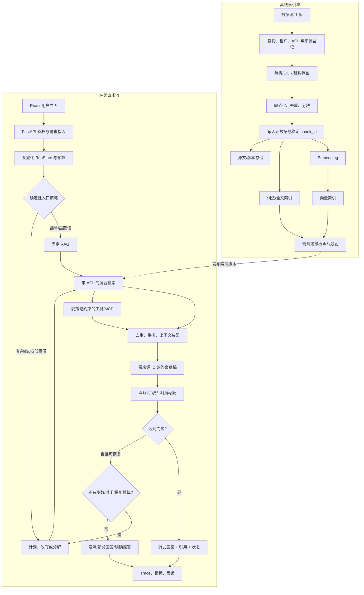

# Agentic RAG：生产架构与开发方法研究

> 面向 NexaFlow 的架构研究。本文只讨论可复用的系统设计与实施方法，不对当前 NexaFlow 内部实现作未经验证的判断。

## 0. 阅读约定与结论摘要

本文刻意区分两类陈述：

- **来源事实**：论文、协议或官方文档明确提出、定义或验证的内容，均在句内附一手来源。
- **工程建议**：标记为 **「建议」**，是结合这些事实给 NexaFlow 的设计取舍，不应误读为论文结论或框架强制要求。

核心结论：

1. 固定 RAG 是一条预先确定的“检索一次 → 拼接上下文 → 生成”数据管线；Agentic RAG 则把“是否检索、查什么、用哪个知识源、结果是否足够、是否继续”变成有状态决策循环。原始 RAG 将参数化生成器与非参数化文档索引结合，而 ReAct 把推理轨迹与外部行动交错执行；Self-RAG 和 CRAG 又分别加入按需检索/自我批评与检索质量纠正机制。[RAG](https://arxiv.org/abs/2005.11401) [ReAct](https://arxiv.org/abs/2210.03629) [Self-RAG](https://arxiv.org/abs/2310.11511) [CRAG](https://arxiv.org/abs/2401.15884)
2. **建议**：不要一开始做“完全自治”的通用代理。先保留可预测的固定路径，再只在确有收益的节点引入模型决策；Anthropic 的第一方生产经验同样建议从最简单方案开始，只有评估证明效果提升时才增加复杂度，并明确区分预定义代码路径的 workflow 与由模型动态控制步骤/工具的 agent。[Anthropic：Building Effective Agents](https://www.anthropic.com/engineering/building-effective-agents)
3. **建议**：把在线执行建模成显式、可持久化、可审计的状态机；把授权过滤、预算、最大步数、可用工具集合、重试与停止条件留在确定性代码中，而不是交给提示词。
4. **建议**：检索与答案必须分层评估。只测“答案看起来不错”会掩盖召回失败、重排失败、引用错位和代理轨迹错误；RAGAS 将 RAG 评估拆成检索上下文、答案忠实度和生成质量等维度，LangSmith 官方指南也要求分别评价 LLM、检索、工具调用与轨迹。[RAGAS](https://arxiv.org/abs/2309.15217) [LangSmith Evaluation Concepts](https://docs.langchain.com/langsmith/evaluation-concepts)

---

## 1. 固定 RAG 与 Agentic RAG 的差异

### 1.1 固定 RAG 基线

原始 RAG 把预训练 seq2seq 模型视为**参数化记忆**，把由神经检索器访问的 Wikipedia 向量索引视为**非参数化记忆**；查询先取 top-k 段落，生成器再基于查询与段落生成答案。[Lewis 等，RAG](https://arxiv.org/abs/2005.11401) 其重要价值是外部知识可替换、扩充和检查，而不必把所有事实固化在模型参数中。[Lewis 等，RAG](https://arxiv.org/html/2005.11401#S1)

现代产品中常见的“固定 RAG”通常不是原论文的端到端训练实现，而是同一拓扑的工程化版本：

```text
用户问题 → 单次查询向量化 → top-k 检索 → 拼接上下文 → 单次生成 → 返回
```

它的优势是低延迟、成本可预测、调用链容易测试；缺点是无论问题是否需要外部知识都执行相同流程，而且一旦查询表达、召回或上下文质量失败，生成器通常没有机会修正。Self-RAG 的出发点正是固定数量、无差别检索可能引入无关段落，且答案不保证受段落支持；CRAG 则专门研究“检索错了怎么办”。[Self-RAG](https://arxiv.org/html/2310.11511#S1) [CRAG](https://arxiv.org/html/2401.15884#S1)

### 1.2 Agentic RAG

ReAct 提出让语言模型交错生成推理与任务行动：推理用于维护/更新计划和处理异常，行动用于访问知识库或环境并取得新证据。[ReAct](https://arxiv.org/abs/2210.03629) 在 RAG 场景里，这意味着检索不再只是生成前的固定前置步骤，而是代理可按状态多次调用的工具。

Agentic RAG 的判定标准不是“用了某个 agent 框架”，而是系统是否具备以下至少一部分动态闭环：

- 判断是否需要检索、需要哪个数据源或工具；
- 重写问题或分解多跳问题，并根据已得到的证据决定下一次查询；
- 评价检索结果是否相关、充分、相互矛盾；
- 在证据不足时改写、扩大/切换来源或澄清；
- 检查答案中的可验证主张是否被证据支持，再决定提交、重试或拒答。

Self-RAG 训练模型生成检索与批评反思 token，以按需检索、判断段落相关性、支持度与答案效用；CRAG 用轻量检索评价器把结果分为 Correct、Incorrect、Ambiguous，并相应执行知识精炼、外部搜索或组合策略。[Self-RAG](https://arxiv.org/html/2310.11511#S3) [CRAG](https://arxiv.org/html/2401.15884#S4)

### 1.3 对照表

| 维度 | 固定 RAG | Agentic RAG |
|---|---|---|
| 控制流 | 代码预定的一次检索与一次生成 | 代码护栏内，由策略/模型动态选择下一步 |
| 查询 | 通常直接使用原问题 | 可消歧、改写、分解、逐步补全 |
| 检索次数 | 通常固定 1 次 | 0..N 次，受预算和停止条件约束 |
| 工具 | 单一知识库检索器 | 多知识库、结构化 API、MCP 工具等 |
| 失败处理 | 空结果或低分后直接生成/拒答 | 评价 → 改写/换源/澄清/拒答 |
| 状态 | 请求内临时变量 | 线程状态、运行状态、证据账本、预算与审批状态 |
| 优势 | 可预测、快、便宜、易测 | 对复杂、多跳、异构来源问题更灵活 |
| 主要风险 | 单点检索失败、上下文污染 | 延迟/成本放大、循环、错误累积、越权工具调用 |

**建议**：把两者设计成同一系统的两条路径，而不是一次性替换。常规知识问答走固定路径；只有多跳、歧义、低置信检索或明确需要工具的请求升级到 agentic 路径。Anthropic 的官方指南指出，agent 往往以延迟与成本换取任务表现，预定义 workflow 更适合定义清晰且需要一致性的任务，动态 agent 更适合步骤无法预知的问题。[Anthropic：When (and when not) to use agents](https://www.anthropic.com/engineering/building-effective-agents#when-and-when-not-to-use-agents)

---

## 2. 端到端流程



### 2.1 离线索引流

1. **接入与登记**：为每个文档记录 `tenant_id`、来源、所有者、可见范围、版本、内容哈希、抓取/上传时间和删除状态。
2. **解析与规范化**：提取标题、章节、表格、页码与链接关系；保留能回溯到原文的定位信息。去重应区分“同内容新版本”和“不同 ACL 的同内容”。
3. **分块**：块应携带稳定 `document_id/chunk_id`、父章节、字符/页码范围、版本与 ACL。原始 RAG 实验将 Wikipedia 切成 100 词块，但这是其数据集设置，不是通用最佳值。[RAG 实验设置](https://arxiv.org/html/2005.11401#S3)
4. **索引**：分别构建词法与向量索引，再发布一个不可变 `index_version`。BEIR 在 18 个异构数据集的原始研究中发现 BM25 是稳健基线，而重排/late-interaction 平均零样本表现更好但计算成本更高，因此不能只凭单一向量检索器的演示效果决定生产方案。[BEIR](https://arxiv.org/abs/2104.08663)
5. **发布前质量门**：检查解析成功率、空块、重复率、ACL 完整率、可检索性与一组已知查询的 Recall@k/nDCG；仅通过后原子切换索引版本。
6. **增量与删除**：使用内容哈希避免重复 embedding；更新写新版本，删除同时进入向量、词法、原文与缓存的清理队列。

**建议**：ACL 字段必须与索引文档同生共死，并在候选召回阶段过滤，而不是先检索越权文本再依赖提示词隐藏。索引版本必须写入每次在线 trace，才能复现实验和事故。

### 2.2 在线请求流

1. **接入**：FastAPI 验证用户、租户、角色和会话，创建 `request_id/run_id/trace_id`，归一化语言与时区；客户端不得直接声明自己可用的工具或知识空间。
2. **确定性预路由**：拒绝超限输入；处理明确命令、纯闲聊、已有缓存或无需检索的固定意图；计算允许的数据源、工具和预算。
3. **策略路由**：简单问题进入固定 RAG；歧义、多实体比较、多跳、首轮检索低分或明确动作意图进入 agentic 图。
4. **查询处理**：保留原问题，另生成 `search_queries`。对代词依赖的多轮问题先做“独立可检索问题”改写；对并列/多跳问题拆成带依赖关系的子问题。
5. **检索与重排**：对每个查询执行带 ACL 的词法 + 向量召回，合并去重，再由更精确但更贵的重排器筛到上下文预算。Cohere 官方将 rerank 定位为位于关键词或向量搜索之后的第二阶段排序。[Cohere Rerank 官方文档](https://docs.cohere.com/docs/reranking-with-cohere)
6. **证据评价**：记录相关性、覆盖的子问题、来源可信级别、时间有效性和冲突。CRAG 证明了在生成前显式评价检索质量并触发纠正动作是一条可行路径。[CRAG](https://arxiv.org/html/2401.15884#S4)
7. **生成与引用**：只向模型提供通过 ACL 与重排的证据，使用稳定来源 ID；输出结构应把答案片段、主张及引用 ID 分离，禁止模型自行构造 URL。
8. **验证与循环**：逐项检查引用存在、引用可见、主张是否被对应证据支持、是否回答所有子问题。未达标时，只允许进入事先定义的恢复边；达到预算或无新信息时停止。
9. **交付**：React 通过流式事件显示阶段、引用和可取消状态。FastAPI 官方支持 `StreamingResponse`；对重型、需跨进程执行的工作，FastAPI 官方明确建议使用外部任务/队列工具而非仅依赖进程内 `BackgroundTasks`。[FastAPI Custom Responses](https://fastapi.tiangolo.com/advanced/custom-response/#streamingresponse) [FastAPI BackgroundTasks caveat](https://fastapi.tiangolo.com/tutorial/background-tasks/#caveat)

---

## 3. 生产模块拆分

**建议**：以下边界按职责与故障域划分；它们可以先在一个 FastAPI 服务内作为深模块存在，不代表必须立即拆微服务。

| 模块 | 主要职责 | 禁止承担的职责 | 关键输入/输出 |
|---|---|---|---|
| API / Session Gateway | 鉴权、配额、请求/流式协议、取消 | 决定答案内容 | `Principal + Request → run_id/events` |
| Policy Engine | 计算数据源、工具、模型、预算、审批规则 | 生成自然语言计划 | `Principal + intent → EffectivePolicy` |
| Orchestrator | 执行状态图、调度节点、停止/恢复 | 在节点内部隐藏业务状态 | `RunState → StateDelta` |
| Query Processor | 独立问题改写、消歧、分解、查询去重 | 访问未授权语料 | `question/evidence → QueryPlan` |
| Retrieval Gateway | 统一词法、向量、SQL/API 检索；强制 ACL | 直接生成最终答案 | `SearchQuery + policy → Candidates` |
| Ranker / Context Builder | 融合、去重、重排、压缩、token 预算 | 修改来源事实 | `Candidates → EvidenceBundle` |
| Tool Gateway / MCP Client | 工具发现、schema 校验、授权、审批、超时、审计 | 把模型输出原样当命令执行 | `ToolIntent + policy → ToolResult` |
| Generator | 基于证据生成结构化草稿与引用 ID | 绕开证据自行访问数据 | `Question + Evidence → Draft` |
| Verifier | 引用完整性、支持度、覆盖率、冲突检查 | 无限自循环 | `Draft + Evidence → Verdict` |
| Memory Service | 线程短期状态、经确认的长期偏好/事实 | 默认永久存储全部对话 | `MemoryRead/Write` |
| Indexing Pipeline | 解析、分块、embedding、版本发布、删除 | 服务在线答案 | `SourceVersion → IndexVersion` |
| Run Store / Durable Executor | checkpoint、幂等、租约、恢复、取消 | 决策用户权限 | `RunState/Event` |
| Observability / Eval | trace、成本、延迟、数据集、评分与回归 | 记录未脱敏秘密 | `Span/Feedback/EvalResult` |

这一拆分保持一个关键性质：**Orchestrator 只看结构化状态与节点结果，不知道向量库或模型供应商细节；Retrieval/Tool Gateway 则必须知道有效授权，但不决定策略目标。**

---

## 4. 状态模型

LangGraph 官方把 checkpointer 定义为线程内图状态快照，用于会话连续性、中断恢复和容错；store 则保存跨线程的长期应用数据。[LangGraph Persistence](https://docs.langchain.com/oss/python/langgraph/persistence) 这个区分适合用作产品状态模型的参考，但**建议**保持供应商无关的数据契约：

```text
RunState
├── identity
│   ├── tenant_id, user_id, roles, authz_snapshot_id
│   └── allowed_corpus_ids, allowed_tool_ids
├── request
│   ├── run_id, thread_id, trace_id, locale
│   └── original_question, normalized_question
├── control
│   ├── phase, status, route, step_no
│   ├── deadline_at, cancelled_at
│   └── max_steps, max_tool_calls, max_tokens, max_cost
├── plan
│   ├── subquestions[{id, text, depends_on, status}]
│   └── pending_actions[]
├── retrieval
│   ├── queries[{text, reason, attempt}]
│   ├── candidates[{chunk_id, score, retriever, acl_decision}]
│   └── index_version
├── evidence
│   ├── items[{evidence_id, chunk_id, source_version, locator, text_hash}]
│   └── coverage, conflicts, quality_verdict
├── answer
│   ├── draft, claims[{claim_id, text, citation_ids[]}]
│   └── verification, final_answer
├── tools
│   └── calls[{call_id, tool_id, args_hash, approval, result_ref, status}]
├── memory
│   ├── selected_thread_context[]
│   └── proposed_long_term_writes[]
└── diagnostics
    ├── errors[], retry_counts, stop_reason
    └── prompt/model/policy versions
```

### 4.1 状态不变量

**建议**将下列规则做成代码断言：

- 每个状态变更是追加事件或带版本号的原子更新；节点只返回 `StateDelta`。
- `identity` 与 `EffectivePolicy` 在一次 run 中不可被模型覆盖；恢复执行时重新验证当前权限，权限收缩立即生效。
- `final_answer` 只能由 `verified`、`partial` 或 `abstained` 三种终态产生；终态后禁止继续调用工具。
- 每条引用指向该次运行实际可见的 `evidence_id`，后者可解析到稳定来源版本和定位。
- 外部副作用以 `call_id/idempotency_key` 去重；重放不得重复发邮件、写记录或扣款。
- checkpoint 不直接保存长期秘密或完整 access token；只保存受控凭据引用。

### 4.2 短期与长期记忆

短期记忆服务于当前线程：对话摘要、已确认实体、未完成计划、证据和审批。长期记忆服务于跨线程偏好或经用户确认的事实。LangGraph 官方也明确把线程级 checkpointer 与跨线程 store 分开。[LangGraph Persistence](https://docs.langchain.com/oss/python/langgraph/persistence#checkpointer-vs-store)

**建议**：

- 默认只读入完成当前问题所需的最少记忆；长期写入必须有类型、来源、置信度、创建/过期时间与删除入口。
- 模型提出长期记忆候选，确定性策略决定是否允许，敏感类别要求用户确认。
- 检索“用户记忆”与“企业知识库”使用不同命名空间和保留策略；不要把聊天摘要混入权威知识索引。
- 摘要是有损派生物，不得覆盖原始审计事件；用户纠正应产生新版本而非静默修改历史。

---

## 5. 路由：确定性策略与 LLM 决策

Anthropic 把 routing 描述为先分类输入再送往专门后续任务，并指出分类既可由 LLM，也可由传统模型/算法完成。[Anthropic：Routing](https://www.anthropic.com/engineering/building-effective-agents#workflow-routing)

### 5.1 确定性策略

适合代码/规则处理的决策：

- 身份、租户、ACL、地域与数据保留限制；
- 工具 allowlist、写操作审批、最大费用/步数/并发；
- 明确命令、文件类型、空输入、速率限制；
- 超时、重试类别、熔断、幂等与停止；
- 检索分数/结果数等可校准阈值；
- 高风险领域的强制拒绝或人工复核。

优点是可复现、可审计、便宜、容易做边界测试；缺点是对自然语言歧义与新类别适应性差，规则会随产品增长而膨胀。

### 5.2 LLM 路由

适合模型判断的决策：

- 问题是否需要新知识、是否多跳或歧义；
- 该用哪些只读知识工具；
- 如何重写、分解与排序子问题；
- 当前证据是否语义上覆盖用户意图；
- 应追问何种澄清信息。

优点是能处理开放语言和长尾组合；缺点是不确定、受提示注入影响、难以校准，并增加一次模型调用的成本与延迟。

### 5.3 推荐的混合裁决

**建议**：采用 `EffectivePolicy ∩ ModelProposal`：

1. 代码先计算本次运行的可用数据源、只读/写工具、预算和审批规则；
2. 模型只能在这个闭集内提出结构化 `RouteDecision`；
3. JSON Schema/类型校验失败、引用未知工具或置信度不足时回落到固定 RAG/澄清，而不是“尽力执行”；
4. 所有写工具在执行前再次做参数级授权，必要时中断等候人审。

LangGraph 的 interrupt 官方机制支持保存状态、暂停并在相同 `thread_id` 上恢复，且明确将关键 API、数据库写入、金融交易的审批列为常见用例。[LangGraph Interrupts](https://docs.langchain.com/oss/python/langgraph/interrupts#approve-or-reject)

### 5.4 可供 NexaFlow 填写的比较标准

| 检查项 | 当前值（待填） | 目标证据 |
|---|---:|---|
| 无需检索请求被正确跳过的比例 |  | 标注集上的 precision/recall |
| 简单问题误升级 agentic 的比例 |  | 路由混淆矩阵、额外成本 |
| 复杂问题错误留在固定路径的比例 |  | 多跳/歧义切片召回 |
| 路由失败回退行为 |  | 可重复的错误/超时演练 |
| 模型能否选择未授权数据源/工具 |  | 必须为 0 的对抗测试 |
| p50/p95 额外路由延迟与费用 |  | trace 聚合 |

---

## 6. 检索质量、查询改写与分解

### 6.1 查询改写与分解策略

- **会话独立化**：把“它去年怎么样？”改写为包含已确认实体和时间范围的查询；必须同时保留原问题，避免改写改变意图。
- **多查询扩展**：为同一意图生成术语、缩写或不同表述，分别召回后融合；设置查询数上限并去重。
- **子问题分解**：比较、聚合和多跳问题拆成依赖 DAG。IRCoT 的原始研究表明，多步问答中“下一步检索什么”取决于已经推导和已经检索的内容，因此交错检索与推理比一次 retrieve-and-read 更适配这类问题。[IRCoT](https://arxiv.org/abs/2212.10509)
- **HyDE**：先生成假想相关文档，再编码它以检索真实文档；论文明确提醒假想文档可能包含虚假细节，依赖稠密编码瓶颈把查询落回真实语料，因此它只能生成检索表示，不能成为答案证据。[HyDE](https://arxiv.org/abs/2212.10496)

**建议**：改写器输出 `{query, purpose, derived_from, entities, time_scope}`；检索结果仍要对原问题重排。子查询只有带来新证据时才继续，否则触发“无进展”停止。

### 6.2 两阶段检索

**建议**：

1. 词法召回覆盖专有名词、编号、错误码和精确短语；向量召回覆盖语义改写；分别在 ACL 过滤下取候选。
2. 使用 rank fusion 合并并按 `chunk_id/source_version` 去重。
3. 对较宽候选集做 query-document 重排，再按来源多样性、时间与 token 预算装配上下文。官方 Cohere 文档支持在任意词法或语义搜索结果后加入第二阶段 rerank。[Cohere Rerank](https://docs.cohere.com/docs/reranking-with-cohere)
4. 相邻块扩展必须在重排之后且继承同一文档 ACL；避免 top-k 全被同一长文档占满。

首阶段目标是高召回，重排目标是高精度；这两个阶段必须分别测量。BEIR 的原始结果也显示检索架构之间存在效果与计算成本权衡。[BEIR](https://arxiv.org/abs/2104.08663)

### 6.3 检索评价指标

- 有 qrels：Recall@k、MRR、nDCG@k、命中权威来源比例；
- 无完整 qrels：人工标注 top-k 相关性、答案所需证据覆盖率、无关上下文率；
- 系统指标：零结果率、ACL 过滤前后候选数、重复率、索引新鲜度、召回/重排延迟、每次请求 token 数；
- 切片：语言、租户、文档类型、问题类型、多跳数、时间敏感性、长尾实体。

---

## 7. Grounding、引用、自我纠正与停止

### 7.1 引用不是“附几个链接”

Self-RAG 把“段落是否相关”“生成是否被段落支持”“答案是否有用”作为不同反思信号，并在长文本生成中逐段提供引用。[Self-RAG](https://arxiv.org/html/2310.11511#S3) 生产系统因此应把引用正确性拆为：

1. **存在性**：引用 ID 必须来自本轮 `EvidenceBundle`；
2. **可见性**：当前用户在输出时仍有权访问；
3. **蕴含/支持度**：证据确实支持紧邻主张，而非仅主题相关；
4. **完整性**：所有可验证的重要主张都有证据；
5. **定位性**：链接能落到文档版本、页码/章节/块，而不是只到首页；
6. **一致性**：冲突来源被显式呈现，不能选择性隐藏。

**建议**：生成模型只输出 `citation_id`，服务器从可信元数据生成标题、URL 和定位；切勿让模型自由拼接来源链接。

### 7.2 验证与纠正回路

可采用 CRAG 风格的三态证据门：

- `SUFFICIENT`：相关、覆盖完整、无未处理冲突 → 生成/提交；
- `INSUFFICIENT`：明显无关或缺失 → 丢弃低质候选，改写或换源；
- `AMBIGUOUS`：部分相关或冲突 → 组合内部检索与经授权的补充来源，并在答案中保留不确定性。

CRAG 原始方法正是以检索评价器的置信度触发 Correct、Incorrect、Ambiguous 三种动作，并通过分解-过滤-重组精炼文档。[CRAG](https://arxiv.org/html/2401.15884#S4)

**建议**：验证器输出结构化 `Verdict`，包括 `unsupported_claim_ids`、`missing_subquestion_ids`、`conflicts` 和唯一的 `next_action`；生成器不得自行决定自己“验证通过”。LLM 语义验证可作为信号，但确定性检查（引用存在、ACL、schema、预算）必须先执行。

### 7.3 重试与停止条件

重试分两类：

- **基础设施重试**：429、可重试 5xx、连接中断；指数退避、抖动、供应商限额和幂等键。
- **语义重试**：证据不足、改写失败、答案未支持；必须改变查询、来源或策略，原样重放没有价值。

**建议**：满足任一条件立即停止：

- 答案通过支持度与覆盖率门槛；
- 达到 `max_steps/max_retrievals/max_tool_calls/max_tokens/max_cost/deadline`；
- 连续两轮无新 `evidence_id` 或计划状态无进展；
- 相同规范化查询 + 来源组合重复；
- 用户取消、权限变化、工具拒绝或需要人工审批；
- 所有允许来源均已尝试且证据仍不足。

终止结果必须是 `completed`、`partial`、`needs_clarification`、`abstained`、`cancelled` 或 `failed` 之一，并附机器可分析的 `stop_reason`。Anthropic 的官方指南也建议代理循环加入最大迭代次数等停止条件，以保持控制。[Anthropic：Agents](https://www.anthropic.com/engineering/building-effective-agents#agents)

---

## 8. 授权、MCP 与工具安全

### 8.1 授权边界

**建议**：每次检索和工具调用都携带服务端派生的 `Principal` 与 `EffectivePolicy`，执行点重新授权；“模型看不到工具”不是安全边界。读取与写入分离，写操作至少要求参数级策略，高影响操作要求显式用户确认。

### 8.2 MCP 的事实边界

MCP 工具由服务器以名称、描述和 JSON Schema 暴露，模型可以发现并请求调用；规范同时指出工具注解来自不可信服务器时必须视为不可信，并建议始终保留可拒绝工具调用的人在回路中、清楚展示暴露的工具与调用指示。[MCP Tools 规范](https://modelcontextprotocol.io/specification/2025-06-18/server/tools)

HTTP MCP 授权规范基于 OAuth，要求 token 面向具体 MCP resource/audience；access token 不得出现在 URI 查询串，MCP server 必须验证 token 是为自己签发的，不能接受或转发其他 token。[MCP Authorization](https://modelcontextprotocol.io/specification/2025-06-18/basic/authorization#access-token-usage)

MCP 官方安全最佳实践明确讨论了 confused deputy、token passthrough、SSRF、session hijacking、本地 server 任意代码执行和 scope inflation；其中要求代理场景做逐客户端 consent、禁止 token passthrough，并建议生产 OAuth URL 使用 HTTPS、阻断私有/保留地址和校验重定向。[MCP Security Best Practices](https://modelcontextprotocol.io/docs/2025-11-25/tutorials/security/security_best_practices)

### 8.3 生产安全清单

**建议**：

- 工具注册表固定 `tool_id + server_id + schema_hash + risk_level + required_scopes`；运行时工具列表变化需重新评估。
- 模型只产生结构化调用意图；Tool Gateway 做 schema、长度、枚举、路径、URL、租户、资源所有权和业务约束校验。
- 默认最小 scope，按操作渐进提权；MCP 官方也建议避免 wildcard/omnibus scope，并记录提权事件。[MCP Scope Minimization](https://modelcontextprotocol.io/docs/2025-11-25/tutorials/security/security_best_practices#scope-minimization)
- 将检索文档与工具结果标记为**不可信数据**；其中的“忽略前文/调用某工具”不得变成系统指令。
- 只读工具与副作用工具分池；删除、发送、支付、发布、权限变更等动作强制显示工具、目标、关键参数与预计影响，用户确认后重新鉴权。
- 防 SSRF：远程 server/重定向 allowlist、HTTPS、解析后 IP 校验、私网/metadata 阻断、egress proxy；不要手写脆弱的 IP 解析器。[MCP SSRF 指南](https://modelcontextprotocol.io/docs/2025-11-25/tutorials/security/security_best_practices#server-side-request-forgery-ssrf)
- 本地 MCP server 使用 sandbox、最小文件/网络权限和明确安装 consent；官方指南要求一键配置前展示完整命令并取得显式批准。[MCP Local Server Compromise](https://modelcontextprotocol.io/docs/2025-11-25/tutorials/security/security_best_practices#local-mcp-server-compromise)
- 工具结果设大小、类型和超时上限；二进制/HTML/嵌入资源先隔离与净化；秘密和 token 不进入模型上下文、checkpoint 或 trace。
- 每个调用生成不可变审计记录：主体、策略版本、工具/schema 版本、参数摘要、审批、结果摘要、耗时与副作用 ID。

---

## 9. 耐久执行与故障恢复

LangGraph checkpointer 可保存线程状态，以支持中断恢复、故障容错与 human-in-the-loop；生产应使用持久化 checkpointer，而不是内存实现。[LangGraph Persistence](https://docs.langchain.com/oss/python/langgraph/persistence) Temporal 的官方工作流文档则说明，它以有序 Event History 为事实来源，通过确定性重放恢复工作流状态；网络、数据库、LLM 与文件 I/O 等外部交互应放在 Activity 中，重放时复用已记录结果而不是再次执行。[Temporal Workflows](https://docs.temporal.io/workflows#how-workflow-replay-works)

**建议**：

- 短、只读、单请求 RAG 可同步执行；超过 HTTP 生命周期、需要审批、多工具副作用或跨分钟运行的任务进入持久化 worker。
- 每个节点有 `started/succeeded/failed` 事件与输入输出引用；checkpoint 在不可重复的外部调用前后落盘。
- 副作用使用 `idempotency_key = run_id + node_id + logical_attempt`；恢复先查询既有结果。
- LLM 调用结果与工具结果作为事件保存，恢复时默认不重新采样；需要重新采样必须产生新 attempt 并保留旧结果。
- 区分节点重试与整条 run 重启；部署升级用 `graph_version/prompt_version/model_version` 固定旧 run 的解释语义。
- 取消是持久状态而非仅断开 SSE；worker 在每个边界检查取消和 deadline。
- checkpoint、原文、trace 和长期记忆分别定义保留期与删除传播；“可恢复”不等于“永久保存”。

---

## 10. 可观测性与评价

### 10.1 Trace 结构

OpenTelemetry 将 trace 定义为请求穿过应用的完整路径，span 表示带父子关系、起止时间、属性、事件与状态的一项工作；跨服务上下文传播使这些 span 组成端到端视图。[OpenTelemetry Traces](https://opentelemetry.io/docs/concepts/signals/traces/) OpenAI Agents SDK 的官方 tracing 也默认覆盖模型生成、工具调用、handoff、guardrail 与自定义事件，并提醒 generation/function span 可能含敏感输入输出。[OpenAI Agents SDK Tracing](https://openai.github.io/openai-agents-python/tracing/)

**建议**：每个请求一个 root trace，每个路由、改写、子查询、召回器、重排、模型调用、验证、工具、审批与持久化节点一个 span。最低属性集：

- `run_id/thread_id/tenant_id_hash`，禁止原始 PII；
- graph、policy、prompt、model、index、tool schema 版本；
- route、step、attempt、stop_reason；
- 输入/输出 token、费用、候选数、重排数、证据数；
- ACL 过滤计数、缓存命中、延迟、错误类别；
- 引用覆盖率、支持度 verdict、用户反馈；
- 对原始问题、文档内容、工具参数/结果做脱敏或仅存 hash/reference。

### 10.2 离线评价

LangSmith 官方把离线评价用于发布前 benchmark、回归、单组件验证和历史回放，并建议先为每个关键组件人工整理少量“好”样例；在线评价则面向真实 runs/threads 做持续监控与异常发现。[LangSmith Evaluation Concepts](https://docs.langchain.com/langsmith/evaluation-concepts)

**建议**建立带切片的黄金集，至少包含：

- 无需检索、单跳、多跳、比较、时间敏感、歧义、不可回答、冲突来源；
- 多语言、拼写错误、缩写、长会话指代；
- 越权文档、prompt injection 文档、恶意工具结果；
- 工具超时、空召回、索引陈旧、模型/schema 错误。

分层指标：

| 层 | 评价对象 | 示例指标 |
|---|---|---|
| 路由 | 是否选对固定/agentic/澄清/拒答 | accuracy、各类 precision/recall、额外成本 |
| 查询 | 是否保持意图并覆盖子问题 | 改写忠实度、子问题覆盖、重复率 |
| 检索 | 是否找到必要证据 | Recall@k、MRR、nDCG、权威/新鲜度 |
| 重排 | 必要证据是否进入上下文 | context precision、top-n coverage |
| 生成 | 是否正确、完整、相关 | exact match/F1、人工 rubric、任务成功率 |
| Grounding | 主张是否被证据支持 | claim support、citation precision/recall |
| Agent 轨迹 | 工具、参数与步骤是否合理 | tool selection、无效步数、循环率、成功率 |
| 安全 | 是否越权或执行危险动作 | 未授权访问/调用率（目标 0）、审批绕过率 |
| 运行 | 是否满足 SLO | p50/p95/p99、token、费用、失败/取消/恢复率 |

RAGAS 原始论文强调 RAG 要分别评价检索到的上下文、模型使用上下文的忠实程度和生成本身，而不是只看最终答案。[RAGAS](https://arxiv.org/abs/2309.15217)

### 10.3 在线评价与闭环

**建议**：

- 线上只对采样流量运行昂贵 judge；所有流量执行确定性 schema、引用存在、ACL、循环与延迟检查。
- 收集“有帮助/无帮助”、引用点击、重新提问、人工纠正与任务是否完成，但不要把代理指标当作事实正确性的唯一替代。
- 把低分、长轨迹、拒答、越权拦截和用户差评 trace 经脱敏后进入标注队列，再晋升为固定离线回归样例。
- 版本发布以成对/影子实验比较；除总体均值外观察每个风险切片，设置质量、延迟、费用和安全四类门槛。
- LLM-as-judge 需要用人工样本校准，记录 judge 模型与提示版本；安全和授权不能只靠 judge。

---

## 11. 适合现有 FastAPI / React 产品的分阶段实施

下面全部是**工程建议**。每阶段只有在离线集、真实 smoke 流与 SLO 均达到退出条件后再进入下一阶段；保留上一阶段为回退路径。

### 阶段 0：测量现有固定 RAG

**后端**：为上传/索引/检索/生成增加统一 `trace_id`；记录索引版本、候选、分数、上下文和引用映射。建立 `RetrievalGateway` 与结构化 `Evidence` 契约，但不改变用户路径。

**前端**：保留现有交互，只新增可选的来源展开与反馈控件。

**退出条件**：形成首批人工黄金集；能分别重放检索与生成；拿到固定 RAG 的质量、延迟、费用与失败基线。

### 阶段 1：把固定 RAG 做正确

**后端**：索引带稳定 chunk/source/version/ACL；加入混合召回、去重、第二阶段重排、上下文 token 预算；生成结构化引用 ID，服务端解析来源。

**前端**：答案片段能定位到来源；明确显示“无足够证据”与普通错误不同。

**退出条件**：检索 Recall@k、引用 precision/recall 与 ACL 对抗样例过门；p95 在预算内。BEIR 提供了为什么应保留 BM25 基线并测量重排成本的原始证据。[BEIR](https://arxiv.org/abs/2104.08663)

### 阶段 2：有限的确定性纠正 workflow

**后端**：引入显式 `RunState` 和固定图：`retrieve → rerank → evidence_gate → generate → verify`。只允许一次受控改写重试；加入无进展、deadline 与预算停止。先用代码阈值/小分类器做 evidence gate，输出可审计 verdict。

**前端**：SSE/流式事件显示“检索、验证、完成/证据不足”，提供取消。FastAPI 的流式响应可承载该事件通道。[FastAPI StreamingResponse](https://fastapi.tiangolo.com/advanced/custom-response/#streamingresponse)

**退出条件**：相对阶段 1，在低质量召回切片显著改善且循环率为 0；失败能回退固定 RAG 或明确拒答。

### 阶段 3：受限 Agentic 路由、改写与分解

**后端**：增加混合路由；LLM 只在服务端 allowlist 内选择 `no_retrieval/fixed_rag/decompose/clarify`。增加子问题 DAG、并行只读检索和最多 N 步循环；每一步结构化输出并校验。

**前端**：复杂任务展示简化的步骤/证据进度，不展示模型隐藏推理；允许用户停止或补充澄清。

**退出条件**：复杂问题任务成功率提升超过额外成本/延迟门槛；简单问题不会显著误升级；达到上限时行为确定。

### 阶段 4：工具与 MCP

**后端**：先接只读、高价值、低风险工具；统一经过 Tool Gateway。落实 OAuth audience、最小 scope、schema 校验、SSRF 防护、结果净化和审计。随后才引入写工具，并用持久中断做审批。

**前端**：调用前后显示工具、数据范围、关键参数、结果；高风险操作提供批准/拒绝/编辑，批准后显示不可变回执。

**退出条件**：所有未授权与注入攻击集均被阻断；超时/拒绝/恢复可复现；写操作不会因重试重复执行。MCP 规范建议保留能拒绝工具调用的人在回路中。[MCP Tools](https://modelcontextprotocol.io/specification/2025-06-18/server/tools#user-interaction-model)

### 阶段 5：耐久执行与长期记忆

**后端**：对长任务、审批和副作用使用持久队列/工作流；checkpoint、幂等键、取消、恢复与版本固定。长期记忆只接受经策略允许/用户确认的类型化写入，具备过期和删除传播。

**前端**：运行可离开页面后重连；显示 pending approval、cancelled、partial、failed 与 resumable；提供记忆查看/纠正/删除。

**退出条件**：进程崩溃、重复投递、部署升级和断线演练均不丢状态、不重复副作用；用户可验证并删除长期记忆。

### 阶段 6：持续优化，而非继续堆自治

用线上异常补充离线集，按查询类型选择模型、top-k、重排和 agentic 预算；只有 A/B 与切片评估证明收益时才增加并行 worker、自评循环或新工具。Anthropic 的第一方建议同样强调，以测量和迭代组合简单模式，只有在效果可证明时增加复杂性。[Anthropic：Combining and customizing patterns](https://www.anthropic.com/engineering/building-effective-agents#combining-and-customizing-these-patterns)

---

## 12. NexaFlow 对照清单（由实现盘点填写）

| 领域 | 需要确认的当前事实 | 期望的可验证产物 |
|---|---|---|
| 索引 | chunk/source/version/ACL 是否稳定且删除同步 | 索引 schema、删除演练、版本 trace |
| 检索 | 词法/向量/融合/top-k/阈值/重排如何配置 | 逐阶段候选与 Recall@k |
| 路由 | 哪些规则确定性，哪些由 LLM 决定 | 路由 schema、混淆矩阵、回退 |
| 状态 | run/thread/plan/evidence/预算存在哪里 | 状态 schema、并发更新规则 |
| 引用 | 引用如何绑定到答案主张与来源版本 | claim-evidence 样例、precision/recall |
| 纠正 | 何时改写、换源、重试、澄清、拒答 | verdict、停止原因、无循环证明 |
| 记忆 | 短期与长期是否分离，如何删除 | 类型、来源、TTL、用户控制 |
| 授权 | ACL 在召回前还是生成后执行 | 越权对抗用例、审计记录 |
| 工具/MCP | allowlist、scope、审批、SSRF、净化 | Tool Gateway 策略与攻击演练 |
| 耐久性 | 崩溃/重放是否重复 LLM 或副作用 | checkpoint 与幂等恢复演练 |
| 可观测性 | 能否关联 API、检索、模型、工具 | 单次端到端 trace 与脱敏策略 |
| 评价 | 是否有离线集、切片、线上反馈闭环 | 版本化数据集、发布门、趋势面板 |
| 前端 | 是否显示来源、阶段、取消、审批与终态 | 真实 UI 流程 smoke 记录 |

---

## 13. 一手来源清单

### 原始论文

- Patrick Lewis 等，[Retrieval-Augmented Generation for Knowledge-Intensive NLP Tasks](https://arxiv.org/abs/2005.11401)，2020。
- Shunyu Yao 等，[ReAct: Synergizing Reasoning and Acting in Language Models](https://arxiv.org/abs/2210.03629)，2022。
- Akari Asai 等，[Self-RAG: Learning to Retrieve, Generate, and Critique through Self-Reflection](https://arxiv.org/abs/2310.11511)，2023/2024。
- Shi-Qi Yan 等，[Corrective Retrieval Augmented Generation](https://arxiv.org/abs/2401.15884)，2024。
- Harsh Trivedi 等，[Interleaving Retrieval with Chain-of-Thought Reasoning for Knowledge-Intensive Multi-Step Questions (IRCoT)](https://arxiv.org/abs/2212.10509)，2022。
- Luyu Gao 等，[Precise Zero-Shot Dense Retrieval without Relevance Labels (HyDE)](https://arxiv.org/abs/2212.10496)，2022。
- Nandan Thakur 等，[BEIR: A Heterogeneous Benchmark for Zero-shot Evaluation of Information Retrieval Models](https://arxiv.org/abs/2104.08663)，2021。
- Shahul Es 等，[RAGAS: Automated Evaluation of Retrieval Augmented Generation](https://arxiv.org/abs/2309.15217)，2023。

### 官方规范与第一方工程指南

- Anthropic，[Building Effective Agents](https://www.anthropic.com/engineering/building-effective-agents)。
- Model Context Protocol，[Tools specification](https://modelcontextprotocol.io/specification/2025-06-18/server/tools)。
- Model Context Protocol，[Authorization specification](https://modelcontextprotocol.io/specification/2025-06-18/basic/authorization)。
- Model Context Protocol，[Security Best Practices](https://modelcontextprotocol.io/docs/2025-11-25/tutorials/security/security_best_practices)。
- LangGraph，[Persistence](https://docs.langchain.com/oss/python/langgraph/persistence) 与 [Interrupts](https://docs.langchain.com/oss/python/langgraph/interrupts)。
- LangSmith，[Evaluation Concepts](https://docs.langchain.com/langsmith/evaluation-concepts)。
- Temporal，[Workflows](https://docs.temporal.io/workflows)。
- OpenTelemetry，[Traces](https://opentelemetry.io/docs/concepts/signals/traces/)。
- OpenAI Agents SDK，[Tracing](https://openai.github.io/openai-agents-python/tracing/)。
- Cohere，[Master Reranking with Cohere Models](https://docs.cohere.com/docs/reranking-with-cohere)。
- FastAPI，[Background Tasks](https://fastapi.tiangolo.com/tutorial/background-tasks/) 与 [Custom/Streaming Responses](https://fastapi.tiangolo.com/advanced/custom-response/)。
