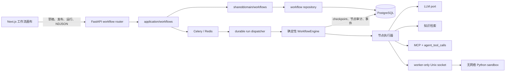

# NexaFlow 工作流方案设计

## 1. 目标与边界

工作流与 Agent 共用 `agents` 应用目录、工作空间权限、模型、知识库、MCP、持久运行、租约、事件和 Celery 基础设施，但使用独立的确定性图引擎。第一批交付包含：

- React Flow 画布编辑、后端强校验、乐观并发草稿保存；
- 草稿调试、节点状态回显、运行与节点审计；
- 不可变发布版本、版本列表、恢复为新草稿、指定版本运行；
- Start、End、LLM、Classifier、Knowledge、Condition、Template、Variable、MCP、Code 十类节点；
- Code 节点的独立、无网络、受资源限制的 Python 生产沙箱；
- Celery 持久执行、租约接管、deadline、步数与模型 token 预算、NDJSON 事件重放。

HITL 暂停/恢复、循环、迭代、子工作流、HTTP 请求和失败分支属于第二批。第一批节点失败的默认且唯一语义是立即中止整个运行；不提供隐式重试、兜底值或部分成功。

## 2. 三家对照与取舍

| 维度 | Dify / Graphon | Coze / eino | MaxKB | NexaFlow 取舍 |
| --- | --- | --- | --- | --- |
| 引擎 | 就绪队列；边 `UNKNOWN/TAKEN/SKIPPED`；自然 fan-out | DSL 编译 DAG；依赖就绪；goroutine | 轻量递归推进；全局线程池 | 采用 Dify 的边三态与就绪判定，用项目内纯 Python async 实现 |
| 定义 | React Flow JSON，草稿与发布版本 | YAML DSL、draft/version/snapshot | LogicFlow JSON，发布快照 | 采用 React Flow JSON，前后端同一图结构，不加转换 DSL |
| 运行 | Run + NodeExecution；事件丰富 | execution + node_execution；生命周期回调 | ChatRecord JSON 聚合 | 复用 `agent_runs`，新增 workflow detail 与独立节点审计表 |
| 版本 | 单草稿 + 不可变发布版本 | draft/commit/version/snapshot | 草稿 JSON + WorkFlowVersion | 单草稿、递增不可变版本、运行保存完整图快照 |
| 暂停 | 完整 runtime snapshot 后跨进程恢复 | interrupt event + 并发恢复锁 | 从历史节点详情重建 | 第二批采用 checkpoint + CAS 恢复锁；第一批不做半成品 |
| 调试 | 画布节点实时事件 | 调试台与调用树 | 对话调试，运行后看详情 | 画布发起草稿运行，NDJSON 回写节点状态并可查输入输出 |
| 风险 | 引擎成熟但较重 | Go/eino 与现有栈不一致 | 简单但缺少 durable recovery | 不搬用三方引擎代码，不引入 Go；复用现有 durable run |

核心选择：

1. 引擎主干采用 Dify/Graphon 的边三态与 fan-in 判定。其规则可以用纯函数表达，分支与汇聚不会依赖 LLM。
2. 借鉴 Coze 的节点生命周期和预算边界：节点开始、节点结束、运行终态均形成持久事件；deadline、步数、token 与输出大小由调度器硬判断。
3. 借鉴 MaxKB 的“画布 JSON 即执行定义”，避免维护第二套 DSL 映射；同时补足它缺少的租约、checkpoint 和独立节点审计。
4. 前端选择 `@xyflow/react`。项目已经是 React/Next.js，且图结构与 Dify 的 React Flow 契约一致；这是本次唯一新增运行依赖。后端和沙箱不新增第三方依赖。

## 3. 架构



分层遵循 `api -> application -> shareddomain/capabilities/infrastructure`。HTTP router 只负责依赖注入与 schema；仓储独占 ORM 写操作；引擎只依赖 schema 和纯类型，不导入 application 或具体 LLM/MCP 实现。

## 4. 确定性调度语义

保存、发布和运行前均执行以下校验：

- 节点、边 ID 唯一；恰好一个 Start 和一个 End；Start 无入边，End 无出边；
- 所有节点从 Start 可达且都可到达 End；禁止环；最多 200 节点、500 边；
- Condition 必须各有一条 `true`、`false` 出边；Classifier 每个 class 和 default 各一条出边；
- 每个节点配置用对应 Pydantic schema 强校验；变量引用只能指向拓扑上游；
- Knowledge 和 MCP 必须是应用已绑定资源，MCP 必须有当前 `read_only` 策略；节点指定模型必须存在且启用。

调度器维护节点状态 `PENDING/SUCCEEDED/SKIPPED/FAILED` 和边状态 `UNKNOWN/TAKEN/SKIPPED`：

- 节点无入边，或所有入边已知且至少一条 `TAKEN` 时就绪；
- 所有入边均为 `SKIPPED` 时节点跳过，并向下游传播 `SKIPPED`；
- 普通节点成功后所有出边 `TAKEN`；Condition/Classifier 仅选中 handle 的边 `TAKEN`，其余 `SKIPPED`；
- 同一就绪波次可并行执行，合并状态和持久化顺序按画布节点顺序固定；
- 任何节点失败都会写失败审计并终止运行；已在同一波次启动的兄弟节点允许完成并审计；
- 每节点结束后，同一事务写节点记录、引擎 checkpoint、运行详情和 durable event；租约丢失则拒绝写入。

运行硬限制为 100 个实际执行步骤、100,000 模型 token、全局运行 deadline、128 KiB 输入、256 KiB 单节点/最终输出。限制判定由代码完成，LLM 只参与 LLM 和 Classifier 节点。

## 5. 数据模型

### 5.1 复用表

| 表 | 工作流用途 |
| --- | --- |
| `agents` | 应用目录；`app_type='workflow'`；模型为 LLM/Classifier 默认模型；类型创建后不可变 |
| `agent_runs` | 运行主记录、状态、执行用户、租约、attempt、worker、checkpoint、trace、模型 usage、时间戳 |
| `agent_run_events` | 有序持久事件与断线重放游标 |
| `agent_tool_calls` | MCP 节点的参数/定义 hash、幂等键、租约与结果账本；不替代节点审计 |
| Agent 资源绑定表 | 工作流可用知识库和 MCP 工具白名单 |

工作流不复用 Agent 的 LangGraph `agent -> tool -> agent` 业务图，只复用它的持久执行外壳。

### 5.2 新表

```mermaid
erDiagram
    AGENTS ||--|| WORKFLOW_DEFINITIONS : "has draft"
    AGENTS ||--o{ WORKFLOW_VERSIONS : publishes
    WORKFLOW_DEFINITIONS ||--o{ WORKFLOW_VERSIONS : snapshots
    AGENT_RUNS ||--|| WORKFLOW_RUN_DETAILS : "workflow kind"
    WORKFLOW_DEFINITIONS ||--o{ WORKFLOW_RUN_DETAILS : traces
    WORKFLOW_VERSIONS o|--o{ WORKFLOW_RUN_DETAILS : "published source"
    AGENT_RUNS ||--o{ WORKFLOW_NODE_EXECUTIONS : audits

    WORKFLOW_DEFINITIONS {
      string id PK
      string workspace_id FK
      string agent_id FK_UK
      int revision
      json graph
      string graph_hash
      string updated_by_user_id
    }
    WORKFLOW_VERSIONS {
      string id PK
      string agent_id FK
      int version_number UK
      int definition_revision
      string default_model_id FK
      json graph
      string graph_hash
      string published_by_user_id
    }
    WORKFLOW_RUN_DETAILS {
      string run_id FK_UK
      string source
      int definition_revision
      int version_number
      string graph_hash
      json graph_snapshot
      json inputs
      json outputs
      datetime deadline_at
      int step_count
      int token_usage
    }
    WORKFLOW_NODE_EXECUTIONS {
      string run_id FK
      string node_id UK
      string node_type
      string status
      int sequence
      json inputs
      json outputs
      json model_usage
      string error
      int duration_ms
    }
```

一次运行始终保存 `definition_revision/version_number/graph_hash/graph_snapshot/inputs`，所以草稿后来修改或发布新版本都不会改变历史运行。

## 6. 节点目录

第一批节点是三家产品交集与 NexaFlow 现有能力的最小生产集合：

| 节点 | 输入与输出 | 选择依据 |
| --- | --- | --- |
| Start | 校验运行输入并输出命名字段 | 三家共同入口 |
| End | 把上游引用映射为运行最终输出 | 三家共同出口 |
| LLM | prompt/system/model -> `text` + usage | 三家核心生成节点 |
| Classifier | 输入/classes/default -> 选中 handle | Dify question classifier、Coze intent detector |
| Knowledge | query + 已绑定知识库 -> 检索结果 | 复用 NexaFlow RAG |
| Condition | 两值 + 确定性操作符 -> true/false | 三家分支基础 |
| Template | 引用模板 -> `text` | Dify template、MaxKB 变量引用 |
| Variable | 任意 JSON/引用 -> `value` | 三家变量能力 |
| MCP | 参数 + 已绑定只读工具 -> 工具输出 | 复用 MCP 策略与 durable ledger |
| Code | Python + JSON 输入 -> result/stdout/stderr | 三家均有代码/函数节点；使用独立沙箱 |

变量语法为 `{{node_id.path}}`。完整字符串引用保留原 JSON 类型，嵌入字符串时对象和数组序列化为紧凑 JSON。Start 会拒绝未知、缺失或类型错误的输入。

第二批再增加 Loop、Iteration、HITL、HTTP、Subworkflow。它们需要执行帧/迭代路径、暂停原因、恢复 CAS 或额外网络策略，不能仅添加一个卡片即宣称完成。

## 7. Code 生产沙箱

Code 节点只接受 JSON `inputs`，用户代码必须给 JSON 可序列化全局变量 `result` 赋值。worker 通过 `/run/sandbox/sandbox.sock` 发送单行 JSON；API 和 frontend 不挂载该 socket。

沙箱容器边界：

- `network_mode: none`、只读根文件系统、`/tmp` 为 32 MiB `noexec/nosuid/nodev`；
- 默认 capability 全删，仅 root supervisor 保留降权和清理子进程所需能力；`no-new-privileges`；
- 用户程序以 UID/GID 65532、隔离 Python 模式、最小环境运行；服务一次只执行一个同 UID 任务；
- 5 秒墙钟/CPU、256 MiB 地址空间、16 进程、64 文件描述符、1 MiB 单文件、stdout/stderr 各 64 KiB；
- 整个进程组在超时或输出超限时强制终止；请求只能降低、不能提高硬限制；
- 沙箱不可用、超时、超限、无 `result`、结果不是 JSON 时节点失败并中止工作流。

基础沙箱不提供包安装、网络、跨运行文件或解释器状态持久化。需要数据科学依赖或多租户高并发时，应采用每次运行独立容器/微虚机池，而不是放宽当前同容器边界。

## 8. API

基础前缀：`/api/v1/workspaces/{workspace_id}/workflows/{agent_id}`。

| Method | Path | 用途 |
| --- | --- | --- |
| GET | `/definition` | 读取草稿 |
| PUT | `/definition` | 用 `expected_revision` 乐观并发保存并校验 |
| POST | `/validate` | 不落库校验图与资源 |
| POST | `/publish` | 工作空间管理员发布不可变版本 |
| GET | `/versions` | 按版本号倒序列出版本 |
| POST | `/versions/{version_number}/restore` | 把版本复制为新的草稿 revision |
| POST | `/runs` | 创建 `draft` 或指定 `published` 版本运行 |
| GET | `/runs` | 查询当前用户的控制台运行 |
| GET | `/runs/{run_id}` | 查询运行快照与终态 |
| GET | `/runs/{run_id}/nodes` | 查询逐节点输入输出、耗时、usage、错误 |
| GET | `/runs/{run_id}/stream?after={sequence}` | NDJSON 快照、事件重放和终态 |

现有 `/agents/{id}/runs`、公开 Agent、Agent API credential 路由显式拒绝 workflow，避免类型串线。工作流运行目前通过工作空间认证接口创建；若后续开放外部生产调用，应单独定义 workflow credential、速率限制和公开响应脱敏，而不是复用 Agent 对话协议。

## 9. 运行事件时序

```mermaid
sequenceDiagram
    participant UI as "画布"
    participant API as "FastAPI"
    participant DB as "PostgreSQL"
    participant Q as "Celery"
    participant W as "Workflow worker"
    participant S as "Code sandbox"

    UI->>API: "PUT definition(expected_revision, graph)"
    API->>DB: "校验后 revision + 1"
    UI->>API: "POST runs(source=draft, inputs)"
    API->>DB: "agent_run + workflow_run_detail + graph snapshot"
    API->>Q: "enqueue durable run"
    Q->>W: "dispatch by workflow_run_detail"
    W->>DB: "CAS claim lease + attempt"
    loop "每个就绪波次"
      W->>DB: "workflow_node_started"
      alt "普通/模型/检索/MCP 节点"
        W->>W: "执行节点"
      else "Code 节点"
        W->>S: "Unix socket JSON request"
        S-->>W: "bounded JSON result"
      end
      W->>DB: "node audit + checkpoint + workflow_node event (one tx)"
      API-->>UI: "NDJSON event; update node status"
    end
    W->>DB: "finalize run + complete/error event"
    API-->>UI: "terminal run snapshot"
    UI->>API: "GET node executions"
```

Celery Beat 每 30 秒扫描 queued 或租约过期的 `agent_runs`，统一任务先检查 `workflow_run_details` 再分派到对应执行器。checkpoint 使接管者跳过已提交节点；MCP 节点额外依赖 `agent_tool_calls` 幂等账本。

## 10. 分阶段实施与验收

| 阶段 | 目标 | 验收标准 | 主要风险 | 回滚方式 |
| --- | --- | --- | --- | --- |
| 0 基础隔离 | 类型不可变、运行分派、Code 沙箱、部署依赖 | Agent 路由拒绝 workflow；沙箱无网络且资源自检通过；Beat 有 DB | 旧 worker 误接 workflow；沙箱权限不足 | 停止创建/运行 workflow；保留类型保护；停用 sandbox 服务 |
| 1 引擎与存储 | 图校验、三态调度、审计、租约/checkpoint | 引擎分支/汇聚/预算测试；迁移 fresh upgrade/downgrade/upgrade；API 运行落库 | checkpoint 重放、并行写顺序、历史图漂移 | 新表为加法迁移；无生产 workflow 数据时可 downgrade；已有数据时保留表和类型保护 |
| 2 画布与发布 | 10 节点编辑、草稿调试、状态回显、版本发布/恢复 | 三语 typecheck/test/build；发布快照与新草稿隔离；真实 API 冒烟 | React Flow 状态序列化、多人保存冲突 | 下线 workflow UI；API 与表保留只读，避免历史运行不可查 |
| 3 高级能力 | HITL、Loop/Iteration、失败分支/兜底、子流 | 暂停跨进程恢复；迭代帧审计；恢复 CAS；独立限额与测试 | 状态空间和副作用重放显著增加 | 每项用独立 schema/feature gate 发布，不改变第一批 DAG 语义 |

迁移回滚只能在确认没有需要保留的工作流定义、版本和运行审计后执行，因为 downgrade 会删除四张 workflow 表。生产已有数据时，正确回滚是退回 UI/运行入口并保留 additive schema 与类型隔离，而不是直接丢表。

## 11. 安全与运维注意事项

- worker、API、Beat 必须使用同一 PostgreSQL/Redis 配置；Beat 必须显式获得容器内 `DATABASE_URL`；
- 只有 worker 挂载 sandbox socket；沙箱不得接入 Compose 网络或业务数据卷；
- MCP 管理员仍具备项目既有的 worker 进程级 stdio 执行权限，工作流仅允许当前策略为 `read_only` 的工具；
- Redis 负责队列，不作为审计真源；运行、checkpoint、事件和节点记录均以 PostgreSQL 为准；
- 事件协议是 `application/x-ndjson`，不是 SSE。客户端用 `after` 游标重放，不依赖进程内内存；
- 当前 Alembic metadata 与历史数据库存在既有漂移，交付迁移以独立 PostgreSQL fresh upgrade/downgrade/upgrade 为准，不把无关全库漂移混入本功能。
