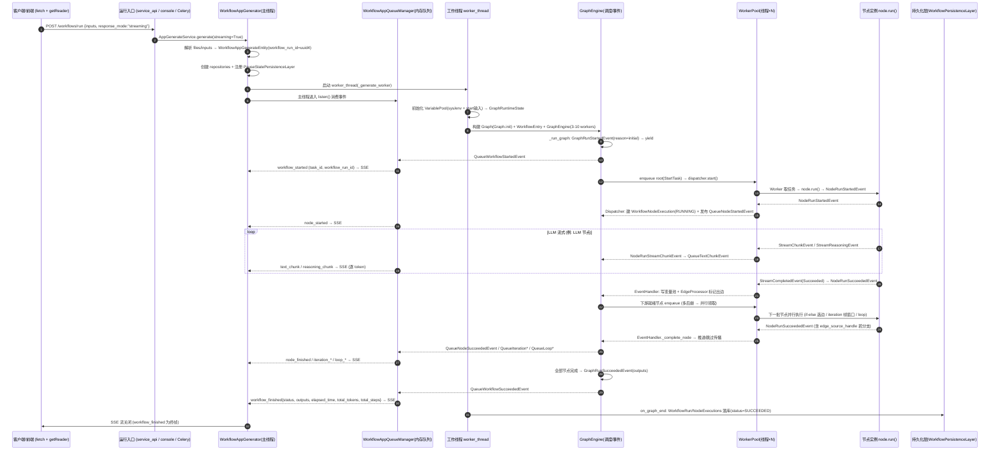
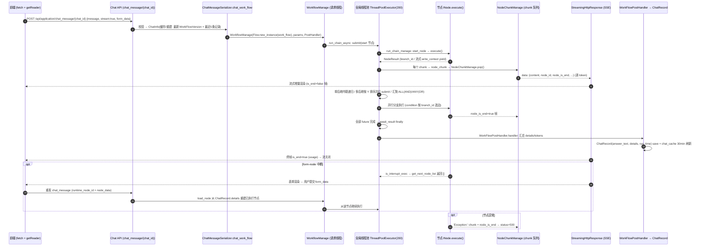
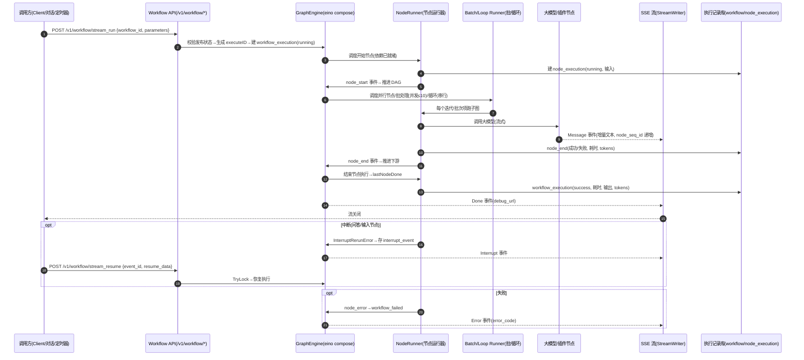

# Dify、Coze 与 MaxKB 工作流实现研究（前后端实现 + 运行时间流程）

> 调研时间：2026-08-12。范围：Dify、Coze、MaxKB（MaxKB 章节为后续补充调研，与另外两家同步固定 commit）。
> 调研目的：为 NexaFlow 自研工作流功能提供参考——前端编辑器怎么实现、工作流定义怎么存储、后端引擎怎么调度、前后端如何协作、一次运行从触发到结束的详细时间流程。
> 只使用官方文档与官方源码（固定 commit hash，避免主分支变化使结论失真）：
> - Dify 仓库（langgenius/dify）main HEAD：`bee269afe82990c96f9ca441cfbf1cac3afb0d3c`（2026-08-11，Dify API 1.16.1）
> - Dify 工作流执行引擎 = 外部开源包 **graphon==0.7.0**（`api/pyproject.toml` 声明），GitHub tag `v0.7.0` = `11e2dee8cbd6dc2e6bf1c2059d9bbf4d0437ebe5`。graphon 源码引用统一用 `https://github.com/langgenius/graphon/blob/11e2dee8cbd6dc2e6bf1c2059d9bbf4d0437ebe5/...`
> - Coze 开源后端 coze-studio（github.com/coze-dev/coze-studio，Apache-2.0，后端 Go 全量开源、前端闭源）：commit `fefb05ff27be1da939612fbf9faf5db62583b8ae`（2026-07-29）
> - MaxKB 仓库（1Panel-dev/MaxKB）main HEAD：`847755b1c2bba658a2062e0f47dd97fa8ae37247`（2025-08-19）；官方文档仓库 MaxKB-docs v1 分支：`966f0383b9e3be88f04fbf43626e4659fab5ca2d`
> - 无法从一手来源证实的内容一律标注 `[未证实]`。

## 结论（对照速览）

| 维度 | Dify | Coze | MaxKB |
|---|---|---|---|
| 执行引擎 | 外部包 **Graphon 0.7.0**（langgenius 自研通用图引擎，线程模型） | **CloudWeGo eino v0.4.8** 图框架（DSL 编译为 DAG，节点=Lambda，goroutine 模型） | **自研轻量图执行器**（Django 请求线程内 + 模块级全局线程池 `ThreadPoolExecutor(max_workers=200)`，`apps/application/flow/workflow_manage.py`） |
| 调度算法 | 就绪队列 + 节点/边三态（UNKNOWN/TAKEN/SKIPPED）+ 动态伸缩线程池（默认 min=3/max=10）；fan-in = 入边全已知且 ≥1 TAKEN | eino DAG：数据依赖全部就绪即调度；`GraphMultiBranch` 多目标分支并行启动 | 递归推进：单后继内联递归；**多后继按画布 Y 坐标排序后分别 submit → 并行分支**；汇聚用 `condition` ALL(AND)/ANY(OR) |
| 并行语义 | 「并行」不是节点类型，是 fan-out 的自然结果；迭代节点用 `parallel_nums` 容量窗口批处理（前端上限 10） | 多分支并行（eino）；批处理 = worker pool（默认并发 10、总次数默认 100 最大 200）；循环 = **严格串行** | 多出边即并行（全局 200 线程池，无按图隔离）；无批处理/循环/迭代节点 |
| 节点生命周期 | `node.run()` 生成器事件流：NodeRunStarted → StreamChunk → Succeeded/Failed；失败先重试（默认关闭）再按 error_strategy 三态（中止/兜底值/失败分支） | init → preProcess → onStart(落库) → invoke/stream（重试循环 + `context.WithTimeout`）→ postProcess → onEnd(落库)；失败三态（中断/返回设定内容/异常分支） | `INode.run()` 记 start_time → `execute()` 返回 NodeResult → `write_context` 写上下文（流式时逐 chunk yield）→ `get_details` 落库；**无超时、无重试、无失败策略**（异常 → status=500 + 'Exception:' chunk） |
| 流式 | 引擎事件 → 内存队列 → StreamResponse → SSE（text_chunk/reasoning_chunk/iteration_*/loop_* 等 20+ 事件） | SSE Message/Error/Done/Interrupt/PING；事件 id 从 0 递增防丢包，Message 带 node_seq_id/node_is_finish | 节点 chunk 队列 → `data: {json}\n\n` SSE；chunk 带 node_id/runtime_node_id/node_is_end/is_end/usage/reasoning_content；**无事件 id/序号**，前端靠 is_end 终止 |
| 暂停/恢复 | human-input → 整个 `GraphRuntimeState.dumps()` 快照存对象存储 + WorkflowPause 表 → Celery resume 从断点续跑（跨进程） | 中断（问答/输入/OAuth）→ interrupt_event 落库 → Interrupt 事件 → stream_resume + TryLock 恢复；无崩溃恢复 | form-node（表单收集）未提交即中断后续；表单提交时带 `chat_record_id + runtime_node_id + node_data` 重开，`load_node` 从 ChatRecord.details 重建已执行节点上下文后继续 |
| 运行记录 | WorkflowRun + WorkflowNodeExecution（大字段可 offload）+ WorkflowAppLog；Redis pub/sub inspector 双通道 | workflow_execution（每次运行一行）+ node_execution（每节点每轮一行，批/循环带 index）；输出保留 24h/结束节点 7 天 | 单表：**ChatRecord.details**（JSON，按 runtime_node_id 存每节点 index/run_time/status/tokens 等）；无独立运行级表 |
| 定义格式 | React Flow 风格 JSON（`{nodes:[{id,data}], edges:[{source,target,sourceHandle,targetHandle}]}`）存 `workflows.graph` 列 | YAML DSL（schema_version 1.0.0，nodes+edges+position；导出 ZIP） | LogicFlow 画布 JSON（`{nodes:[{id,type,x,y,properties}], edges:[{sourceNodeId,targetNodeId,sourceAnchorId,...}]}`）存 `Application.work_flow` JSON 列 |
| 版本化 | 每应用一个 draft 行（hash 冲突检测自动保存）+ 发布生成不可变版本 | workflow_draft（commit_id）+ 发布版本 + 提交版本；「加载到草稿」回退；嵌套引用版本必须一致 | 草稿 = `Application.work_flow`（PUT 应用保存，自动保存可开关、60s 间隔）；发布 = 校验后新建 `WorkFlowVersion` 快照（版本名=发布时间），运行永远取最新版本 |
| 前端编辑器 | **reactflow 11.11.4 + zustand**（Next.js，全开源可查） | 闭源 `[未证实]`；编辑体验：可视化画布、节点面板、子画布、试运行、调试台（调用树/火焰图） | **LogicFlow**（`@logicflow/core ^1.2.27` + extension）+ Vue 3 + Element Plus + Pinia；dagre 自动布局（@antv/layout）；调试 = 右侧 AiChat 对话 + 事后「执行详情」对话框（画布不实时高亮节点） |
| 崩溃恢复 | 仅暂停场景有快照恢复；同步路径断连可经 `GET /workflows/{run_id}/events` SSE 重连，运行仍在 worker 线程继续 | 无崩溃恢复（非持久执行引擎）；持久化的只是运行记录与中断事件 | 无（请求线程内执行，进程崩溃即运行丢失；运行中无持久状态） |

---

# 一、Dify 工作流实现

## 1. 产品定位与工作流形态

- **产品位置**：Dify 是低代码 AI 应用平台，工作流是其核心编排能力，用于构建两类应用（官方文档 [Workflow & Chatflow](https://docs.dify.ai/en/cloud/use-dify/build/workflow-chatflow.md)）：
  - **Workflow 应用**：一次调用从 start 跑到 end，无会话状态；以 User Input / Trigger 开头，以 Output（可选）结尾。
  - **Chatflow 应用**：带会话层（conversation/message），每次用户消息触发一次流程；以 User Input 开头，以 Answer 结尾。
  - 另有 **RAG Pipeline**（知识库流水线，`WorkflowType.RAG_PIPELINE`，源码 `api/models/workflow.py:116`）。
- 三种形态运行时共用同一套 Graphon 引擎，差别在应用入口层（`WorkflowAppGenerator` vs `AdvancedChatAppGenerator`，后者多出 conversation/message 实体与会话变量层，源码 `api/core/app/apps/advanced_chat/app_runner.py:61`）。
- **触发方式**（源码 `models/enums.py` 与文档 [Start Node](https://docs.dify.ai/en/cloud/use-dify/nodes/start.md)）：
  - 用户/API 调用（`WorkflowRunTriggeredFrom.APP_RUN / SERVICE_API / WEB_APP / EXPLORE / DEBUGGING`）。
  - 触发器节点（schedule 定时 / webhook / plugin 集成），见 `api/core/workflow/nodes/trigger_*`，异步路径经 Celery（`api/tasks/async_workflow_tasks.py`）执行。
- 每次运行产物：`WorkflowRun`（运行记录）+ 若干 `WorkflowNodeExecution`（节点执行记录）+ 可选 `WorkflowAppLog`（来源：api/models/workflow.py:761/940/1299）。

## 2. 架构与核心组件

### 2.1 Graphon 引擎内部结构（源码 graphon-0.7.0 `src/graphon/`）

**重要背景**：截至上述 commit，Dify 已把工作流执行引擎从仓库内 `api/core/workflow/graph_engine/`（旧版自研引擎）整体迁移为外部开源包 Graphon（同样 langgenius 出品）。仓库内 `api/core/workflow/` 只保留 Dify 侧的节点实现与集成层（`workflow_entry.py`、`node_factory.py`、`nodes/human_input|datasource|trigger_*|agent*|knowledge_*`）。

`GraphEngine`（`graph_engine/graph_engine.py`）是队列式执行引擎，构造时组合以下子系统：

| 组件 | 职责 | 源码 |
|---|---|---|
| `GraphStateManager` | 节点/边状态转移（UNKNOWN→TAKEN/SKIPPED）、就绪判定、unfinished 跟踪 | `graph_engine/graph_state_manager.py` |
| `ReadyQueue` | 就绪任务队列（`StartTask`/`ResumeTask`），支持 `dumps/loads` 序列化 | `graph_engine/ready_queue/` + `runtime/ready_queue.py` |
| `WorkerPool` + `Worker` | 线程池动态伸缩，Worker 从就绪队列取任务执行 `node.run()` | `graph_engine/worker_management/worker_pool.py`、`graph_engine/worker.py` |
| `Dispatcher` | 独立线程：消费 Worker 产出的事件队列，驱动 EventHandler/命令处理 | `graph_engine/orchestration/dispatcher.py` |
| `EventHandler` | 节点事件 → 图推进（写变量池、算下游、选分支、失败处理） | `graph_engine/event_management/event_handlers.py` |
| `EventManager` | 线程安全收集 + 增量发射事件（`emit_events()` 生成器），供外部流式消费 | `graph_engine/event_management/event_manager.py` |
| `EdgeProcessor` / `SkipPropagator` | 出边处理（分支选边）与 SKIPPED 状态递归传播 | `graph_engine/graph_traversal/` |
| `ErrorHandler` | 节点失败 → 重试/中止/失败分支/默认值 | `graph_engine/error_handler.py` |
| `CommandProcessor` + `CommandChannel` | 外部控制命令（Abort/Pause/UpdateVariables），Redis 通道支持跨进程 | `graph_engine/command_processing/`、`command_channels/` |
| `ContainerHandler`（Loop/Iteration） | 容器节点子图调度（每迭代/循环一个执行帧 frame） | `graph_engine/iteration_container_handler.py`、`loop_container_handler.py` |
| `GraphEngineLayer` | 引擎钩子（on_graph_start/on_event/on_node_run_start...），Dify 的扩展点 | `graph_engine/layers/base.py` |
| `GraphRuntimeState` | 运行时总状态：变量池、outputs、ready queue、graph execution、容器帧；`dumps()/from_snapshot()` 是暂停/恢复的序列化基础 | `runtime/graph_runtime_state.py` |

### 2.2 Dify 侧集成层（仓库内 `api/core/workflow/` 与 `api/core/app/`）

- **`WorkflowEntry`**（`api/core/workflow/workflow_entry.py:59`）：装配 GraphEngine。读取 `dify_config.GRAPH_ENGINE_*`（worker 池参数）、`WORKFLOW_MAX_EXECUTION_STEPS/TIME`（ExecutionLimitsLayer）、`WORKFLOW_CALL_MAX_DEPTH`（子工作流调用深度，默认 5）；挂 DebugLoggingLayer（DEBUG 模式）、LLMQuotaLayer、ObservabilityLayer（OTel）。`run()` 对引擎事件应用 `ResponseStreamFilter`（`filter_graph_events`，保持 Dify 响应流语义，含 `from_variable_selector` 透传）。
- **`DifyNodeFactory`**（`api/core/workflow/node_factory.py:284`）：节点注册表 = `graphon.nodes.*`（内置）+ `core.workflow.nodes.*`（Dify 特有：human-input、datasource、trigger-*、knowledge-*、agent v1/v2 的 Dify 侧实现），`__init_subclass__` 自动注册（`graphon/nodes/base/node.py:429` 附近，生产节点优先）。
- **`WorkflowAppRunner`**（`api/core/app/apps/workflow/app_runner.py:32`）：初始化变量池（系统变量 + 环境变量 + start 节点输入）→ 构建 `GraphRuntimeState` → 建 `WorkflowEntry` → 注册 `WorkflowPersistenceLayer`（运行/节点执行持久化 + inspector 发布）与 Agent workspace 回收层 → 消费 `workflow_entry.run()` 事件流。
- **`WorkflowAppGenerateTaskPipeline`**（`generate_task_pipeline.py`）：把 QueueEvent 转成对外 StreamResponse（SSE / blocking 聚合）。
- **执行线程模型**：`WorkflowAppGenerator._generate`（`app_generator.py:330`）把整次运行放入一个 **worker 线程**（`threading.Thread`），主请求线程从 `WorkflowAppQueueManager` 队列读事件；Graphon 内部还有 worker 线程池与 dispatcher 线程——即一次运行涉及 3 层线程。

### 2.3 数据模型与版本化（`api/models/workflow.py`）

- **`Workflow`**（:177，表 `workflows`）：`tenant_id/app_id/type/kind/version/graph/_features/_environment_variables/_conversation_variables/_rag_pipeline_variables`。`graph` 是整个画布 JSON（nodes+edges，含布局/编辑信息）；`version` = `"draft"`（每个 app 一个草稿）或发布版本号（`Workflow.version_from_datetime` 生成）。
- **`WorkflowRun`**（:761，表 `workflow_runs`）：`workflow_id/triggered_from/version/graph(快照)/inputs/status/outputs/error/elapsed_time/total_tokens/total_steps/created_at/finished_at/exceptions_count`。`status ∈ {running, succeeded, failed, stopped, partial-succeeded, paused}`（`graphon/enums.py:WorkflowExecutionStatus` 附完整状态机注释）。
- **`WorkflowNodeExecutionModel`**（:940，表 `workflow_node_executions`）：单节点执行的 inputs/process_data/outputs/elapsed_time/metadata；大字段支持 offload 到对象存储（`WorkflowNodeExecutionOffload`，:1190，`ExecutionOffLoadType.INPUTS/PROCESS_DATA/OUTPUTS`）。
- **`WorkflowPause`**（:2087，表 `workflow_pauses`）：`workflow_run_id`（唯一）→ `state_object_key`（GraphRuntimeState 快照的对象存储键）+ `resumed_at`；`WorkflowPauseReason`（:2155）记录暂停原因（HITL_REQUIRED / SCHEDULED_PAUSE）。
- **版本化**：发布 = `WorkflowService.publish_workflow` 把草稿复制为新版本 Workflow（不可变），并更新 `App.workflow_id` 指向新版本（`api/controllers/console/app/workflow.py:1255` 的 POST）；可 `GET /apps/{id}/workflows/publish` 取当前发布版本。运行时可指定 `workflow_id` 运行特定版本（`/workflows/<workflow_id>/run`）。

## 3. 节点模型

### 3.1 节点类型清单

**内置节点**（`graphon/enums.py:BuiltinNodeTypes`）：`start`、`end`、`answer`、`llm`、`knowledge-retrieval`、`if-else`、`code`、`template-transform`、`question-classifier`、`http-request`、`tool`、`datasource`、`variable-aggregator`、`variable-assigner(assigner)`、`loop`(+`loop-start/loop-end`)、`iteration`(+`iteration-start`)、`parameter-extractor`、`document-extractor`、`list-operator`、`agent`、`human-input`。

**Dify 特有节点**（`api/core/workflow/nodes/`，注册进同一 registry）：`knowledge-index`、`trigger-schedule`、`trigger-webhook`、`trigger-plugin`、`agent-v2`，以及 human-input/datasource/knowledge-retrieval 的 Dify 侧封装。

**节点执行类型**（`NodeExecutionType`，决定推进语义）：
- `EXECUTABLE`（普通节点，如 llm/code/http/tool）
- `RESPONSE`（end/answer：完成时 `merge_response_outputs` 写入运行 outputs）
- `BRANCH`（if-else/question-classifier：完成事件携带 `edge_source_handle`，只放行选中边、跳过其余）
- `CONTAINER`（loop/iteration：管理子图帧）
- `ROOT`（start/触发器：图入口，多根时非活动根整支 SKIPPED，`graph/graph.py:216 mark_inactive_root_branches`）

### 3.2 节点数据结构与序列化

运行期节点配置 = `NodeConfigDict = {id: str, data: BaseNodeData}`（`graphon/entities/graph_config.py`）。`BaseNodeData`（`graphon/entities/base_node_data.py`）公共字段：

```python
type: NodeType            # 节点类型
title: str; desc: str|None
version: str = "1"        # 节点版本，registry 按 (type, version) 解析
error_strategy: ErrorStrategy | None   # None | "fail-branch" | "default-value"
default_value: list[DefaultValue] | None  # 兜底值（type+value+key）
retry_config: RetryConfig  # max_retries=0, retry_interval(毫秒)=0, retry_enabled=False
```
具体节点用泛型 `Node[NodeDataT]` 声明自己的 `NodeData`（如 `LLMNodeData`），pydantic `extra="allow"` 兼容旧 DSL 多余字段。

### 3.3 变量引用与作用域

- **变量池 `VariablePool`**（`graphon/runtime/variable_pool.py`）：核心结构 `variable_dictionary[node_id][variable_name] -> Variable`；**selector = `[node_id, variable_name]` 两元素路径**。节点输出由 `_store_node_outputs` 写入 `[node_id, key]`。
- **特殊前缀命名空间**：`sys.*`（系统变量：`query/files/conversation_id/user_id/workflow_id/workflow_run_id` 等，`api/core/workflow/system_variables.py:22`）、`env.*`（环境变量，节点 id = `ENVIRONMENT_VARIABLE_NODE_ID`）、`conversation.*`（会话变量，Chatflow）、`rag.*`（RAG Pipeline）。start 节点输入在 `WorkflowAppRunner` 里 `add_node_inputs_to_pool` 注入 `[root_node_id, var]`。
- **作用域**：并行分支各自从同一变量池读写（可并发写不同 key）；**迭代/循环内每个迭代一个子帧（frame），子帧持变量池深拷贝**（`iteration_container_handler.py:_start_iteration_frame`），迭代内节点把输出写回子帧池，容器结束时按 `output_selector` 聚合（`_complete_iteration_step`）。迭代变量 `[iteration_node_id, "index"|"item"]`。
- 前端引用语法：`{{#node_id.variable#}}`（Jinja2 模板，`graphon/nodes/base/template.py`、`api/core/workflow/template_rendering.py`）；变量选择器映射由 `Node.extract_variable_selector_to_variable_mapping` 静态提取（`graphon/nodes/base/node.py:509` 附近）。

## 4. 执行引擎与调度

### 4.1 图数据结构与解析

`Graph`（`graphon/graph/graph.py`）：`nodes/edges/in_edges/out_edges/root_node`；边由 React Flow 风格 `{source, target, sourceHandle}` 构建（`Graph._build_edges`，edge id 自动生成）。`Graph.init(graph_config, node_factory, root_node_id)`：过滤 `custom-note` 编辑器注释节点 → 校验 → 建节点实例 → 把 `error_strategy=fail-branch` 节点提升为 BRANCH → 多根时标记非活动根分支 SKIPPED → 图结构校验（`graph/validation.py`）。

### 4.2 调度算法（就绪队列模型）

1. **入口**：`GraphEngine._start_execution` 把根节点（start）`enqueue_node`（状态 TAKEN + `StartTask` 入就绪队列），启动 WorkerPool 与 Dispatcher。
2. **Worker 循环**（`graph_engine/worker.py:run`）：从就绪队列取任务 → `node.run()` 生成器逐事件推入事件队列 → Dispatcher 线程处理。
3. **节点完成推进**（`EventHandler._complete_node`，`event_handlers.py:263`）：
   - 存 LLM usage、写节点输出到变量池；
   - 非分支节点：`EdgeProcessor.process_node_success` → **全部出边标记 TAKEN**（`GraphEdgeTakenEvent`）；
   - 分支节点：`handle_branch_completion(selected_handle)` → 选中边 TAKEN、未选中边经 `SkipPropagator` 递归 SKIPPED（`GraphEdgeSkippedEvent`）；
   - 每条被 TAKEN 的边检查下游：`is_node_ready(node)` = **所有入边状态已知（非 UNKNOWN）且至少一条 TAKEN**（`graph_state_manager.py:88`）→ 就绪则 `enqueue_node`。这就是 fan-in/join 语义：多分支汇聚节点等所有上游分支尘埃落定（含 SKIPPED 分支）才执行。
   - RESPONSE 节点（end/answer）完成时 `merge_response_outputs` 汇总到 `GraphRuntimeState.outputs`。
4. **并行**：多出边节点完成 → 多个下游同时就绪入队 → WorkerPool 并发领取执行。**「并行」不是节点类型，而是 fan-out 的自然结果**；文档 [Orchestration Logic](https://docs.dify.ai/en/cloud/use-dify/build/orchestrate-node.md) 亦表述为 "parallel: nodes run at the same time, they can't read each other's variables"。并发上限 = worker 池大小（非分支数）。
5. **终止**：`unfinished_nodes` 清空 → dispatcher 停 → `_emit_terminal_events`：paused → `GraphRunPausedEvent`；aborted → `GraphRunAbortedEvent`；`graph_execution.error` → 抛错（`GraphRunFailedEvent`）；`exceptions_count>0` → `GraphRunPartialSucceededEvent`；否则 `GraphRunSucceededEvent`（均携带 `outputs`）。

### 4.3 并发模型（线程，非 asyncio）

- `WorkerPool`（`worker_management/worker_pool.py`）：`threading.Thread` 池，按图规模定初始线程数（<10 节点=min；<50=min+1；否则 min+2），按队列积压动态伸缩（scale_up_threshold=0 即积压即扩，idle≥5s 缩容）；`GraphEngineConfig` 默认 min=1/max=5，**Dify 覆盖为 min=3/max=10**（`api/configs/feature/__init__.py:911`）。
- 无 asyncio：Worker 线程直接同步执行 `node.run()`（LLM 等阻塞调用在 worker 线程内发生）；事件收集用 `queue.Queue` + 读写锁；Dispatcher 单线程串行处理推进决策，保证图状态一致性。
- 命令通道（Abort/Pause/UpdateVariables）：默认内存 `InMemoryChannel`；Web 运行用 `CombinedCommandChannel(RedisChannel("workflow:{task_id}:commands"), CelerySignalChannel)`（`app_runner.py:206`），`/workflows/tasks/{task_id}/stop` 即 `GraphEngineManager(redis).send_stop_command(task_id)` 发 AbortCommand（`controllers/service_api/app/workflow.py:536`）。

### 4.4 批处理（迭代/循环容器）

- **Iteration**（`iteration_container_handler.py`）：迭代节点产出 `ContainerAwaitRequest`（含 items/indexes）→ `start_await` 按 **容量窗口** 批量调度：`active = scheduled_count - completed_count`，`capacity = parallel_nums - active`，每次请求 `range(scheduled_count, scheduled_count+capacity)` 的新迭代帧（子 `GraphRuntimeState`，深拷贝变量池 + `index/item` 变量）。每帧完成 → 聚合输出、记 `duration_map`（每迭代耗时）、`completed_count+1` → 继续窗口直至全部完成 → `ResumeTask` 唤醒容器节点输出结果。错误模式：`terminated`（整体失败）/ `continue-on-error`（失败项输出 null）/ `remove-abnormal-output`（失败项从输出剔除）。
- **Loop**（`loop_container_handler.py`）：类似，但按循环条件/次数推进（`loop_start/loop_end` 结构），循环变量输出聚合为 `loop_variable_map`。
- 文档语义：迭代并行模式 "up to 10 items simultaneously"（[Iteration](https://docs.dify.ai/en/cloud/use-dify/nodes/iteration.md)）——即 `parallel_nums` 前端上限 10；`node_run_steps` 全局累计每次节点运行。

### 4.5 流式机制

- 引擎层：`EventManager.collect`（写锁 append + notify layers）与 `emit_events()`（增量 yield，1ms 轮询直到 `mark_complete`）分离；`GraphEngine.run()` 是生成器，事件边产生边被 `WorkflowEntry.run()` 消费。
- Dify 层：`WorkflowAppRunner` 把每个 GraphEngineEvent 转为 QueueEvent 发布到 `WorkflowAppQueueManager`（内存队列，`PublishFrom.APPLICATION_MANAGER`）；主线程 pipeline 消费 → StreamResponse 生成器 → Flask `json_or_event_stream_response` 输出 `text/event-stream`。
- **LLM 流式**：`LLMNode._run`（`graphon/nodes/llm/node.py:209`）→ `_yield_run_completion` 透传 `StreamChunkEvent(selector=[node_id,"text"], chunk, is_final)` / `StreamReasoningEvent` / `ModelPollingProgressEvent` → 节点基类 dispatch 成 `NodeRunStreamChunkEvent/NodeRunReasoningChunkEvent` → runner 转 `QueueTextChunkEvent(from_variable_selector=selector)` / `QueueReasoningChunkEvent` → SSE `text_chunk` / `reasoning_chunk`。结束时发 `StreamChunkEvent(is_final=True)` + `StreamCompletedEvent`（Succeeded/Failed）。
- **partial streaming**：无独立机制——LLM 节点的 chunk 事件直接穿透引擎到达 SSE；非流式（blocking）模式下 pipeline 丢弃 chunk 只聚合终态。`ResponseStreamFilter` 保证响应顺序语义（text_chunk 相对节点事件的排序）。

## 前端实现与前后端协作

> Dify 前端开源（`web/`，Next.js），以下均来自 `web/` 源码（commit `bee269afe`）与官方文档。

### 1. 编辑器（画布）

- **画布库**：`reactflow@11.11.4`（React Flow v11 旧包名；`pnpm-workspace.yaml:232` 目录 catalog，`web/package.json:128` 声明 `reactflow: "catalog:"`）。入口 `web/app/components/workflow/index.tsx` 使用 `ReactFlow/Background/ReactFlowProvider/useNodesState/useEdgesState/useReactFlow` 等。状态管理：**zustand**（`web/app/components/workflow/store/`：`workflow-slice/node-slice/edge 交互`等）；`hooks-store` 用 zustand vanilla store 注入页面级动作。
- **节点渲染**：`web/app/components/workflow/nodes/<type>/`（start/end/answer/llm/code/if-else/iteration/loop/human-input/tool/http/…30+ 目录）+ `_base`（公共：`node-handle.tsx`、error-handle、retry 表单等）。候选节点拖拽：`candidate-node.tsx` / `block-selector`；自定义连线 `custom-connection-line.tsx`、自定义边 `custom-edge.tsx`（含动画状态）、边右键菜单 `edge-contextmenu.tsx`；注释节点 `note-node`（`custom-note`，后端过滤不执行）。
- **属性表单**：节点选中后右侧 `panel/`（`use-panel-interactions` + `form-input-item.tsx` 等公共表单组件；LLM 等节点有各自 panel 子目录），字段变化走 `use-node-data-update` → zustand 更新 node.data。
- **前端数据模型**（`web/app/components/workflow/types.ts`）：
  - `Node<T> = ReactFlowNode<CommonNodeType<T>>`；`CommonNodeType` 含 `title/desc/type(BlockEnum)/position/error_strategy/retry_config/default_value`，以及**下划线前缀的运行时瞬态字段**：`_runningStatus/_waitingRun/_iterationIndex/_loopIndex/_isCandidate` 等。
  - `Edge = ReactFlowEdge<CommonEdgeType>`；`CommonEdgeType` 含 `sourceType/targetType/_sourceRunningStatus/_targetRunningStatus`、`isInIteration/iteration_id`。
  - `ValueSelector = string[]`（`[nodeId, key...]`），与后端变量池 selector 一一对应。
  - `BlockEnum` 与后端 `BuiltinNodeTypes` 字符串一致（start/end/answer/llm/if-else/iteration/loop/…）。

### 2. 定义存储契约（草稿 vs 发布）

- **持久化结构**：`Workflow.graph` 列（LongText）存整份画布 JSON。真实形状（`graphon/graph/graph.py:init` 解析的输入）：
```json
{
  "nodes": [
    {"id": "start", "type": "custom", "width": 114, "height": 514,
     "data": {"type": "start", "title": "Start", "desc": "Start", "version": "1",
              "variables": [{"variable": "query", "label": "query", "required": true, "value_selector": []}]}},
    {"id": "llm_1", "type": "custom", "width": 320, "height": 800,
     "data": {"type": "llm", "title": "LLM", "version": "1", "prompt_template": [{"role": "user", "text": "{{#start.query#}}"}],
              "model": {"provider": "openai", "name": "gpt-4o"}, "error_strategy": null,
              "retry_config": {"retry_enabled": false, "max_retries": 0, "retry_interval": 0}}}
  ],
  "edges": [
    {"source": "start", "target": "llm_1", "sourceHandle": "source", "targetHandle": "target"}
  ],
  "viewport": {"x": 0, "y": 0, "zoom": 1}
}
```
（节点结构参照 `WorkflowEntry._create_single_node_graph` 与 `graphon/graph/graph.py` 解析逻辑；具体字段因节点而异。）`features`（应用设置）、`environment_variables`/`conversation_variables`/`rag_pipeline_variables` 为 Workflow 表独立 JSON 列。
- **保存草稿（前端自动保存）**：`web/service/workflow.ts:syncWorkflowDraft(url, {graph, features, conversation_variables, environment_variables, environment_variable_patch})` → `POST /apps/{app_id}/workflows/draft`（Chatflow 为 `/advanced-chat/workflows/draft`），body 为 JSON（支持 `text/plain` 兼容），返回 `{result, hash, updated_at}`（`api/controllers/console/app/workflow.py:565 DraftWorkflowApi.post`）。`hash` 是前端算的工作流内容哈希，后端 `sync_draft_workflow` 校验（`WorkflowHashNotEqualError` → 409 冲突，前端弹 `syncing-data-modal` 协同冲突处理）。`use-nodes-sync-draft.ts` 提供防抖自动保存；`syncWorkflowDraftWhenPageClose` 页面关闭兜底。
- **发布**：`use-workflow.ts:usePublishWorkflow` → `POST /apps/{app_id}/workflows/publish`（body `{marked_name, marked_comment}`）→ 后端 `publish_workflow` 复制草稿为不可变版本并更新 `App.workflow_id`（`api/controllers/console/app/workflow.py:1255`）。版本历史/回滚：`web/app/components/workflow/workflow-history-store.ts` + 后端 `workflow_runs` 相关接口（`use-workflow.ts:useDeleteWorkflow/useRestoreWorkflow`）。
- **前后端分工**：前端持有画布完整状态并负责 DSL 的编辑序列化（含布局/note 等仅编辑信息）；后端存原始 JSON、只对执行所需部分做语义化解析（graphon `Graph.init` 过滤 custom-note、按 `data.type` 解析节点），**不反向建模节点 schema**——节点字段校验在运行解析时由各 `NodeData` pydantic 模型完成。

### 3. 运行期协作（发起运行、流式消费、状态渲染）

- **发起调试运行**：`panel/debug-and-preview/hooks.ts` → `useWorkflowRun().handleRun(bodyParams, callbacks)` → `ssePost`（`web/service/base.ts:538`）`POST /apps/{id}/workflows/draft/run`（后端 `api/controllers/console/app/workflow.py:1128`，`streaming=True`）；正式运行走 Service API `POST /workflows/run`（`response_mode: streaming|blocking`）。停止：`POST .../workflows/tasks/{task_id}/stop`（双机制：legacy stop flag + Redis AbortCommand）。
- **SSE 消费**（`web/service/base.ts:handleStream`）：`fetch` → `response.body.getReader()` + `TextDecoder` 按行解析 `data: ` 前缀 JSON，按 `event` 字段分发回调。事件清单（`web/service/base.ts:380-423` + 官方 [Run Workflow](https://docs.dify.ai/en/api-reference/workflow-runs/run-workflow.md)）：

| event | 载荷要点 | 说明 |
|---|---|---|
| `ping` | 无 data | 保活，约每 10s，首帧即 ping |
| `workflow_started` | task_id, workflow_run_id, data{id, workflow_id, inputs, created_at, reason} | 运行被接受；reason=initial/resumption |
| `node_started` | data{id, node_id, node_type, title, index, created_at} | 节点开始（重试不重复发） |
| `node_finished` | data{..., status, inputs, process_data, outputs, elapsed_time, execution_metadata, error?} | 节点终态（succeeded/failed/exception） |
| `node_retry` | data{..., retry_index} | 节点进入重试 |
| `text_chunk` | data{text, from_variable_selector:[node_id,var]} | LLM 流式增量（含 Answer 节点聚合文本） |
| `reasoning_chunk` | data{reasoning, node_id, is_final} | 思考流 |
| `iteration_started/next/completed`、`loop_started/next/completed` | index/output/steps 等 | 容器进度 |
| `agent_log` | 工具/Agent 调用日志 | |
| `message` / `message_end` | answer 等 | Chatflow 的会话消息（先于 workflow_finished） |
| `human_input_required` / `human_input_form_filled` / `human_input_form_timeout` | form_token, form_id 等 | 暂停审批 |
| `workflow_finished` | data{status, outputs, error, elapsed_time, total_tokens, total_steps, created_at, finished_at, exceptions_count?} | 终态：succeeded / failed / stopped / partial-succeeded |
| `workflow_paused` | data{status: paused, paused_nodes, reasons} | 暂停（随 human_input_required 或调度暂停发出） |
| `error` | status/code/message | 流内错误（HTTP 仍 200） |

- **调试时节点状态渲染**（`debug-and-preview/hooks.ts:449-700`）：`onWorkflowStarted` → 置 `WorkflowRunningStatus.Running`；`onNodeStarted` → tracing 中该 node_id 条目 `status = NodeRunningStatus.Running`（不存在则 push）；`onNodeFinished` → 合并 data（status/耗时/outputs/error）；`onHumanInputRequired` → 该节点 `NodeRunningStatus.Paused`；`onWorkflowFinished/Paused` → 整体终态。运行结果面板 `run/status.tsx` 显示 SUCCESS/FAIL/PARTIAL SUCCESS/EXCEPTION/STOPPED/PAUSED/Running（`StatusDot` 绿/红/黄/蓝）与 `elapsed_time`（`run/node.tsx:getTime`：ms/s/m 格式化）、token 数；节点详情可展开 inputs/process_data/outputs，迭代/循环/重试/Agent 日志有独立详情抽屉。
- **画布节点实时状态**：`store/workflow-slice` 维护 `_runningStatus`（`NodeRunningStatus` 枚举：Running/Succeeded/Failed/Exception/Paused…），节点外壳组件（`nodes/_base/components/node-handle.tsx`）据此渲染高亮/图标；此外后端 `WorkflowPersistenceLayer` 通过 Redis pub/sub `dify:inspector:workflow_run:{run_id}`（`api/services/workflow/inspector_events.py`）推送 `node_changed/workflow_completed` 增量，SSE 端点 `/workflow/{runId}/events`（`debug-and-preview/hooks.ts:735`，`include_state_snapshot=true` 先回放已执行节点）驱动「节点输出检查器」实时面板——与主事件流双通道。
- **流式文本渲染**：`text_chunk` 累积到 `responseItem` 并实时渲染（`result-text.tsx`/`output-panel.tsx`），`reasoning_chunk` 渲染思考区；断线重连用 `stream-workflow-events`（`GET /workflows/{run_id}/events`，官方 [Stream Workflow Events](https://docs.dify.ai/en/api-reference/workflow-runs/stream-workflow-events.md)）。

## 5. 详细时间流程（一次运行从触发到结束）

### 5.1 运行生命周期总览（mermaid sequenceDiagram）

以下为**同步 Chatflow/Workflow 运行（streaming）**主路径（源码依据：`api/core/app/apps/workflow/app_generator.py`、`app_runner.py`、`workflow_app_runner.py`、`workflow_entry.py`、graphon `graph_engine.py`/`worker.py`/`event_handlers.py`；异步 Celery 路径差异见 5.2 阶段 8）。



暂停分支（human-input）：节点发 `PauseRequestedEvent` → `graph_execution.pause(reason)` + 引擎把该节点 StartTask 转入 deferred 队列 → `GraphRunPausedEvent` → `QueueWorkflowPausedEvent` + `human_input_required` → SSE 结束于 `workflow_paused`；`PauseStatePersistenceLayer` 把 `GraphRuntimeState.dumps()` 存对象存储 + 写 `WorkflowPause` 行。恢复：提交表单 → Celery `resume_workflow_execution`（`api/tasks/async_workflow_tasks.py:168`）→ `from_snapshot` 重建 → `generator.resume` → GraphEngine resume 模式（恢复容器帧、drain deferred 队列重新入队）→ 事件流从断点继续。

### 5.2 分阶段时序（源码为准，逐步列出「发生什么 / 谁执行 / 数据流向」）

#### 阶段 0：请求进入与运行实例创建（同步路径）
1. 客户端请求 `POST /workflows/run`（service_api，`api/controllers/service_api/app/workflow.py:326`）或 `/workflows/draft/run`（console 调试）或 Celery 触发（`api/tasks/async_workflow_tasks.py:execute_workflow_*`）。
2. `AppGenerateService.generate` → `WorkflowAppGenerator.generate`（`app_generator.py:115`）：解析 files（`file_factory.build_from_mappings`）→ `WorkflowAppConfigManager.get_app_config`（读发布版/草稿 Workflow + features）→ `_prepare_user_inputs`（按 start 变量定义做类型校验/默认值）→ 构造 `WorkflowAppGenerateEntity`，**`workflow_run_id = uuid4()`**（此后即持久化的 WorkflowRun.id）。
3. 创建仓储（`WorkflowExecutionRepository` / `WorkflowNodeExecutionRepository`，`DifyCoreRepositoryFactory`，默认 SQLAlchemy 实现，`api/configs/feature/__init__.py:RepositoryConfig`）；`triggered_from` = DEBUGGING（调试）/ APP_RUN（应用运行）/ 显式传入（异步触发器）。
4. `_generate`（`app_generator.py:330`）：注册 `PauseStatePersistenceLayer`（若给 pause config）→ `db.session.close()`（释放连接）→ **启动 worker_thread**（`threading.Thread`，携带 flask 上下文 contextvars）→ 主线程 `_handle_response` 从 `WorkflowAppQueueManager.listen()` 消费事件（生产者-消费者）。

#### 阶段 1：图加载与校验（worker 线程内）
5. `WorkflowAppRunner.run`（`app_runner.py:73`）：构建 `VariablePool`（`build_system_variables` 注入 sys.*；`build_bootstrap_variables` 注入 env.*；`add_node_inputs_to_pool` 把请求 inputs 注入 `[root_node_id, var]`）；`GraphRuntimeState(variable_pool, start_at=time.perf_counter())`。
6. `WorkflowEntry._init_graph` → `Graph.init(graph_config=workflow.graph_dict, node_factory=DifyNodeFactory, root_node_id)`：解析 nodes/edges、建节点实例、过滤 custom-note、fail-branch 提升、多根分支 SKIPPED 标记、结构校验（见 §4.1）。
7. 创建 `WorkflowEntry`：装配 `GraphEngine`（`GraphEngineConfig(min_workers=3, max_workers=10, scale_up_threshold=0, scale_down_idle_time=5)`）→ layer(ExecutionLimitsLayer(500 步, 1200s)) → layer(LLMQuotaLayer) → layer(WorkflowPersistenceLayer) → layer(ObservabilityLayer/其他) → layer(PauseStatePersistenceLayer)（`app_runner.py:170-215`）。

#### 阶段 2：引擎启动与根节点
8. `workflow_entry.run()` → `GraphEngine.run()`（`graph_engine/graph_engine.py:113`）：`_event_manager.reset()` → `_initialize_layers()`（各 layer `on_graph_start`）→ `graph_execution.start()`（非 resume）→ yield `GraphRunStartedEvent(reason=INITIAL)` → `_start_execution`：`state_manager.enqueue_node(root.id)`（TAKEN + StartTask 入就绪队列）→ `worker_pool.start()`（按节点数起 3~5 线程）→ `dispatcher.start()`（独立线程）。
9. `GraphRunStartedEvent` 经 runner → `QueueWorkflowStartedEvent` → pipeline `_handle_workflow_started_event`：**首次运行时写 `WorkflowAppLog`**（`_save_workflow_app_log`，DEBUGGER 不写）→ SSE `workflow_started`（含 task_id、workflow_run_id、reason）。

#### 阶段 3：节点执行生命周期（Worker 线程 + Dispatcher）
10. Worker 取 `StartTask` → `_execute_node` → `node.run()`（`graphon/nodes/base/node.py:662`）：
    - yield `NodeRunStartedEvent(id=execution_id, start_at=now)` → EventHandler：`get_or_create_node_execution`（`retry_count==0` 才对外收集，重试静默）、`increment_node_run_steps()`（全局步数 +1）→ `QueueNodeStartedEvent` → SSE `node_started`（`index` = 步序）。
    - 节点 `_run()` 执行（LLM 逐 chunk 流式 / HTTP 阻塞 / Code 运行沙箱 / 容器请求等）。
    - 结束：`NodeRunSucceededEvent` 或 `NodeRunFailedEvent`（含 `node_run_result: {inputs, process_data, outputs, metadata, llm_usage}`）。
11. Dispatcher `_dispatch_event`（`event_handlers.py`）：
    - **Succeeded**：`add_llm_usage` → `_store_node_outputs`（写变量池 `[node_id, key]`）→ 非分支：`process_node_success` 全部出边 TAKEN → 各下游 `is_node_ready`（入边全已知且 ≥1 TAKEN）→ `enqueue_node`（**多后继并行入队**）；分支：`handle_branch_completion(edge_source_handle)` 选中边 TAKEN + 未选中边 SkipPropagator 递归 SKIPPED → 选中边下游入队；RESPONSE 节点（end/answer）→ `merge_response_outputs`；`finish_execution`（从 unfinished 移除）→ `QueueNodeSucceededEvent` → SSE `node_finished`。
    - **Failed**：`ErrorHandler.handle_node_failure`（§6.1）→ 可能产出 `NodeRunRetryEvent`（re-enqueue，重试）或 `NodeRunExceptionEvent`（走错误策略）或 None（`graph_execution.fail`，整体失败）。
12. **持久化**（`WorkflowPersistenceLayer.on_event`）：`node_started` 写 WorkflowNodeExecution(RUNNING，`index` 递增、`in_iteration_id/in_loop_id` 元数据)；`node_retry` 写 RETRY 状态 + 重试历史（`retry_history` 累积到 process_data）；`node_finished` 写终态 + `elapsed_time` + inputs/process_data/outputs（`project_node_outputs_for_workflow_run` 投影；大字段 offload）；并 `publish_node_changed` 到 Redis pub/sub（inspector 通道）。

#### 阶段 4：分支、并行与批处理
13. **并行分支**：`if-else`/`question-classifier` 完成 → 单边放行；普通节点多出边 → 多下游同时就绪，WorkerPool 并发执行（无执行顺序保证）。汇聚点 fan-in：入边全部已知（TAKEN 或 SKIPPED）才执行（SKIPPED 分支的汇聚语义由 `is_node_ready` 保证——全部 SKIPPED 则节点也 SKIPPED，SkipPropagator 处理）。
14. **迭代**：Iteration 节点 `_run` 发 `IterationFrameRequest` → `IterationContainerHandler.start_await` 按 `parallel_nums` 容量窗口逐批创建子帧（每帧：变量池深拷贝 + `[node_id, index|item]`；共享根 ready queue 与 execution）→ 帧内节点正常调度 → 帧完成 `complete_frame` → 聚合 outputs/duration_map/usage → 窗口推进 → 全部完成发 `ResumeTask` 唤醒迭代节点输出（SSE `iteration_started/iteration_next/iteration_completed`）。
15. **循环**：Loop 容器类似，`loop-start/loop-end` 成对子图，按条件重复直至满足，输出聚合 `loop_variable_map`（SSE `loop_*`）。

#### 阶段 5：流式输出与中间结果
16. LLM chunk 事件 → `QueueTextChunkEvent(text, from_variable_selector)` → SSE `text_chunk`（前端按 selector 识别来源节点累积渲染）；`reasoning_chunk` 同理（`is_final:true` 标记思考结束）。Answer 节点（Chatflow）输出流式文本也会经 `QueueTextChunkEvent` 汇入 `message` 事件（`message` 的 answer 字段由 text_chunk 累积）。
17. 事件暴露的「中间结果」：`node_finished` 的 data 含 `outputs/process_data`（节点级）；运行级 outputs 只在终态 `workflow_finished` 暴露（来自 `GraphRuntimeState.outputs`，由 RESPONSE 节点与迭代 merge 累积）；`human_input_required` 携带表单内容。调试模式另有 `draft/variables` 检查器 API 读变量池。

#### 阶段 6：结束与输出
18. 所有节点完成（`unfinished_nodes` 空）→ dispatcher 停止 → `_emit_terminal_events`：无错误 → `GraphRunSucceededEvent(outputs=GraphRuntimeState.outputs)`（若有 `exceptions_count>0` → `GraphRunPartialSucceededEvent`）；错误 → 抛异常生成 `GraphRunFailedEvent`。
19. runner → `QueueWorkflowSucceededEvent/QueueWorkflowFailedEvent` → pipeline：`workflow_finished`（status、outputs、error、elapsed_time=perf_counter 差、total_tokens、total_steps、created_at、finished_at、exceptions_count）→ SSE 终帧，流关闭。blocking 模式聚合为 `WorkflowAppBlockingResponse` JSON。

#### 阶段 7：持久化与清理
20. `WorkflowPersistenceLayer`：`graph_run_succeeded/failed/aborted/paused` → 更新 WorkflowExecution（Run）状态、`outputs/error/elapsed_time/total_tokens/total_steps/exceptions_count/finished_at`（`_populate_completion_statistics`）→ 仓储 save；失败时把仍 RUNNING 的节点执行标记 FAILED（`_fail_running_node_executions`）→ 写 trace 任务（OTel）。
21. 引擎 `_stop_execution`：dispatcher.stop()（join 2s）、worker_pool.stop()（join 2s）、layers `on_graph_end`；`WorkflowAppGenerator._join_worker_thread` 等待 worker_thread 结束。异步路径（Celery）：`TriggerPostLayer` 更新 `WorkflowTriggerLog` 状态与耗时（`async_workflow_tasks.py:_execute_workflow_common`）。

#### 阶段 8（异步路径差异）：Celery + 时间片 + 触发日志
22. 触发器（schedule/webhook/plugin）→ `WorkflowTriggerLog` 保存 `trigger_data` JSON（含 inputs/root_node_id/trigger 元数据）→ Celery 任务（professional/team/sandbox 队列分档，`tasks/workflow_cfs_scheduler/`）→ `_execute_workflow_common`：重建 `TriggerData` → `WorkflowAppGenerator.generate(streaming=False, invoke_from=InvokeFrom.SERVICE_API, graph_engine_layers=[TriggerPostLayer, TimeSliceLayer])`。
23. `TimeSliceLayer`（时间片调度，`api/core/app/workflow/layers/`）：长任务按 `ASYNC_WORKFLOW_SCHEDULER_GRANULARITY` 切片暂停（`SchedulingPause`），Celery 定期 resume（`resume_workflow_execution`）——即异步路径的「崩溃/续跑」基础：每次暂停持久化快照，恢复时重建（源码 `async_workflow_tasks.py:168-247` 与 `api/tasks/workflow_execution_tasks.py` 相关实现；当前代码注释显示 HITL 发布后 TimeSliceLayer 重新启用）。`[未证实]`：TimeSliceLayer 当前默认启用状态与切片粒度默认值未逐一核对。

#### 阶段 9（Chatflow 差异）：conversation/message
24. `AdvancedChatAppRunner` 多出：加载 Conversation、创建/更新 Message（`QueueMessage*` 事件）、`conversation_variables` 从会话加载注入变量池（`ConversationVariablePersistenceLayer`，`api/core/app/layers/conversation_variable_persist_layer.py`）、结束后 `QueueAnnotationReplyEvent`（标注回复）等；SSE 事件在 workflow_* 之外附带 `message_start/message/agent_thought/message_end`（Chatflow 终态为 `message_end` 后接 `workflow_finished`）。

### 5.3 关键时间参数（默认值；出处或 [未证实]）

| 参数 | 默认值 | 出处 |
|---|---|---|
| 单次运行最大执行步数 `WORKFLOW_MAX_EXECUTION_STEPS` | **500** | `api/configs/feature/__init__.py:880`（ExecutionLimitsLayer 超限发 AbortCommand，`graphon/graph_engine/layers/execution_limits.py`） |
| 单次运行最大时长 `WORKFLOW_MAX_EXECUTION_TIME` | **1200 s (20 min)** | 同上 :890 |
| 嵌套工作流调用深度 `WORKFLOW_CALL_MAX_DEPTH` | **5** | 同上 :895（`WorkflowEntry.__init__` 校验） |
| GraphEngine worker 池 min/max | **3 / 10**（Dify 覆盖；graphon 默认 1/5） | :911/:916；graphon `graph_engine/config.py` |
| 扩缩容阈值 / 缩容空闲秒 | 0 / 5.0 s | :921/:926 |
| 节点重试 `retry_config` | `max_retries=0, retry_interval=0ms, retry_enabled=false`（默认不重试） | `graphon/entities/base_node_data.py:RetryConfig`；重试间隔为毫秒，失败时 `time.sleep(interval)` 后重入队（`error_handler.py:_handle_retry`） |
| 迭代并行数 `parallel_nums` | 前端上限 **10**（并行模式） | 文档 [Iteration](https://docs.dify.ai/en/cloud/use-dify/nodes/iteration.md)；引擎按该值开容量窗口（`iteration_container_handler.py:_request_iteration_frames`） |
| Human Input 表单超时 | 默认 **3 天** | 文档 [Human Input](https://docs.dify.ai/en/cloud/use-dify/nodes/human-input.md)；超时走节点 timeout 分支或结束；代码侧 `api/tasks/human_input_timeout_tasks.py` 存在对应定时任务 `[未证实]`：默认值 3 天的代码常量未逐一定位 |
| SSE ping 间隔 | 约 **10 s**（首帧即 ping） | 文档 [Consume Streaming](https://docs.dify.ai/en/api-reference/guides/streaming.md) |
| 单条执行路径节点数上限 | 50（编辑器约束） | 文档 [Orchestration Logic](https://docs.dify.ai/en/cloud/use-dify/build/orchestrate-node.md) |
| 变量大小上限 / Template 输出上限 | 200 KB / 400,000 字符 | `api/configs/feature/__init__.py:899/:903` |
| 调试并发提交线程数 `MAX_SUBMIT_COUNT` | 100 | 同上（WorkflowNodeExecutionConfig） |

## 6. 错误处理与边界

### 6.1 节点失败策略（源码 `graph_engine/error_handler.py` + 文档 [Handle Errors](https://docs.dify.ai/en/cloud/use-dify/build/predefined-error-handling-logic.md)）

失败事件 `NodeRunFailedEvent` → `ErrorHandler.handle_node_failure`：
1. **重试优先**：`node.retry and retry_count < retry_config.max_retries` → `time.sleep(retry_interval/1000)` → `NodeRunRetryEvent` → EventHandler `increment_retry()` + `enqueue_node` 重跑；重试期间 `NodeRunStartedEvent` 不对外发布（`retry_count==0` 才收集），`node_retry` SSE 事件仍发出（前端展示重试历史，`persistence.py:_append_retry_history`）。
2. 按 `error_strategy` 分发：
   - **None（默认）** → 中止：`_handle_abort` 返回 None → `graph_execution.fail(error)` → 整体 `GraphRunFailedEvent`（运行状态 failed，正在跑的节点标记 failed）。
   - **default-value** → `_handle_default_value`：产出 `NodeRunExceptionEvent`（outputs=默认值，`default_value_dict` 按类型校验），`EventHandler` 对 EXCEPTION 事件 `follow_branch=False` → 走**普通成功路径**推进下游，运行最终 `partial-succeeded`（`exceptions_count`+1）。
   - **fail-branch** → `_handle_fail_branch`：产出 `NodeRunExceptionEvent`，outputs 含 `{error_message, error_type}`，`follow_branch=True` → 节点被 `Graph.init` 提升为 BRANCH 类型，`edge_source_handle="fail-branch"` 放行失败分支、跳过成功分支（`graph/graph.py:_promote_fail_branch_nodes` + `event_handlers.py:NodeRunExceptionEvent` 分支）。
3. 容器内错误：迭代按 `error_handle_mode`（terminated/continue-on-error/remove-abnormal-output）处理（`iteration_container_handler.py:_complete_failed_iteration_frame`）；**Loop 遇子节点失败总是立即终止**（文档明确）。
4. 非节点级异常（引擎线程崩溃）→ `GraphEngine.run()` except → yield `GraphRunFailedEvent` + raise（`workflow_entry.run()` 捕获转成 GraphRunFailedEvent，不对外抛）。

### 6.2 整体失败 / 用户停止
- 停止：`POST /workflows/tasks/{task_id}/stop` → legacy stop flag（队列层，pipeline 遇 `QueueStopEvent` 输出 `workflow_finished{status:"stopped"}`）+ Redis AbortCommand（引擎层，`CommandProcessor` 处理 → `graph_execution.abort` → `GraphRunAbortedEvent` → runner 转 `QueueStopEvent(stopped_by=USER_MANUAL)`）。Celery 热关停：`CelerySignalCommandChannel` 发 Abort（`WORKFLOW_WARM_SHUTDOWN_ABORT_REASON`）。
- 限流/配额：`LLMQuotaLayer`（`api/core/app/workflow/layers/llm_quota.py`）在节点运行前检查租户配额；`ExecutionLimitsLayer` 超步数/超时发 AbortCommand（`LimitType.STEP_LIMIT/TIME_LIMIT`，abort reason 带 `step_limit/time_limit` 标记）。

### 6.3 崩溃恢复 / 暂停恢复
- **暂停**：human-input 节点 `PauseRequestedEvent` → `graph_execution.pause(reason)` + 节点自身任务 defer（`defer_ready_task(StartTask)`，暂停期间 `enqueue_ready_task` 一律转 deferred，`graph_runtime_state.py:enqueue_ready_task`）→ worker 排空后 `GraphRunPausedEvent` → `PauseStatePersistenceLayer` 调 `GraphRuntimeState.dumps()`（v2.0 快照：variable_pool / ready_queue / deferred_ready_tasks / graph_execution / container_runs / container_frames / graph_node_states / graph_edge_states / outputs / llm_usage / node_run_steps）→ 存对象存储，`WorkflowPause(workflow_run_id→state_object_key)` + `WorkflowPauseReason` 落库（`api/core/app/layers/pause_state_persist_layer.py` + `models/workflow.py:2087`）。
- **恢复**：表单提交 → `resume_workflow_execution`（Celery，`async_workflow_tasks.py:168`）：读 pause → `WorkflowResumptionContext.loads`（含 generate entity + serialized GraphRuntimeState + ResponseStreamFilter）→ `GraphRuntimeState.from_snapshot` → `generator.resume(...)` → `WorkflowAppRunner.run` 以 resume_state 分支构建（`app_runner.py:79`）→ `GraphEngine._run_graph`：`resume=True` 时恢复容器帧（`container_handlers[...].restore_frame`）、`track_unfinished`、drain deferred 队列重新入队 → `GraphRunStartedEvent(reason=RESUMPTION)` → 从断点继续。恢复后删除 `WorkflowPause` 记录。
- **同步路径崩溃**：进程内异常 → `GraphEngine.run()` finally `_stop_execution`（线程 join）+ 事件流以 `error`/`workflow_finished{failed}` 结束；已写入 DB 的运行记录停留在 running 状态（无自动补偿）——恢复仅针对「暂停」（有快照）的场景；同步请求断连可经 `stream-workflow-events` 重连（`GET /workflows/{run_id}/events?include_state_snapshot=true&continue_on_pause=true`，官方文档 [Stream Workflow Events](https://docs.dify.ai/en/api-reference/workflow-runs/stream-workflow-events.md)），运行仍在 worker 线程继续执行。

### 6.4 运行记录与可观测性
- `WorkflowRun`（运行级）+ `WorkflowNodeExecution`（节点级，含 elapsed_time/inputs/process_data/outputs/metadata/retry 历史）+ `WorkflowAppLog`（按调用来源记日志）+ `WorkflowArchiveLog`（归档）。
- 调试用：`/workflows/draft/variables` 检查器（变量池查询）、`/workflow/{runId}/events` SSE（inspector，Redis pub/sub `dify:inspector:workflow_run:{id}`）、运行历史面板（`web/app/components/workflow/workflow-history-store.ts`）。
- 生产：OTel `ObservabilityLayer`（`extensions/otel/`）、TraceManager（`TraceTaskName.WORKFLOW_TRACE`）、外部集成（Langfuse/LangSmith 等）。

---

# 二、MaxKB 工作流实现

> 调研时间：2026-08-12。来源：官方源码（固定 commit）+ 官方文档（MaxKB-docs v1 分支固定 commit）。
> 源码固定版本：1Panel-dev/MaxKB main HEAD `847755b1c2bba658a2062e0f47dd97fa8ae37247`（2025-08-19）；文档 MaxKB-docs v1 分支 `966f0383b9e3be88f04fbf43626e4659fab5ca2d`。
> **重要背景**：与 Dify（外部 graphon 引擎）、Coze（eino）不同，MaxKB 是**自研的轻量图执行器**：运行在 Django 请求线程内 + 模块级全局线程池；无独立引擎包、无运行级状态机、无节点级超时/重试、无定时/Webhook 触发。

## 1. 产品定位与工作流形态

- MaxKB（飞致云）是开源知识库问答平台，应用分两类（源码 `ApplicationTypeChoices`，[models/application.py](https://github.com/1Panel-dev/MaxKB/blob/847755b1c2bba658a2062e0f47dd97fa8ae37247/apps/application/models/application.py)）：**SIMPLE 简易应用**（单模型 + 知识库检索流水线，走 `PipelineManage`）与 **WORK_FLOW 工作流应用**（官方文档称「高级编排应用」）。[官方文档 高级编排应用](https://github.com/1Panel-dev/MaxKB-docs/blob/966f0383b9e3be88f04fbf43626e4659fab5ca2d/docs/user_manual/app/workflow_app_v1.md)
- 新创建的高级编排应用默认生成简易工作流（start → search-dataset → ai-chat → reply 的默认画布 JSON，`apps/application/flow/default/` 下 `default_workflow_zh.json`），自定义编排后点【发布】生效（文档：发布成功后所有节点配置修改才在问答页面生效）。
- **触发方式：仅对话触发**（页面聊天 / API `POST /api/application/chat_message/{chat_id}`）；无定时/Webhook 触发器。子应用节点（application-node）可嵌套调用其他应用（`child_node` 参数）。
- 每次运行产物：一条 `ChatRecord`（`details` JSON 列 = 全部节点运行详情，按 runtime_node_id 为键）+ `Chat` 会话行；无独立运行级表。

## 2. 架构与核心组件

### 2.1 核心模块（`apps/application/flow/`）

| 组件 | 职责 | 源码 |
|---|---|---|
| `Flow` / `Node` / `Edge` | 画布数据类；`Flow.new_instance(work_flow)` 从 JSON 反序列化；`is_valid()` 全图校验（开始/基本信息节点唯一、节点出边完整、条件分支必须连边、模型参数校验） | `workflow_manage.py` |
| `WorkflowManage` | 执行器：`run()` → `run_stream`（SSE）/ `run_block`；递归推进 `run_chain_manage`；节点上下文 `node_context`；变量引用解析 `reset_prompt`/`generate_prompt`；`get_next_node_list` 分支选边与 AND/OR 汇聚 | `workflow_manage.py` |
| `NodeChunkManage` | 流式 chunk 队列：各节点把 `to_stream_chunk_response` 产出压入自己的 `node_chunk`，`pop()` 按 FIFO 出队（含节点间 `\n\n` 分隔注入） | `workflow_manage.py` |
| `INode`（基类）+ `NodeResult` | 节点生命周期：`run()`（计时）→ `execute()` → `NodeResult`；`write_context` 写节点/全局上下文（流式逐 chunk yield）；`is_assertion_result()`（branch_id）与 `is_interrupt_exec()`（form-node 未提交） | `i_step_node.py` |
| `WorkFlowPostHandler` | 运行结束回调：汇总 details/tokens/answer_text_list → 写/更新 `ChatRecord` → `append_chat_record`（Chat 建行 + ChatRecord.save + chat_cache 30 分钟刷新） | `i_step_node.py` |
| `step_node/` | 每种节点一个包（start/ai_chat/search_dataset/condition/reply/question/form/function/application/variable_assign/mcp 等），实现 `execute()` + `get_details()` | `step_node/*` |

### 2.2 执行并发模型

- 模块级全局线程池 `executor = ThreadPoolExecutor(max_workers=200)`（`workflow_manage.py` 顶部）。`run_chain_async` 把 `run_chain_manage` 提交到线程池；**一次运行的链式推进分布在多个线程**（递归中单后继内联、多后继各自 submit）。
- 请求线程：`run_stream` 里 `tools.to_stream_response_simple(self.await_result())` 直接返回 `StreamingHttpResponse`——**SSE 生成器在请求线程内消费 chunk 队列**，节点执行在池线程。
- **无 Celery 工作流任务**：`apps/application/task/__init__.py` 为空，仅 `apps/common/job/clean_chat_job.py`（apscheduler）清理过期会话。

### 2.3 数据模型与版本化（`apps/application/models/application.py`）

- **`Application`**：`type`（SIMPLE/WORK_FLOW）、`work_flow` JSONField（**草稿**，整份画布）、`dataset_setting/model_setting` 等应用级 JSON 配置。
- **`WorkFlowVersion`**：`application_id + name + publish_user_id/name + work_flow`（发布快照）；版本名 = 发布时间字符串；`re_open_chat_work_flow` 取 `order_by('-create_time')` 最新一条，**运行永远用最新发布版本**。
- **`ChatRecord`**：`problem_text/answer_text/answer_text_list/details/message_tokens/answer_tokens/run_time/index`；`details` = 节点运行详情字典（`{runtime_node_id: {index, node_id, up_node_id_list, run_time, status, err_message, ...节点专属字段}}`）。
- 会话缓存：`chat_cache`（Django cache，30 分钟）存 `ChatInfo`（含应用、WorkFlowVersion、最近对话记录）；`re_open_chat_work_flow` 从 DB 恢复最近 5 条 ChatRecord + 最新 WorkFlowVersion。

### 2.4 发布流程（`ApplicationSerializer.Operate.publish`，[application_serializers.py:871](https://github.com/1Panel-dev/MaxKB/blob/847755b1c2bba658a2062e0f47dd97fa8ae37247/apps/application/serializers/application_serializers.py)）

`PUT /api/application/{application_id}/publish` body `{work_flow}` → 事务内：`Flow.new_instance(work_flow).is_valid()` 校验 → 从 base-node 回填应用名/描述/开场白 → 反向解析 search-dataset-node 更新知识库关联（`update_reverse_search_node` + `save_application_mapping`）→ `application.work_flow = work_flow` → 清 chat_cache → 新建 `WorkFlowVersion` 快照。**发布前不保存草稿**（发布即快照当前画布）。

## 3. 节点模型

### 3.1 节点类型（前端 [enums/workflow.ts](https://github.com/1Panel-dev/MaxKB/blob/847755b1c2bba658a2062e0f47dd97fa8ae37247/ui/src/enums/workflow.ts) + 官方文档「高级编排应用」）

| 类别 | type | 说明 |
|---|---|---|
| 基础 | `base-node`、`start-node` | 基本信息（应用名/描述/开场白）、开始（输入 `question`，全局变量 `globalFields` 如 `time`）；各应用唯一、不可删 |
| 模型类 | `ai-chat-node`（AI 对话）、`question-node`、`reranker-node`（多路召回） | 大模型对话/问题优化/重排 |
| 知识 | `search-dataset-node`（知识库检索）、`document-extract-node`（文档内容提取） | 检索引用数据集 |
| 逻辑 | `condition-node`（判断器，多分支）、`reply-node`（指定回复）、`form-node`（表单收集，可中断）、`variable-assign-node`（变量赋值）、`function-node`/`function-lib-node`（函数） | 分支/回复/收集/全局变量 |
| 子应用 | `application-node` | 调用其他应用（可嵌套） |
| 多模态 | `image-understand-node`、`image-generate-node`、`speech-to-text-node`、`text-to-speech-node` | 图片/语音 |
| 外部 | `mcp-node` | MCP 调用 |

结束节点集合（可无出边）：`ai-chat-node / reply-node / function-node / function-lib-node / application-node / image-understand-node / speech-to-text-node / text-to-speech-node / image-generate-node`（`workflow_manage.py end_nodes`）。

### 3.2 节点数据结构与序列化（LogicFlow 画布 JSON）

```json
{
  "nodes": [
    {"id": "start-node", "type": "start-node", "x": 430, "y": 3660,
     "properties": {"stepName": "开始", "height": 276,
       "config": {"fields": [{"label": "用户问题", "value": "question"}],
                  "globalFields": [{"label": "当前时间", "value": "time"}]},
       "node_data": {...}}},
    {"id": "b931efe5-...", "type": "ai-chat-node", "x": 680, "y": 3210,
     "properties": {"stepName": "AI 对话", "node_data": {"model_id": "...", "prompt": "{{开始.question}}", ...}}}
  ],
  "edges": [
    {"id": "7d0f166f-...", "type": "app-edge",
     "sourceNodeId": "start-node", "targetNodeId": "b931efe5-...",
     "sourceAnchorId": "start-node_right", "targetAnchorId": "b931efe5-..._left",
     "startPoint": {"x": 590, "y": 3660}, "endPoint": {"x": 680, "y": 3210},
     "pointsList": [{"x": 590, "y": 3660}, {"x": 700, "y": 3660}]}
  ]
}
```
（取自 `default_workflow_zh.json` 真实片段。）分支边锚点约定：`sourceAnchorId = "{nodeId}_{branch_id}_right"`——条件节点运行时按选中的 `branch_id` 匹配出边。

### 3.3 变量引用与作用域

- 提示词引用语法：`{{节点名称.变量名称}}`（文档），如 `{{开始.question}}`；运行期 `WorkflowManage.reset_prompt` 把「节点名.字段」文本替换为 `context.get('node_id').get('field')`，再经 Jinja2 `PromptTemplate` 渲染（`generate_prompt`，模板变量 `context` = 全部节点上下文 + `global`）。
- 全局变量：start-node 的 `config.globalFields` 定义（如 `time`），引用 `全局变量.xxx` 或 `global.xxx` → `context['global'][xxx]`；`form_data`（表单提交）也写入全局上下文。
- 作用域：节点只能引用**已执行过的上游节点**（前端 `get_up_node_field_list` 沿入边递归收集字段，后端 `get_node_by_id(node_id).context` 取不到即为空）；`get_reference_field('global', fields)` 取全局。
- 节点输出写入 `node.context`，全部节点上下文经 `get_workflow_content()` 汇总为 `{global: ..., node_id: context}` 供提示词渲染。

## 4. 执行引擎与调度

### 4.1 图数据结构与校验

`Flow.new_instance(work_flow)` 从画布 JSON 构造 `Node/Edge` 列表；`is_valid()`：模型参数校验 → 开始节点唯一 → 基本信息节点唯一 → 递归 `is_valid_work_flow`（每个节点有出边，除非是 end_nodes；条件节点每个分支必须连边）。前端 `WorkFlowInstance`（`ui/src/workflow/common/validate.ts`）在发布/调试前做**同构的前端校验**（开始/基本信息节点、DFS 连通、无孤立节点）。

### 4.2 调度算法（递归 + 线程池，无事件驱动）

1. `run()` → `run_stream`/`run_block` → `run_chain_async(start)`：把 `run_chain_manage` 提交全局线程池，future 记入 `future_list`。
2. `run_chain_manage`：start 节点实例化 → `append_node`（去重更新 node_context）→ `run_chain` → 若结果为 None 直接返回（节点失败/中断）；否则 `get_next_node_list(current_node, result)`：
   - **单后继**：内联递归 `run_chain_manage(node, None)`（同一线程继续）；
   - **多后继**：按 `node.y`（画布 Y 坐标）排序后，逐个 `executor.submit(run_chain_manage, node, None)` → **并行分支**（各分支独立线程，future 全部记入 future_list）；
   - 分支选边：`NodeResult.is_assertion_result()`（`branch_id in node_variable`）时只匹配 `sourceAnchorId == f"{node.id}_{branch_id}_right"` 的边；普通节点放行全部出边。
   - **汇聚（fan-in）**：下游节点 `properties.condition`（默认 `'AND'`）——`AND` 时 `dependent_node_been_executed` 要求所有上游节点都已执行且 `node_chunk.is_end()` 才入队；`ANY`（`'OR'`）时任一上游完成即可。文档称 ALL/ANY 执行条件（[执行条件](https://github.com/1Panel-dev/MaxKB-docs/blob/966f0383b9e3be88f04fbf43626e4659fab5ca2d/docs/user_manual/app/workflow_app_v1.md)）。
   - **中断**：`NodeResult.is_interrupt_exec`（form-node 且未提交表单）→ 返回空列表，链式推进停止（`get_next_node_list` 开头判断）。
3. 结束判定：`run_block` 用 `is_run(timeout=0.5)` 轮询 `future_list`（`concurrent.futures.wait`）；`run_stream` 的 `await_result()` 生成器边等 future 边从 `NodeChunkManage` 出队 chunk，`finally` 里等全部 future 完成后调用 `work_flow_post_handler.handler(...)` 落库并 yield 终帧。

### 4.3 节点执行生命周期

`INode.run()`：`context['start_time']=now` → `_run()` → `execute()`（节点实现，返回 `NodeResult(node_variable, workflow_variable, _write_context=...)`）→ `context['run_time']`。流式节点（AI 对话）用 `write_context_stream`：`chat_model.stream()` 逐 chunk `yield chunk.content`；非流式用 `write_context` 取 `response.content`。节点参数校验在 `valid_args`（DRF `node_params_serializer` + `flow_params_serializer` 强校验）。

`hand_event_node_result`（流式路径）把 `write_context` 的每个 yield 包装成 SSE chunk（`to_stream_chunk_response`，带 `node_type/runtime_node_id/view_type/node_is_end/real_node_id/reasoning_content/child_node`），`node_is_end: true` 帧标记该节点输出结束；异常时产出 `'Exception:' + str(e)` 帧 + `node_is_end`，`self.status = 500`，`get_write_error_context` 写错误上下文。

### 4.4 流式机制（SSE）

- chunk 序列化（`SystemToResponse.to_stream_chunk_response`，[system_to_response.py](https://github.com/1Panel-dev/MaxKB/blob/847755b1c2bba658a2062e0f47dd97fa8ae37247/apps/common/handle/impl/response/system_to_response.py)）：
```json
data: {"chat_id": "...", "chat_record_id": "...", "operate": true, "content": "增量文本",
       "node_id": "ai-chat-node-id", "up_node_id_list": [...], "is_end": false,
       "usage": {"completion_tokens": 0, "prompt_tokens": 0, "total_tokens": 0},
       "node_type": "ai-chat-node", "runtime_node_id": "...", "view_type": "many_view",
       "node_is_end": false, "real_node_id": "...", "reasoning_content": "", "child_node": {}}
```
- 终帧：`is_end: true`（含 usage 汇总）；`await_result` finally 里再发一帧空 content + is_end + usage 后流关闭（`tools.to_stream_response_simple` 包 `StreamingHttpResponse`）。
- 前端解析：`fetch` → `response.body.getReader()` + TextDecoder，缓冲拼接后用正则 `/data:.*}\n\n/g` 切分 chunk（处理 TCP 分包），`chunk.is_end` 终止（[ai-chat/index.vue](https://github.com/1Panel-dev/MaxKB/blob/847755b1c2bba658a2062e0f47dd97fa8ae37247/ui/src/components/ai-chat/index.vue)）；非流式响应（Content-Type 非 SSE）走 JSON 整包解析。

### 4.5 恢复/续跑（表单中断场景）

`chat_workflow` 接受可选 `chat_record_id + runtime_node_id + node_data`（表单提交/「换个答案」）：`WorkflowManage` 构造时 `load_node(chat_record, start_node_id, node_data)`——从既有 `ChatRecord.details`（按 index 排序）重建已执行节点（`get_node_cls_by_id` + `valid_args` + `save_context` 回填上下文 + `node_chunk.end()`），从指定 runtime_node_id 节点继续执行；子应用节点（application-node）的 `application_node_dict` 也从 details 恢复。`runtime_node_id = sha1(uuid5(排序后的 up_node_id_list + node_id))`，同一路径身份稳定，这是恢复的锚点。

## 前端实现与前后端协作

### 1. 编辑器（画布）

- **画布库：LogicFlow**（`@logicflow/core ^1.2.27` + `@logicflow/extension`，[ui/package.json](https://github.com/1Panel-dev/MaxKB/blob/847755b1c2bba658a2062e0f47dd97fa8ae37247/ui/package.json)）；技术栈 Vue 3 + Element Plus + Pinia。编辑器主组件 [ui/src/workflow/index.vue](https://github.com/1Panel-dev/MaxKB/blob/847755b1c2bba658a2062e0f47dd97fa8ae37247/ui/src/workflow/index.vue)：`new LogicFlow({plugins: [Dagre], grid, keyboard})`，`batchRegister([...nodes, AppEdge])` 注册全部节点 Vue 组件与自定义边 `app-edge`，`setDefaultEdgeType('app-edge')`；拖拽 `lf.dnd.startDrag`、`addNode` 从底部节点面板（`data.ts menuNodes`）添加。
- 节点渲染：`nodes/<type>/index.ts`（`import.meta.glob` 动态注册）+ `common/app-node.ts`（AppNode 包装：自动重名 stepName、`get_up_node_field_list` 沿入边递归收集可引用字段、`clear_next_node_field` 缓存失效、锚点样式）；`common/NodeContainer.vue` 提供节点外壳（重命名/复制/删除菜单、参数列表 `{value}` 复制、`node_status != 200` 错误横幅）。
- 自动布局：`plugins/dagre.ts` 用 `@antv/layout`（dagre）一键优化布局；`common/edge.ts` 自定义 `app-edge`（LogicFlow 边模型，含 pointsList 折线）。
- 前端数据模型 = LogicFlow `getGraphData()` 输出：`{nodes: [{id, type, x, y, properties}], edges: [{id, type:'app-edge', sourceNodeId, targetNodeId, sourceAnchorId, targetAnchorId, pointsList}]}`——**与后端存储/引擎输入完全同一份 JSON，无转换层**。
- 校验：`common/validate.ts` 的 `WorkFlowInstance`（前端同构实现后端 Flow.is_valid：start/base 唯一、DFS 连通、无孤立节点）。

### 2. 定义存储契约（草稿 vs 发布）

- **保存草稿**：`PUT /api/application/{application_id}` body `{work_flow: getGraphData()}`（`application-workflow/index.vue saveApplication`）；默认手动保存，开启自动保存后每 **60 秒**保存一次（`initInterval`，localStorage 开关）；离开页面有未保存改动时弹确认。
- **发布**：`PUT /api/application/{application_id}/publish` body `{work_flow}`——前端先 `validate()` + `WorkFlowInstance.is_valid()`，后端再 `Flow.new_instance(...).is_valid()`，通过后落 `Application.work_flow` 并新建 `WorkFlowVersion` 快照（版本名 = `YYYY-MM-DD HH:MM:SS`）；运行取最新版本。**无 hash 冲突检测**（多人编辑以最后保存为准）。
- **版本历史/恢复**：`PublishHistory.vue` 组件 + version 接口（`application_version_views.py`：列表/详情/改名）；查看历史版本 = `renderGraphData(item)` 把节点标 `noRender` 后渲染（只读预览），「加载到草稿」式恢复由加载历史版本后保存实现。
- 前后端分工：前端持有 LogicFlow 画布状态并整体序列化；后端存原始 JSON、运行时解析执行（Flow.new_instance），**同样不反向建模节点 schema**（节点字段由各 step 的 DRF serializer 在运行/校验时验证）。

### 3. 运行期协作（发起运行、流式消费、状态渲染）

- **发起**：调试页（`application-workflow/index.vue`）validate 后打开 AiChat 调试面板 → `openChatId()`（`POST /api/application/chat_workflow/open`，调试用「open 传任意图」路径）→ `postChatMessage(chat_id, {message, re_chat, form_data, image_list, ...})`（`POST /api/application/chat_message/{chat_id}`，[api/application.ts:189](https://github.com/1Panel-dev/MaxKB/blob/847755b1c2bba658a2062e0f47dd97fa8ae37247/ui/src/api/application.ts)）。正式问答页同接口（open 走 `chat/open`，应用已发布则用最新 WorkFlowVersion）。
- **SSE 消费**（`ai-chat/index.vue getWrite`）：`fetch` → `getReader()` → TextDecoder → 缓冲按 `/data:.*}\n\n/` 切分 → `JSON.parse` → `ChatManagement.appendChunk`（流式追加渲染）；`chunk.is_end` → 结束；`chat.chat_id/record_id` 从 chunk 回填。无心跳、无事件 id（断流只能整体失败重试）。
- **节点状态渲染**：运行中**画布不实时高亮节点**（无 node_status 回写 LogicFlow 的逻辑）；回答完成后「执行详情」对话框（`ExecutionDetailDialog.vue`）按 `ChatRecord.details` 展示每个节点的执行状态（status/err_message）、耗时（run_time）、输入输出（system/question/answer/tokens 等节点专属字段）——事后查看模式。
- **表单中断交互**：form-node 收集用户输入 → 工作流在表单节点处停止（`is_interrupt_exec`）→ 前端渲染表单（chunk 的 node_type=form-node 触发）→ 用户提交 → `chatMessage` 带 `form_data` + `node_id/runtime_node_id` 重发 → 后端 `load_node` 从该节点继续。

## 5. 详细时间流程（一次运行从触发到结束）

### 5.1 运行生命周期总览（mermaid sequenceDiagram）



### 5.2 分阶段时序（源码为准，逐步列出「发生什么 / 谁执行 / 数据流向」）

#### 阶段 0：请求进入与运行实例创建
1. `POST /api/application/chat_message/{chat_id}`（`chat_views.py`）→ `ChatMessageSerializer.chat`（[chat_message_serializers.py](https://github.com/1Panel-dev/MaxKB/blob/847755b1c2bba658a2062e0f47dd97fa8ae37247/apps/application/serializers/chat_message_serializers.py)）：校验 → `get_chat_info`（chat_cache 命中或用 `re_open_chat_work_flow` 重建：最新 WorkFlowVersion + 最近 5 条 ChatRecord）→ 按 `application.type` 分流：SIMPLE → `chat_simple`（PipelineManage 流水线）；WORK_FLOW → `chat_work_flow`。
2. `chat_work_flow`：`chat_record_id = uuid1()`（或复用传入记录）；构造 `WorkflowManage(Flow.new_instance(work_flow_version.work_flow), params{history_chat_record, question, stream, re_chat, ...}, WorkFlowPostHandler, base_to_response, form_data, image/document/audio/other_list, runtime_node_id, node_data, chat_record, child_node)`。
3. `work_flow_manage.run()` → `params['stream']` 为真走 `run_stream`。

#### 阶段 1：图加载与首节点（线程池内）
4. `run_chain_async(None, None)` → `executor.submit(run_chain_manage, None, None, language)`；future 入 `future_list`。
5. `run_chain_manage`：`get_start_node()`（type='start-node'）→ `get_node(type)(start_node, params, workflow)` 实例化 → `node_chunk_manage.add_node_chunk(start_node.node_chunk)` → `append_node` → `run_chain`。
6. `run_chain`：`run_node_future`（valid_args 校验节点/流程参数 → `run_node` = `node.run()`）→ 流式走 `hand_event_node_result`（消费 NodeResult 的 write_context 生成器）。

#### 阶段 2：节点执行生命周期
7. `INode.run()`：`context['start_time']=now` → `execute()`（如 ai-chat 节点：`generate_prompt` 渲染提示词 → `chat_model.stream/invoke`）→ 返回 `NodeResult`。
8. 流式：`write_context_stream` 逐 chunk `yield content` → `hand_event_node_result` 包成 SSE chunk（`to_stream_chunk_response`）→ `current_node.node_chunk.add_chunk`；结束后加 `node_is_end:true` 帧 → `node_chunk.end()`。
9. 非流式：`hand_node_result` 阻塞收集完整结果后 `write_context` 一次写入。

#### 阶段 3：分支、并行与汇聚
10. 节点完成 → `get_next_node_list(current_node, result)`：`is_assertion_result()`（condition-node 输出 branch_id）按 `{node_id}_{branch_id}_right` 锚点匹配唯一出边；普通节点放行全部出边。
11. 下游 `condition='AND'`（默认 ALL）：`dependent_node_been_executed` 检查所有上游已执行且 chunk 结束才推进；`'OR'`（ANY）：任一上游完成即推进。
12. 多后继：按 `node.y` 排序 → 每个 `executor.submit(run_chain_manage, node, None)` → 并行分支；`form-node` 未提交 → `is_interrupt_exec` → 返回空列表，链路停止。

#### 阶段 4：流式输出与 SSE 消费
13. 请求线程 `await_result()`：`is_run(timeout=0.5)` 轮询 futures，同时 `node_chunk_manage.pop()` 逐 chunk yield → `StreamingHttpResponse` 输出 `data: {json}\n\n`。
14. 前端 `getReader` + 正则切分 chunk → 追加渲染；`node_is_end` 帧驱动节点收尾 UI；`is_end:true` 终帧结束。

#### 阶段 5：结束与持久化
15. 全部 future 完成 → `await_result` finally：`work_flow_post_handler.handler(chat_id, chat_record_id, answer, workflow)` → `get_runtime_details`（node_context 逐个 `get_details(index)` 生成 `{runtime_node_id: {...}}`，含 index/node_id/up_node_id_list/run_time/status/tokens）→ `ChatRecord(answer_text, details, message_tokens, answer_tokens, answer_text_list, run_time, index)` → `append_chat_record`（Chat 行 upsert + ChatRecord.save + `chat_cache.set(chat_id, chat_info, timeout=60*30)`）。
16. 终帧：`data: {chat_id, chat_record_id, content:'', is_end:true, usage}` → 流关闭。

#### 阶段 6（失败路径）
17. 节点异常：`hand_event_node_result` catch → `'Exception:' + str(e)` chunk + `node_is_end:true` → `get_write_error_context`（status=500, answer_text=err）→ `run_chain_manage` 中 result=None 停止该链（并行分支中仅该分支停止，其余分支继续跑完）。
18. `run_block`（非流式）：轮询 `is_run()` 直到全部 future 完成 → 聚合 answer_text_list + tokens → `to_block_response`（status 200/500 由 self.status 决定）。

### 5.3 关键时间参数

| 参数 | 默认值 | 出处 |
|---|---|---|
| 全局线程池 | `ThreadPoolExecutor(max_workers=200)`（所有工作流/节点共享） | `workflow_manage.py` 模块级 executor |
| 会话缓存（chat_info） | 30 分钟（`chat_cache.set(timeout=60*30)`） | `chat_message_serializers.py` / `i_step_node.py` |
| 历史对话注入 | 最近 5 条 ChatRecord | `re_open_chat_work_flow` |
| 前端自动保存 | 手动（默认关）；开启后每 60s `PUT` 保存 | 文档「6 保存」+ `application-workflow/index.vue initInterval` |
| 节点/运行超时 | **无**（引擎层无 timeout/retry 代码） | `[未证实]` 模型供应商调用层超时未逐一核对 |
| 节点重试 | 无 | 同上 |
| future 轮询粒度 | `is_run(timeout=0.5)` / `await_result(timeout=1)` | `workflow_manage.py` |
| 对话记录字段上限 | problem_text ≤10240 / answer_text ≤40960 字符 | `append_chat_record` |

## 6. 错误处理与边界

### 6.1 节点失败
- 无重试、无兜底值、无失败分支策略（与 Dify/Coze 的三态策略不同）：异常 → 节点 status=500 + err_message + 流式 'Exception:' 帧；`run_chain_manage` 捕获后返回 None 停止该链。`Flow.is_valid` 在运行前做静态校验（模型存在/可用、边完整）。
- 分支并发下：单分支失败只终止该分支链路，`self.status=500` 会传导到最终响应码（block 模式 500）。

### 6.2 中断与恢复（表单）
- form-node 未提交 → `is_interrupt_exec` 中断后续节点；已执行节点上下文与部分输出落库（ChatRecord）。
- 恢复：用户提交表单 → 同一 chat 重发 `chat_message`（带 `runtime_node_id` + `node_data`/`form_data`）→ `load_node` 从 details 重建 → 从该节点继续，`form_data` 注入全局上下文。

### 6.3 崩溃/并发边界
- 无崩溃恢复、无运行级状态机：请求线程 + 池线程进程内执行，进程/线程异常即运行丢失（`close_old_connections` 仅处理 DB 连接复用）。
- 并发隔离弱：全局 200 线程池被所有租户/应用共享（无 per-run 隔离、无配额）；无运行取消 API（前端「停止」仅断开连接，后端仍会跑完）。
- 版本一致性问题：`re_open_chat_work_flow` 只取最新 WorkFlowVersion；若用户发布新版本，进行中的会话下一次消息即切换到新版本（无版本锁定）。

### 6.4 运行记录与可观测性
- 单表模式：ChatRecord.details（每节点 index/run_time/status/err_message + 节点专属字段如 system/question/answer/message_tokens/answer_tokens/branch_id）；ChatRecord.answer_text_list 分段答案；run_time 总耗时。
- 前端：执行详情对话框（ExecutionDetailDialog）、来源详情（`getRecordDetail` 回填展示）；日志页复用 ChatRecord 数据。

> 注：MaxKB 的「对 NexaFlow 的启示」与完整来源清单已并入本文第五、六章。

---

# 三、Coze（扣子）工作流实现

## 1. 产品定位与工作流形态

- Coze 中「低代码工作流」是扣子编程（低代码开发平台）的核心能力：**工作流（Workflow）处理功能类请求、顺序执行节点；对话流（Chatflow）是基于会话的特殊工作流**，可读取/写入会话历史，支持角色配置、发布到社交渠道；两者可互转（工作流转对话流后开始节点会加 `USER_INPUT`、`CONVERSATION_NAME` 预置参数）。来源：[工作流与对话流](https://docs.coze.cn/guides_workflow_and_chatflow)。
- 工作流的存放与使用形态：
  - **资源库工作流**：独立存在于工作空间资源库，可发布版本、可被智能体/应用引用、可批量/异步执行；
  - **应用工作流**：属于低代码应用（可携带 UI），可发布到 API&SDK、小程序、社交渠道等；
  - **智能体绑定工作流**：智能体自动按人设描述调用，始终使用最新发布版本。
  来源：[使用低代码工作流](https://docs.coze.cn/guides_use_workflow)、[管理低代码工作流版本](https://docs.coze.cn/guides_workflow_version)。
- 触发方式（官方支持全集）：
  1. **对话触发**：智能体在对话中调用绑定的工作流（模型根据人设自动填参，缺少必选参数则不触发）；
  2. **OpenAPI 触发**：`POST /v1/workflow/run`（同步/异步）、`POST /v1/workflow/stream_run`（流式）、`POST /v1/workflow/stream_resume`（恢复）；
  3. **定时触发（Cron）**：低代码应用的预设触发器（开发者设置，开始节点触发器页签）与用户触发器（`设置定时触发器节点`，按用户+时区生效）——仅限低代码应用，含触发器节点的工作流不能进智能体；
  4. **事件触发**：文档明确「低代码应用触发器目前仅支持定时触发，事件触发需在 UI 绑定按钮调用工作流」（即无独立 Webhook 触发节点）；HTTP 回调类需求通过 HTTP 请求节点/插件实现。
  来源：[为应用设置触发器](https://docs.coze.cn/guides_set_trigger_for_app)、[设置定时触发器节点](https://docs.coze.cn/guides_set_timed_trigger)、[执行工作流](https://docs.coze.cn/developer_guides/workflow_run)。

## 2. 架构与核心组件

### 2.1 开源后端分层（coze-studio，commit `fefb05ff`）

| 层 | 目录 | 职责 |
|---|---|---|
| API 层 | `backend/api/handler/coze/workflow_service.go` | `/v1/workflow/run`、`/v1/workflow/stream_run`、`/v1/workflow/stream_resume`、`/v1/workflow/get_run_history` 的 HTTP 入口；SSE 序列化 |
| 应用层 | `backend/application/workflow/workflow.go` | OpenAPI 请求→内部 `WorkflowRunner`，内部 `entity.Message` → OpenAPI 流式事件转换 |
| 领域层 | `backend/domain/workflow/` | 工作流实体、Schema、执行引擎（compose/execute/nodes/repo/schema/canvas） |
| 执行引擎 | `internal/compose` | 将 `WorkflowSchema` 编译为 eino 图（`NewWorkflow`→`Compile`→Runnable），节点运行器 `node_runner` |
| 执行上下文/事件 | `internal/execute` | `Context`（Root/SubWorkflow/Node/Batch 四级上下文）、`Event`（workflow_start/success/failed/cancel/interrupt/resume、node_start/end/error/streaming…）、`StreamContainer`、`TokenCollector` |
| 节点实现 | `internal/nodes/*` | 每种节点一个包（llm、code、plugin、selector、intentdetector、batch、loop、variableaggregator、httprequester、database、knowledge、qa、receiver 等） |
| 持久化 | `internal/repo` | `workflow_execution`、`node_execution`（MySQL/GORM）、中断事件、取消标志（Redis）、执行历史 |

来源：[仓库目录树](https://github.com/coze-dev/coze-studio/tree/fefb05ff27be1da939612fbf9faf5db62583b8ae/backend/domain/workflow)。

### 2.2 运行入口与三层 Runner

`WorkflowRunner`（`internal/compose/workflow_run.go`）是核心门面，`Prepare()` 做四件事：生成/复用 `executeID` → 创建 `workflow_execution` 记录（running）→ 起事件处理 goroutine（`HandleExecuteEvent`）→ 返回 `cancelCtx` 与 eino compose 选项。中断恢复路径（`resumeReq`）先取回 `interrupt_event`，用 `TryLockWorkflowExecution`（WHERE status=interrupted AND resume_event_id=0 → 置为 running）做并发防重入锁。整体超时（同步/异步）在 `Prepare` 用 `context.WithTimeout` 注入；开源版 `execute/consts.go` 中 `foregroundRunTimeout`、`backgroundRunTimeout` 常量均为 0（无限制），**云端超时（10 分钟/24 小时）是云构建时注入的配置** `[未证实具体注入方式]`。

`Workflow`（`internal/compose/workflow.go`）负责建图：`AddNode` 按 `resolveDependencies` 解析每个节点的输入引用（`node_inputs[].value.ref_node + path`）为 eino `FieldMapping` 数据边；`Compile()` 把 entry 节点接 `START`、exit 节点设为终止点；`SyncRun` = `Runner.Invoke`。

图节点用 `compose.AnyLambda(invoke/stream/collect/transform)` 包装，`WithLambdaCallbackEnable(true)` 开启回调 → 回调经 `node_runner` 的 `onStart/onEnd/onError` 发布事件。

来源：[workflow_run.go](https://github.com/coze-dev/coze-studio/blob/fefb05ff27be1da939612fbf9faf5db62583b8ae/backend/domain/workflow/internal/compose/workflow_run.go)、[workflow.go](https://github.com/coze-dev/coze-studio/blob/fefb05ff27be1da939612fbf9faf5db62583b8ae/backend/domain/workflow/internal/compose/workflow.go)、[consts.go](https://github.com/coze-dev/coze-studio/blob/fefb05ff27be1da939612fbf9faf5db62583b8ae/backend/domain/workflow/internal/execute/consts.go)。

### 2.3 工作流定义的数据模型与版本化

- **定义序列化 = YAML DSL（schema_version 1.0.0）**，导出的 ZIP 内含 `MANIFEST.yml` + `workflow/<名称>.yaml`。DSL 顶层字段：`schema_version / name / id / description / mode / icon / nodes[] / edges[]`；`nodes[].parameters` 含 `node_inputs`、`node_outputs`、`batch`（批处理配置）、`settingOnError`（异常处理）；`edges[]` 为 `source_node / target_node / source_port`（分支端口：`default`、`branch_error`、`branch_N`）。节点有 `position.x/y`（画布坐标，初始虚拟画布 1512×644 px，原点左上），循环/批处理节点带 `canvasPosition`（子画布）。来源：[导入与导出低代码工作流（DSL 结构）](https://docs.coze.cn/guides_import_and_export_workflow)。
- **版本化**：资源库工作流「发布」时生成一个新的**发布版本 + 提交版本**（内容与时间一致，version 号由开发者设定）；版本列表按时间倒序（版本号/描述/操作者/发布时间），可「加载到草稿」回退；智能体始终引用最新版本，低代码应用内的引用固定版本（需手动升级，且必须升级到最新版）；嵌套引用同一子工作流必须版本一致，否则运行报「工作流的版本号冲突」。来源：[管理低代码工作流版本](https://docs.coze.cn/guides_workflow_version)。
- 底层表：`workflow_meta`（元信息）、`workflow_draft`（草稿）、`workflow_version`（版本）、`workflow_snapshot`（执行快照，`CreateSnapshotIfNeeded` 在 WorkflowStart 时触发）、`workflow_execution`/`node_execution`（运行记录）。来源：[repo/dal/model 目录](https://github.com/coze-dev/coze-studio/tree/fefb05ff27be1da939612fbf9faf5db62583b8ae/backend/domain/workflow/internal/repo/dal/model)。

## 3. 节点模型

### 3.1 节点类型全集（DSL `type` 枚举，44 种，来源：[导入导出文档 nodes 字段](https://docs.coze.cn/guides_import_and_export_workflow)）

| 类别 | type 枚举 |
|---|---|
| 起止/输入输出 | `start`、`end`、`input`（输入/中断收集）、`output`（输出节点）、`message` 系列（`message_create/update/delete/list`） |
| 模型类 | `llm`（大模型）、`intent`（意图识别）、`question`（问答/中断） |
| 业务逻辑 | `code`、`condition`（选择器/if-else）、`loop`（循环）、`batch`（批处理）、`variable_merge`（变量聚合）、`variable_assign`（设置变量，仅循环体）、`asynchronous_task`（异步任务）、`http`、`text`（文本处理）、`to_json`/`from_json` |
| 数据/知识 | `database`（SQL 自定义）、`insert_database/select_database/update_database/delete_database`、`knowledge`（知识库检索）、`dataset_write/dataset_delete`、`ltm/ltm_write/ltm_read`（长期记忆）、`variable`（变量节点） |
| 插件/子流 | `plugin`、`subflow`（工作流节点） |
| 多模态 | `image_generate`、`drawing_board`、`video_generation`、`video_audio_extractor`、`video_frame_extractor` |
| 会话 | `conversation_create/update/delete/list`、`conversation_history_list`、`conversation_clear` |
| 触发器（仅应用内） | 定时触发器节点组（设置/查询/删除） |
| 注释 | `comment`（slate 富文本备注，不出现在执行图） |

说明：`异步任务节点`、`设置/查询/删除定时触发器节点` 在文档节点分组中独立列出（触发器节点仅限低代码应用使用，见 [设置定时触发器节点](https://docs.coze.cn/guides_set_timed_trigger)）。

### 3.2 节点数据结构（源码：`internal/schema/node_schema.go` 与 `internal/nodes/node.go`）

节点编译后为 `schema.NodeSchema`：`Key/Type/Name/Configs` + `InputTypes`（输入类型表）+ `InputSources`（每个输入来自哪个上游节点的哪个字段，即 FieldMapping）+ `OutputSources`（输出定义）+ `Branch`（出边分支）。每个节点实现 eino 接口之一：`InvokableNodeWOpt`（同步执行）/ `StreamableNodeWOpt`（流式执行）/ `CollectableNodeWOpt` / `TransformableNodeWOpt`；另有可选接口 `Initializer`（init 钩子）、`CallbackInputConverted`/`CallbackOutputConverted`（结构化回调输入/输出，供调试与落库）。来源：[node.go](https://github.com/coze-dev/coze-studio/blob/fefb05ff27be1da939612fbf9faf5db62583b8ae/backend/domain/workflow/internal/nodes/node.go)、[workflow_schema.go](https://github.com/coze-dev/coze-studio/blob/fefb05ff27be1da939612fbf9faf5db62583b8ae/backend/domain/workflow/internal/schema/workflow_schema.go)。

### 3.3 变量引用与作用域

- 引用语法：提示词/参数值中用 `{{变量名}}`；`{{变量名.子变量名}}` 取 JSON 子字段；`{{变量名[数组索引]}}` 取数组元素（来源：[大模型节点](https://docs.coze.cn/guides_llm_node)）。
- 运行时引用解析：DSL 中每个输入 `value: {ref_node, path}` 被 `resolveDependencies` 转成对上游节点输出的字段映射；**若引用路径中间某层是数组，自动取第一个元素（arrayDrillDown，`a.b[0].c` 语义）**，只有路径末层是数组才保留数组（[workflow.go arrayDrillDown](https://github.com/coze-dev/coze-studio/blob/fefb05ff27be1da939612fbf9faf5db62583b8ae/backend/domain/workflow/internal/compose/workflow.go)）。
- 作用域：
  - 普通节点：只能引用**直接或间接上游**节点的输出（无上游则不显示参数，文档 FAQ「设置参数时显示暂无数据」）；跨分支引用是禁止的（变量聚合节点即为此设计）。
  - 循环/批处理节点：子画布（批处理体/循环体）内通过 `节点key#item`、`节点key#index` 内置变量取当前元素/索引，仅限子画布内部；循环中间变量（`IntermediateVars`）跨迭代存活（[loop.go Adapt](https://github.com/coze-dev/coze-studio/blob/fefb05ff27be1da939612fbf9faf5db62583b8ae/backend/domain/workflow/internal/nodes/loop/loop.go)）。
  - 应用级变量（`AppVariables`）挂在执行 Context 上（[context.go](https://github.com/coze-dev/coze-studio/blob/fefb05ff27be1da939612fbf9faf5db62583b8ae/backend/domain/workflow/internal/execute/context.go)）。
- 数据类型：string/integer/number/boolean/time/object/array/file/image/svg/audio/video/voice/doc/ppt/excel/txt/code/zip（[导入导出文档数据类型](https://docs.coze.cn/guides_import_and_export_workflow)）。

## 4. 执行引擎与调度

### 4.1 图遍历：eino DAG + 数据依赖

- 工作流 = DAG。节点执行条件 = 其所有数据依赖（AddInput 的上游）完成。`Compile` 后 `Runner.Invoke(ctx, input)` 从 `START`（开始节点）推进，**任一节点的所有前置就绪即调度**，无前置依赖关系的节点天然并行（eino 图引擎语义，见 [workflow.go Compile](https://github.com/coze-dev/coze-studio/blob/fefb05ff27be1da939612fbf9faf5db62583b8ae/backend/domain/workflow/internal/compose/workflow.go)）。
- **并行扇出**：一个节点连到多个下游（无 port 或 port=default）时，`BuildBranches` 将其归入 `DefaultMapping`（多目标），eino `GraphMultiBranch` 一次返回多个为 true 的目标并**并行启动**它们（[branch_schema.go](https://github.com/coze-dev/coze-studio/blob/fefb05ff27be1da939612fbf9faf5db62583b8ae/backend/domain/workflow/internal/schema/branch_schema.go)）。文档侧对应：多分支后接「变量聚合节点」汇总「多路分支」的输出（[变量聚合节点](https://docs.coze.cn/guides_variable_merge_node)）。
- **条件分支**：选择器节点（if-else，条件支持且/或、多分支优先级排序，[选择器节点](https://docs.coze.cn/guides_condition_node)）与意图识别节点（极速模式≤10 意图、完整模式≤50 意图，输出 `classificationId`（未命中=0）+`reason`，[意图识别节点](https://docs.coze.cn/guides_intent_recognition_node)）通过 `BranchBuilder` 抽取分支号，`GraphMultiBranch` 的 condition 返回 `Mappings[index]`（每轮只执行被选中的分支集）；未命中走 `DefaultMapping`（否则分支）。异常分支（`branch_error`）由 `isSuccess==false` 触发。
- **扇入（汇聚）**：下游节点须等待全部输入边就绪（eino 语义）；变量聚合节点在分支汇合处读取「第一个非空值」（分组聚合，组内类型必须一致）（[变量聚合节点](https://docs.coze.cn/guides_variable_merge_node)）。

### 4.2 批处理（并行）与循环（串行）

**批处理**（[batch.go](https://github.com/coze-dev/coze-studio/blob/fefb05ff27be1da939612fbf9faf5db62583b8ae/backend/domain/workflow/internal/nodes/batch/batch.go)）：
- 输入必须引用上游 Array 参数；`minLen` = 最短数组长度，`maxIter`（默认 100）截断；`concurrency`（默认 10）为并发上限。
- 调度：`taskChan := make(chan int, concurrency)` + concurrency 个 goroutine 消费；每个任务 `innerWorkflow.Invoke`（把批处理体编译成的子图跑一遍），失败经 `cancelFn` 中止全部；输出 `initOutput(minLen)` 为**定长数组**，按索引 `setIthOutput` 填回（数组空洞=未完成/未恢复）。
- 文档口径：每批默认并行 10 次、总次数默认 100（最大 200）；并行数量引用值 >10 取 10、<1 取 1；批处理节点中不可再嵌套批处理/循环；**同一时刻工作流内只能运行一个流式插件或消息节点，勿用批处理并行跑流式节点**（[批处理节点](https://docs.coze.cn/guides_batch_node)）。

**循环**（[loop.go](https://github.com/coze-dev/coze-studio/blob/fefb05ff27be1da939612fbf9faf5db62583b8ae/backend/domain/workflow/internal/nodes/loop/loop.go)）：
- 三种模式：数组循环（maxIter=最短数组长度）、指定次数（1~1000，默认 10）、无限循环（maxIter=MaxInt，靠「终止循环」节点 + 条件判断跳出，`BreakKey` 中间变量）。
- **严格串行**：`for i:=0; i<maxIter; i++ { inner.Invoke(...) }`，无 goroutine；每轮检查 `ctx.Done()` 与 `hasBreak`；输出 `append` 累积为动态数组；中间变量跨轮传递（由「设置变量」节点在循环体内改写）。
- 不支持嵌套循环（循环节点内不能再加循环节点），但循环内可嵌套「含循环的工作流」（子工作流节点）；循环体不允许加批处理节点；循环与批处理不可互相嵌套（[循环节点](https://docs.coze.cn/guides_loop_node)）。

### 4.3 节点执行生命周期（node_runner，源码级）

`node_runner`（[node_runner.go](https://github.com/coze-dev/coze-studio/blob/fefb05ff27be1da939612fbf9faf5db62583b8ae/backend/domain/workflow/internal/compose/node_runner.go)）统一包裹所有节点：

1. `init`：节点可选 Initializer 钩子；
2. `preProcess`：类型转换（`ConvertInputs` 按 InputTypes 强转）+ 流式结束标记清洗（`KeyIsFinished` = `\x1FKey is finished\x1F` 后缀剥离，用于流式输入节点）；
3. `onStart`：发布 `node_start` 事件（创建 node_execution 记录，含输入、batch index/items、parent 关联）；
4. `invoke/stream/collect/transform`：**带重试循环**——`maxRetry > n` 时失败后 `n++` 并重跑（`CurrentRetryCount` 递增）；超时由 `newNodeRunner` 的 `context.WithTimeout(timeoutMS)` 控制；中断（`InterruptRerunError`）标记 `interrupted` 并向外抛；
5. `postProcess`：输出后处理（默认输出解析、异常分支输出注入等）；
6. `onEnd`：发布 `node_end` 事件（更新 node_execution：status=success、duration、tokens、输出、错误级别；`isSuccess=true` 注入——当配置了异常分支/返回默认值时）；
7. `onError`：按 `errProcessType` 三种策略：中断流程（默认，发布 `node_error`→node_execution 标 failed）；返回设定内容（输出 `errorBody{errorCode,errorMessage}` + `isSuccess=false`，工作流继续）；执行异常流程（走 `branch_error` 分支，同上输出）。

### 4.4 流式机制（源码级）

- 节点级：LLM 等节点实现 `StreamableNodeWOpt.Stream`，通过 `node_streaming_output` 事件把增量文本（`event.Answer`、`event.StreamEnd`）发到 `sw`（StreamWriter）；`StreamContainer` 负责把**多个并发节点子流**汇聚转发到唯一出口（每个子流一个 goroutine `PipeAll`，[stream_container.go](https://github.com/coze-dev/coze-studio/blob/fefb05ff27be1da939612fbf9faf5db62583b8ae/backend/domain/workflow/internal/execute/stream_container.go)）。
- 事件序列（外部 SSE）：`Message`（content/node_title/node_id/node_type/node_seq_id/node_is_finish/usage/token）→ `Interrupt`（中断）→ `Error`（error_code/error_message）→ `Done`（结束，含 debug_url）；另有 `PING` 心跳（文档 [stream_run](https://docs.coze.cn/developer_guides/workflow_stream_run)）。内部 `execute.EventType` 全集：workflow_start/success/failed/cancel/interrupt/resume、node_start/end/end_streaming/error/streaming_input/streaming_output、function_call/tool_response/tool_streaming_response/tool_error（[event.go](https://github.com/coze-dev/coze-studio/blob/fefb05ff27be1da939612fbf9faf5db62583b8ae/backend/domain/workflow/internal/execute/event.go)）。
- 文档级规则：输出节点/问答节点/开启流式输出的结束节点支持流式；大模型节点**单个输出参数**时支持流式，多输出参数时等全部结果；**开启流式输出后一旦开始输出，异常时无法重试或走异常分支**（[大模型节点](https://docs.coze.cn/guides_llm_node)、[输出节点](https://docs.coze.cn/guides_message_node)）。

## 前端实现与前后端协作

> Coze 前端（扣子编程 Web IDE）**闭源** `[未证实]`，以下编辑体验来自官方文档，运行期协议来自官方 OpenAPI + 开源后端实现；具体前端库（React Flow/Vue Flow 等）无法证实。

### 编辑器体验（官方文档描述）

- **可视化画布**：扣子编程提供「可视化画布，通过拖拽节点迅速搭建低代码工作流，支持在画布实时调试，可清晰看到数据的流转过程和任务的执行顺序」；节点从底部节点面板选择、拖入画布，按执行顺序连线；开始/结束节点默认存在（[低代码工作流介绍](https://docs.coze.cn/guides_workflow)）。
- **节点配置面板**：每个节点一个配置表单（输入/输出参数、模型/提示词/异常处理等）；输入参数支持「固定值」或「引用上游节点输出」两种取值，引用时通过 `{{` 联想上游参数（[使用低代码工作流](https://docs.coze.cn/guides_use_workflow)）。
- **子画布**：循环/批处理节点自带「循环体/批处理体」子画布（`canvasPosition` 定位），子画布内节点默认沿连线执行；子画布与外部节点不可互相拖拽（[循环节点](https://docs.coze.cn/guides_loop_node)、[批处理节点](https://docs.coze.cn/guides_batch_node)）。
- **试运行与调试台**：试运行可在画布上实时看到每个节点状态（成功节点边框绿色、节点右上角查看输入输出）；「调试台」展示全链路调用树、每节点状态与耗时（毫秒）、输入输出、token 消耗、火焰图（耗时分布）、Logid、首次响应耗时（[预览与调试](https://docs.coze.cn/guides_preview_debug)）。

### 定义存储契约（草稿 vs 版本）

- **前端数据模型**（从导出 DSL 反推）：`{nodes: [{id, type, title, icon, description, position{x,y}, canvasPosition?, parameters{node_inputs, node_outputs, batch?, settingOnError?}}], edges: [{source_node, target_node, source_port?}]}`；`node_inputs[].value` 为 `{type?, value}`（固定值）或 `{ref_node, path}`（引用）（[导入导出文档 DSL](https://docs.coze.cn/guides_import_and_export_workflow)）。画布坐标：初始虚拟画布 1512×644 px、原点左上。
- **草稿与版本**：编辑态 = 草稿（`workflow_draft` 表，`commit_id` 标识提交）；「发布」生成发布版本 + 提交版本（版本号开发者指定）；「加载到草稿」实现回退；导出文件命名 `Workflow-${名称}-draft|commit|${版本号}-随机数.zip` 直接反映三种状态（[管理低代码工作流版本](https://docs.coze.cn/guides_workflow_version)、[导入与导出](https://docs.coze.cn/guides_import_and_export_workflow)）。
- **前后端分工** `[未证实]`：OpenAPI 未提供创建/更新工作流定义的管理 API（`developer_guides_create_workflow` 等页面不存在），保存草稿/发布走扣子平台内部接口；OpenAPI 侧仅暴露执行类接口（run/stream_run/resume/run_histories）与资源查询接口。因此自研产品若要对齐 Coze，需自行设计「画布 → DSL → 草稿/版本表」链路。

### 运行期前后端协作（事件协议，源码 + 文档双证）

- **发起运行**：`POST /v1/workflow/stream_run`（流式）或 `POST /v1/workflow/run`（一次性）；请求体 `workflow_id / parameters(JSON 字符串) / bot_id / app_id / ext / workflow_version / connector_id`（[执行工作流](https://docs.coze.cn/developer_guides/workflow_run)）。
- **SSE 消费**：响应 `text/event-stream`，每帧 `id:<N>` + `event:<Type>` + `data:<JSON>`；事件 ID 从 0 递增、以 `event: Done` 结束（可据此查丢包）；Message 事件的 `node_seq_id` 从 0 递增、以 `node_is_finish: true` 结束（[stream_run](https://docs.coze.cn/developer_guides/workflow_stream_run)）。前端据此渲染「打字机」流式文本与节点状态。
- **事件类型清单**（前端需处理的完整集合）：

| event | data 关键字段 | 语义 |
|---|---|---|
| Message | content, node_title, node_id, node_type, node_seq_id, node_is_finish, usage, token | 节点输出消息（增量文本/最终 JSON） |
| Interrupt | interrupt_data{event_id, type(2=问答/5=输入/6=端插件/7=OAuth), data, required_parameters}, node_title | 工作流暂停，等待用户输入 |
| Error | error_code, error_message, debug_url | 运行失败 |
| Done | debug_url | 运行结束 |
| PING | （空） | 心跳保活 |

（事件枚举来源：[stream_run 返回结果](https://docs.coze.cn/developer_guides/workflow_stream_run)；中断类型来源：[执行工作流 Interrupt 字段](https://docs.coze.cn/developer_guides/workflow_run)。）

- **节点运行状态渲染**：调试台调用树展示每节点 status（运行中/成功/失败）、耗时、输入输出——数据来自 `node_execution` 表（前端经调试台/消息日志接口读取）；异步场景用 `GET /v1/workflows/:workflow_id/run_histories/:execute_id` 轮询 `execute_status`（Success/Running/Fail）与 `node_execute_status`（含 loop_index/batch_index/sub_execute_id/node_execute_uuid）（[查询异步运行结果](https://docs.coze.cn/developer_guides/workflow_history)）。`debug_url` 为可视化排障页面（有效期 7 天）。

## 5. 详细时间流程

### 5.1 运行生命周期总览（mermaid sequenceDiagram）



### 5.2 分阶段时序（从触发到结束）

**阶段 0：触发与运行实例创建**
1. 触发来源：对话（智能体内部调用）、OpenAPI（run/stream_run）、定时触发器（应用 Cron）、异步任务节点/批量任务（任务中心队列）。定时/异步场景先落「任务执行实例」（状态：未执行/执行中/已执行/失败/已取消；批量任务状态：排队中/进行中/已完成/已取消）（[异步执行](https://docs.coze.cn/guides_execute_workflow_asynchronously)、[批量执行](https://docs.coze.cn/guides_batch_run_workflow)）。
2. API 层校验：工作流必须已发布（否则 4200）；请求 ≤20MB；`workflow_version` 缺省用最新版；必要时校验 bot_id/app_id 与空间权限（[执行工作流限制](https://docs.coze.cn/developer_guides/workflow_run)）。
3. `WorkflowRunner.Prepare`：`repo.GenID()` 生成 executeID → 创建 `workflow_execution`（status=running，记录 input、node_count、commit_id、log_id）→ 起事件处理 goroutine → 注入整体超时 context（[workflow_run.go](https://github.com/coze-dev/coze-studio/blob/fefb05ff27be1da939612fbf9faf5db62583b8ae/backend/domain/workflow/internal/compose/workflow_run.go)）。

**阶段 1：图加载/校验**
4. 加载 `WorkflowSchema`（版本对应的 DSL）→ `NewWorkflow` 逐节点 `AddNode`：解析输入引用为数据边（FieldMapping）、注册分支（GetFullBranch）、处理 arrayDrillDown → `Compile` 产出 Runnable；校验失败（如引用未知节点、类型不符、子工作流版本冲突）在运行前报错（[workflow.go](https://github.com/coze-dev/coze-studio/blob/fefb05ff27be1da939612fbf9faf5db62583b8ae/backend/domain/workflow/internal/compose/workflow.go)）。
5. 从 `START`（开始节点）注入输入：开始节点只定义输入参数，必选参数缺失时（智能体触发场景）不触发工作流（[开始节点](https://docs.coze.cn/guides_start_end_node)）。

**阶段 2：节点执行生命周期（每个节点）**
6. `node_runner`：init → preProcess（类型转换）→ onStart（发布 node_start，DB 建 `node_execution` running 记录，批/循环场景带 composite index/items）→ invoke/stream（内部重试循环，`context.WithTimeout` 节点超时）→ postProcess → onEnd（发布 node_end，DB 更新 success+duration+tokens+输出；若配置异常处理则在输出注入 `isSuccess`）。
7. 事件循环 `HandleExecuteEvent` 每收到一个事件就落库并推进（NodeStart 建记录、NodeEnd 更新、NodeStreamingOutput 流式更新输出、NodeError 标 failed）（[event_handle.go](https://github.com/coze-dev/coze-studio/blob/fefb05ff27be1da939612fbf9faf5db62583b8ae/backend/domain/workflow/internal/execute/event_handle.go)）。

**阶段 3：分支与并行调度**
8. 条件分支：选择器/意图识别节点执行后，`GraphMultiBranch` condition 根据 `classificationId`/条件结果返回目标分支集；被选中分支的节点继续被调度，未选中分支不执行（变量聚合节点容忍其输出为空）。
9. 并行扇出：多目标分支并行启动（eino multi-branch）；并行节点各自 onStart/onEnd 落库。
10. 批处理：worker pool 按并发上限（默认 10）并行执行批处理体子图，全部完成后输出定长数组并继续下游；任一批失败则 `cancelFn` 中止整个批处理（异常处理策略仍生效）。
11. 循环：逐轮串行执行循环体，每轮检查中断/终止条件；中间变量跨轮更新；输出累积。

**阶段 4：流式输出与中间结果**
12. 大模型节点单输出参数时开启流式：增量经 `node_streaming_output` → `sw.Send(DataMessage{Answer})` → 外部 SSE `Message` 帧（node_seq_id 0 起，`node_is_finish:true` 收尾）。
13. 输出节点（中间消息）与结束节点（最终回复）同样支持流式；输出节点仅可在大模型节点之后开启流式；多个输出节点按执行顺序依次输出（[输出节点](https://docs.coze.cn/guides_message_node)）。
14. 流式期间 DB 同步做流式更新（`UpdateNodeExecutionStreaming` 保存已产出文本）；流式一旦开始，节点不可重试/走异常分支（文档规则）。

**阶段 5：错误处理/重试/超时**
15. 节点失败 → `onError`：默认中断流程（工作流整体 failed，错误码+原因落库）；或返回设定内容/执行异常分支（工作流继续，`isSuccess=false` + `errorBody`）。
16. 重试：`node_runner` 内重试循环（maxRetry，默认 0=不重试，LLM/插件/意图/代码可设 1 次，HTTP 默认 3 次最大 10 次）；LLM 重试可选备选模型。
17. 超时：整体超时（同步 10 分钟/异步 24 小时/非流式 API 90 秒无响应断连）；节点超时（模型/插件 3 分钟默认，HTTP 2 分钟，代码/数据库/意图/画板 1 分钟，视频生成 6 分钟，图像生成 10 分钟）；`context.WithTimeout` 到期 → DeadlineExceeded → 按失败处理。
18. 中断（问答/输入节点/OAuth/端插件）：抛 `InterruptRerunError` → workflow_execution 置 interrupted、`interrupt_event` 落库 → SSE `Interrupt` 事件 → 调用方提交 resume（stream_resume）→ `TryLockWorkflowExecution` 恢复（重跑该节点及其后路径）。

**阶段 6：结束与输出**
19. 结束节点（exit）完成 → `NodeEnd` 事件且 `NodeType==exit` → `lastNodeDone` 信号；等待 `WorkflowSuccess` 事件配对后 `setRootWorkflowSuccess`：更新 workflow_execution（success、duration、output=结束节点+输出节点的 JSON 汇总、tokens）→ SSE `Done`（debug_url）→ 流关闭。
20. 输出结构：`{"Output": "<结束节点输出>", "<输出节点1>": "...", ...}`（[查询异步运行结果 output 说明](https://docs.coze.cn/developer_guides/workflow_history)）。

**阶段 7：持久化/运行记录**
21. 运行记录：workflow_execution（每次运行一行，子工作流多行，root 关联）+ node_execution（每节点每轮一行，批/循环按 index 多行）+ interrupt_event（中断时）+ 取消标志（Redis）。
22. 可观测入口：`debug_url`（7 天）、消息日志/调用树（tokens、每节点耗时）、`run_histories` API、任务中心（异步/批量任务的执行实例与状态）。
23. 保留期：输出节点输出 24 小时、结束节点输出 7 天、debug_url 7 天（[查询异步运行结果限制](https://docs.coze.cn/developer_guides/workflow_history)）。

### 5.3 关键时间参数汇总

| 参数 | 默认值 | 上限/范围 | 出处 |
|---|---|---|---|
| 工作流整体超时（同步） | 10 分钟（建议 ≤5 分钟保证准确） | — | [使用限制](https://docs.coze.cn/guides_workflow_limits) |
| 工作流整体超时（异步） | 24 小时 | — | 同上 |
| 非流式 API 响应超时 | 90 秒断连 | — | [执行工作流](https://docs.coze.cn/developer_guides/workflow_run) |
| 模型/插件节点超时 | 180s（3 分钟） | 0.1s~600s；2025-04-24 前创建的老节点默认 10 分钟 | [大模型节点](https://docs.coze.cn/guides_llm_node)、[使用限制](https://docs.coze.cn/guides_workflow_limits) |
| LLM 首次响应超时 | — | ≤100s | [大模型节点](https://docs.coze.cn/guides_llm_node) |
| HTTP 节点超时 | 120s | ≤600s | [HTTP 请求节点](https://docs.coze.cn/guides_http_node) |
| 代码/数据库/意图/画板/视频抽帧超时 | 60s | 0.1s~60s | [代码节点](https://docs.coze.cn/guides_code_node)、[意图识别节点](https://docs.coze.cn/guides_intent_recognition_node) |
| 视频生成节点超时 | 6 分钟 | ≤10 分钟 | [使用限制](https://docs.coze.cn/guides_workflow_limits) |
| 图像生成节点超时 | 10 分钟 | ≤10 分钟 | 同上 |
| 节点重试 | 默认不重试（HTTP 默认 3 次） | 一般最多 1 次；HTTP 最多 10 次 | [大模型节点](https://docs.coze.cn/guides_llm_node)、[HTTP 请求节点](https://docs.coze.cn/guides_http_node) |
| 批处理并发 | 每批并行 10 | 引用值 >10 取 10，<1 取 1 | [批处理节点](https://docs.coze.cn/guides_batch_node) |
| 批处理总次数 | 100 | 最大 200 | 同上 |
| 循环次数 | 10 | 1~1000（引用值超界钳制） | [循环节点](https://docs.coze.cn/guides_loop_node) |
| 单次运行节点数 | — | ≤1000 节点/次（含循环展开） | [FAQ](https://docs.coze.cn/guides_workflow_faq) |
| 工作流节点数 | — | ≤1000 个/工作流；≤50 个代码节点 | [使用限制](https://docs.coze.cn/guides_workflow_limits) |
| 代码节点并发 | — | 每工作空间 500 | 同上 |
| QPS | — | 单节点 3000（数据库节点 400）；单工作流 200（免费版）~500 | 同上 |
| 请求大小 | — | ≤20MB；节点入参 ≤10MB（代码/插件 ≤2MB） | 同上 |
| 智能体连续两次回复间隔 | 10 分钟 | 超时则停止工作流 | [FAQ](https://docs.coze.cn/guides_workflow_faq) |
| 定时触发最小间隔 | 1 分钟 | — | [为应用设置触发器](https://docs.coze.cn/guides_set_trigger_for_app) |
| 异步执行并发上限 | — | 主/子账号共享 1000 | [执行工作流](https://docs.coze.cn/developer_guides/workflow_run) |
| 运行记录保留 | 输出节点 24h / 结束节点 7 天 / debug_url 7 天 | — | [查询异步运行结果](https://docs.coze.cn/developer_guides/workflow_history) |
| 定时触发语义 | 预设/用户触发器，支持 Cron + 时区 + AI 生成；用户触发器按用户时区 | 间隔 ≥1 分钟；触发器绑定工作流+参数 | [为应用设置触发器](https://docs.coze.cn/guides_set_trigger_for_app)、[设置定时触发器节点](https://docs.coze.cn/guides_set_timed_trigger) |

> 定时触发的「错过执行/失败重试」细节官方未披露 `[未证实]`；可确认的只有：间隔≥1 分钟、按用户时区执行、触发器列表含 triggerTime(Cron 格式)、支持手动「执行一次」触发器（[查询定时触发器节点](https://docs.coze.cn/guides_query_timed_trigger)）。

## 6. 错误处理与边界

### 6.1 节点失败策略（三种，`settingOnError.processType`）

| processType | 行为 | 对下游的影响 | 出处 |
|---|---|---|---|
| 1 中断流程（默认） | 工作流整体失败，调试界面/API 返回错误 | 后续节点全部不执行；已成功付费节点仍计费 | [大模型节点异常处理](https://docs.coze.cn/guides_llm_node)、[使用限制](https://docs.coze.cn/guides_workflow_limits) |
| 2 返回设定内容 | 输出自定义 JSON + `isSuccess:false` + `errorBody{errorCode,errorMessage}` | 工作流继续 | 同上 |
| 3 执行异常流程 | 走 `branch_error` 异常分支 | 工作流继续 | 同上 |

### 6.2 整体失败与超时
- 工作流整体超时：同步 10 分钟 / 异步 24 小时；超时后 workflow_execution 置 fail（`WorkflowTimeoutErr`），SSE 发 `Error`。
- 智能体场景：工作流运行中超 10 分钟，智能体判定超时并提前结束对话；异步运行则先回预设文案、完成后补最终回复。
- 运行上限：单次执行最多 1000 个节点（含循环展开、子工作流节点）；工作流定义 ≤1000 节点。开源版 `consts.go` 对应常量默认 0（无限制），云端注入 `[未证实]`。

### 6.3 崩溃/恢复
- 无崩溃恢复机制（非持久执行引擎）：进程级上下文（cancelCtx、事件循环 goroutine）丢失即运行失败/悬挂；持久化的仅是运行记录与中断事件。
- 中断恢复是唯一「暂停-恢复」路径：interrupt_event 落库 + `TryLockWorkflowExecution`（状态机 running→interrupted→running，用 resume_event_id 防并发恢复）；恢复时按 NodePath 定位到嵌套位置（批处理/循环用 index，子工作流用节点 key）注入 StateModifier 重跑（[workflow_run.go Prepare](https://github.com/coze-dev/coze-studio/blob/fefb05ff27be1da939612fbf9faf5db62583b8ae/backend/domain/workflow/internal/compose/workflow_run.go)）。
- 取消：`HandleExecuteEvent` 在可取消模式下每 200ms 轮询 Redis 取消标志（`cancelCheckInterval`），触发后 cancelFn → `WorkflowCancel` → 置 canceled + `CancelAllRunningNodes`（[event_handle.go](https://github.com/coze-dev/coze-studio/blob/fefb05ff27be1da939612fbf9faf5db62583b8ae/backend/domain/workflow/internal/execute/event_handle.go)、[consts.go](https://github.com/coze-dev/coze-studio/blob/fefb05ff27be1da939612fbf9faf5db62583b8ae/backend/domain/workflow/internal/execute/consts.go)）。

### 6.4 运行记录与可观测性
- 双层记录：workflow_execution（运行级）+ node_execution（节点级，含 composite index/items、sub_execute_id、fc_called_detail 函数调用明细）。
- 前端可观测：调试台（调用树/火焰图/节点耗时/token/Logid）、消息日志（tokens）、试运行调试（节点输入输出）、debug_url 可视化页面。
- API 可观测：`run_histories`（execute_status/output/node_execute_status/usage/error_code）、流式事件中的 usage/token 字段。

---

# 四、Dify / Coze / MaxKB 对照

## 4.1 定义与版本化对照

| 维度 | Dify | Coze | MaxKB |
|---|---|---|---|
| 定义格式 | React Flow 风格 JSON（节点 `data.type` 语义化；`custom-note` 仅编辑用） | YAML DSL（schema_version 1.0.0；`comment` 仅编辑用） | LogicFlow 画布 JSON（`nodes[].properties` 承载语义；无仅编辑用节点类型） |
| 存储 | `workflows.graph` LongText 列 + 独立 JSON 列（features/env/conversation vars） | 分表：workflow_meta / workflow_draft / workflow_version / workflow_snapshot | `Application.work_flow` JSON 列（草稿）；发布新建 `WorkFlowVersion` 快照行 |
| 草稿 | 每应用一个 draft 行；`POST /workflows/draft` + 前端算 hash 做冲突检测（409） | workflow_draft + commit_id；保存/发布走平台内部接口（OpenAPI 不暴露） `[未证实]` | `PUT /api/application/{id}` 整份画布覆盖保存；自动保存可开关（60s）；**无冲突检测** |
| 发布 | 复制草稿为不可变版本 + 更新 App.workflow_id | 发布版本 + 提交版本双记录；引用固定版本，嵌套引用版本必须一致 | 校验后直接落 `Application.work_flow` + 新建 WorkFlowVersion（版本名=时间）；**运行永远取最新版本** |
| 回滚 | 版本历史/恢复接口 | 「加载到草稿」 | 版本历史列表 + 渲染历史版本（noRender 只读）+ 加载后保存 |
| 变量引用语法 | `{{#node_id.variable#}}`，selector = `[node_id, key]` 数组 | `{{变量名}}`/`{{变量.子字段}}`，DSL 引用 = `{ref_node, path}` | `{{节点名称.变量名称}}`（如 `{{开始.question}}`）、`全局变量.xxx`；运行期文本替换为 context 取值再 Jinja2 渲染 |

## 4.2 调度模型对照

| 维度 | Dify（Graphon） | Coze（eino） | MaxKB（自研） |
|---|---|---|---|
| 调度核心 | 就绪队列（ReadyQueue）+ 节点/边三态状态机 + 线程池 Worker | eino 图引擎：数据依赖（FieldMapping 边）就绪即调度，goroutine | 递归 `run_chain_manage` + 全局线程池（200）submit；无事件驱动 |
| 就绪条件 | 入边全部已知且 ≥1 TAKEN（fan-in；全 SKIPPED 则节点 SKIPPED） | 所有输入边（数据依赖）完成 | 汇聚节点 `condition`：AND(ALL) 等所有上游完成 / OR(ANY) 任一完成；无 SKIPPED 概念 |
| 分支 | BRANCH 节点按 `edge_source_handle` 选边，其余递归 SKIPPED | `GraphMultiBranch` condition 返回目标分支集；`branch_error` 走异常边 | condition-node 输出 `branch_id`，按 `{node_id}_{branch_id}_right` 锚点选边，未选分支不执行 |
| 并行 | fan-out 自然并行；并发上限 = worker 池（默认 3~10 线程） | 多分支并行；批处理 worker pool（并发 ≤10）；循环严格串行 | 多后继按画布 Y 排序后并行 submit；上限 = 全局 200 线程池（无按图隔离） |
| 批处理/循环 | 迭代 = 容量窗口（parallel_nums≤10）；循环 = 帧推进 | 批处理 = 定长数组索引回填；循环 = for 串行 + append | **无批处理/循环/迭代节点** |
| 并发模型 | 3 层线程（请求 worker 线程 + 池线程 + dispatcher 单线程串行推进） | goroutine + 事件循环 goroutine（HandleExecuteEvent 单点落库推进） | 请求线程（SSE 消费 chunk）+ 池线程（节点执行）；多线程共享 future_list，无单点推进 |
| 全局步数限制 | 500 步 + 1200s 硬上限 | 单次 ≤1000 节点（含循环展开） | **无**（无步数/时长上限） |

## 4.3 前端编辑器与前后端契约对照

| 维度 | Dify | Coze | MaxKB |
|---|---|---|---|
| 画布库 | reactflow 11.11.4 + zustand（Next.js） | 闭源 `[未证实]`（文档描述：可视化画布 + 节点面板拖拽 + 子画布） | **LogicFlow** `@logicflow/core ^1.2.27` + Vue 3 + Element Plus + Pinia；dagre 自动布局（@antv/layout） |
| 画布 JSON ↔ 后端 | 前端序列化整份 React Flow JSON 存 `workflows.graph`；后端运行时解析语义子集，不建模节点 schema | DSL YAML 顶层 nodes/edges/position/canvasPosition；前端反推模型同上结构 | 前端 `getGraphData()` 输出与后端存储/引擎输入**同一份 JSON，零转换**；后端同样不建模节点 schema |
| 保存/发布 API | `POST /workflows/draft`（hash 冲突检测）、`POST /workflows/publish` | 平台内部接口（OpenAPI 无管理 API） | `PUT /api/application/{id}`（草稿，可 60s 自动保存）、`PUT /api/application/{id}/publish`（校验+版本快照） |
| 运行 API | `POST /workflows/run`（streaming/blocking）、`POST /workflows/draft/run`（调试） | `POST /v1/workflow/run`、`/v1/workflow/stream_run`、`/v1/workflow/stream_resume` | `POST /api/application/chat_message/{chat_id}`（同一接口承载调试与正式）；调试先 `chat_workflow/open` |
| 流式协议 | SSE：ping / workflow_started / node_started / node_finished / text_chunk / reasoning_chunk / iteration_* / loop_* / workflow_finished / error 等 20+ 事件 | SSE：Message / Error / Done / Interrupt / PING；帧 id 递增 + node_seq_id + node_is_finish 防丢 | SSE：`data: {json}\n\n` 单事件流（content/node_id/runtime_node_id/node_is_end/is_end/usage/reasoning_content）；**无心跳、无事件 id/seq** |
| 节点状态渲染 | `_runningStatus` 瞬态字段 + StatusDot + Redis inspector 双通道 | 调试台调用树 + 火焰图；异步轮询 run_histories | 画布**不实时高亮**；回答完成后「执行详情」对话框按 ChatRecord.details 展示（状态/耗时/输入输出） |
| 断线恢复 | `GET /workflows/{run_id}/events`（include_state_snapshot 回放） | 事件 id 可查丢包；stream_resume 用于中断恢复 | 无（断流即整体失败重试；表单中断靠 runtime_node_id 重发恢复） |

## 4.4 一次运行的时间流程对照（逐阶段）

| 阶段 | Dify | Coze | MaxKB |
|---|---|---|---|
| 0 触发 | 用户/API/调试/定时/webhook/插件（Celery 队列分档） | 对话/OpenAPI/定时 Cron（仅低代码应用）/异步任务/批量任务 | **仅对话触发**（页面/API chat_message；子应用节点嵌套调用） |
| 1 运行实例 | workflow_run_id=uuid4 → WorkflowRun + 仓储；请求线程 + worker 线程 | executeID → workflow_execution(running) 落库 + 事件处理 goroutine | chat_record_id=uuid1（或复用）；无运行级落库（ChatRecord 结束才写）；请求线程 + 池线程 |
| 2 图加载 | Graph.init 解析画布 JSON（过滤 note、fail-branch 提升、多根 SKIPPED） | Schema → NewWorkflow/AddNode/Compile → eino Runnable | Flow.new_instance 反序列化 + is_valid 静态校验（前端同构预校验） |
| 3 节点执行 | node.run() 生成器：Started → chunk → Succeeded/Failed；Dispatcher 串行推进 | node_runner：init → preProcess → onStart(落库) → invoke/stream → postProcess → onEnd(落库) | INode：valid_args → execute() → NodeResult → write_context（流式逐 chunk yield）；**无 onStart/onEnd 落库事件**（结束统一写 details） |
| 4 并行/批处理 | fan-out 并行（worker 池）；迭代容量窗口；loop 帧 | eino 多分支并行；批处理 worker pool；循环串行 | 多后继按 Y 排序并行 submit（全局 200 池）；汇聚 ALL/ANY；无批处理/循环 |
| 5 流式 | text_chunk/reasoning_chunk 穿透引擎 → SSE | Message 帧（node_seq_id）+ StreamContainer 汇聚 | 节点 chunk 队列 → `data: {json}` SSE；node_is_end 标记节点结束 |
| 6 结束 | GraphRunSucceededEvent → workflow_finished{outputs, elapsed_time, total_tokens, total_steps} | 结束节点完成 → lastNodeDone → workflow_execution(success) → Done(debug_url) | 全部 future 完成 → PostHandler 写 ChatRecord → 终帧 is_end=true（usage） |
| 7 持久化 | WorkflowRun + WorkflowNodeExecution（大字段 offload）+ WorkflowAppLog；inspector Redis pub/sub | workflow_execution + node_execution；输出 24h/结束节点 7 天/debug_url 7 天 | 单表 ChatRecord.details（节点详情 JSON）+ ChatRecord 汇总字段；chat_cache 30min |
| 8 暂停/恢复 | human-input → GraphRuntimeState 快照 → 对象存储 + WorkflowPause → Celery resume（跨进程续跑） | 中断 → interrupt_event 落库 → Interrupt → stream_resume + TryLock（重跑节点） | form-node 中断 → 提交 form_data + runtime_node_id → load_node 从 details 重建上下文后继续 |
| 9 失败/取消 | 重试 → error_strategy 三态；stop = legacy flag + Redis AbortCommand；崩溃仅暂停有快照恢复 | 重试 → processType 三态；取消 = 200ms 轮询 Redis 标志；无崩溃恢复 | 无重试/失败策略（异常 → status=500 + 'Exception:' 帧）；无取消 API；无崩溃恢复 |

## 4.5 关键参数对照

| 参数 | Dify | Coze | MaxKB |
|---|---|---|---|
| 运行总时长上限 | 1200s（20 分钟） | 同步 10 分钟 / 异步 24 小时 | **无**（引擎层无超时） `[未证实]` 模型层超时未核对 |
| 运行步数/节点数上限 | 500 步 | 1000 节点（含循环展开） | 无步数上限；节点数无官方声明 |
| 并行上限 | worker 池 3~10；迭代 parallel_nums ≤10 | 批处理并发 ≤10（默认）；多分支并行无显式上限 | 全局 200 线程池（所有运行共享，无按运行隔离） |
| 节点超时 | 各节点自配（LLM 等），无全局默认值 | 分节点类型默认（LLM 180s / HTTP 120s / 代码 60s…） | 无节点级超时配置 |
| 重试 | retry_config 默认关闭；重试静默（不重发 node_started） | maxRetry 默认 0；HTTP 默认 3 次最多 10 次；流式开始后不可重试 | **无重试** |
| 嵌套调用深度 | 子工作流 5 层 | 子工作流引用版本必须一致（深度未见明确上限） `[未证实]` | 子应用节点可嵌套（深度无声明） `[未证实]` |
| 心跳 | SSE ping ~10s | SSE PING（间隔未披露） `[未证实]` | 无心跳 |
| 暂停超时 | Human Input 默认 3 天 | 中断无超时说明 `[未证实]` | 表单中断无超时说明 `[未证实]` |
| 运行记录保留 | 无公开保留期说明 | 输出节点 24h / 结束节点 7 天 / debug_url 7 天 | 随 ChatRecord 永久保留（清理任务仅清过期会话，未核对保留策略） |

---

# 五、对 NexaFlow 的启示

综合三份调研，按「可直接采用 / 建议自研时考虑 / 可规避」三层整理：

## 5.1 可直接借鉴的实现模式

1. **定义存储 = 画布 JSON + 草稿/版本两段式**（Dify 全链路开源、可照抄）：前端用 React Flow 风格 JSON 直接序列化整份画布（`{nodes:[{id,data}], edges:[{source,target,sourceHandle}]}`），后端原样存储、运行时只解析执行所需语义子集（过滤注释节点、按 `data.type` 实例化）；每应用一个草稿行 + 发布生成不可变版本，前端算内容 hash 做并发冲突检测（409 + 前端协同弹窗）。Coze 的 YAML DSL + 分表（draft/version/snapshot）是同一思路的另一种形态。
2. **双层运行记录（run + node_execution）从第一天就建**（两家一致）：`WorkflowRun`/`workflow_execution`（运行级：inputs/status/outputs/error/elapsed_time/tokens/steps）+ `WorkflowNodeExecution`/`node_execution`（节点级：inputs/process_data/outputs/elapsed_time/重试历史/批索引）。前端调用树、火焰图、debug_url 全部由第二张表支撑；大字段可 offload（Dify 对象存储 offload 机制）。
3. **节点失败三态语义化**（两家等价）：中止（默认）/ 兜底值（default-value / 返回设定内容）/ 失败分支（fail-branch / branch_error），加上 partial-succeeded 终态（Dify exceptions_count）——失败不再是「整体异常」，前端可精确渲染。
4. **SSE 事件协议模板**：Dify 事件清单（workflow_started → node_started → text_chunk → node_finished → workflow_finished）与 Coze 协议（帧 id 递增 + node_seq_id + node_is_finish）都可直接作为自研流式协议蓝本；Coze 的「事件 id 防丢包 + 节点 seq 防丢消息」值得采用。
5. **批处理与循环的语义分层**（Coze）：批处理 = 数据并行（并发上限 + 定长输出数组按索引回填），循环 = 严格串行（中间变量跨轮）；两者互斥嵌套，规则简单、行为可预期。Dify 的迭代 = parallel_nums 容量窗口是同一语义的线程池实现。
6. **暂停/审批 = 运行时状态快照**（Dify）：把整个运行时状态（变量池/就绪队列/容器帧/图状态）`dumps()` 序列化存对象存储，恢复时反序列化 + 引擎 resume 模式，天然支持跨进程续跑与时间片调度。NexaFlow 已有 durable Run + PostgreSQL checkpoint，可在此基础上做「挂起点」而非全量快照。
7. **前端同构校验 + 零转换定义链路**（MaxKB）：`WorkFlowInstance`（前端）镜像后端 `Flow.is_valid`（开始/基本信息节点唯一、DFS 连通、无孤立节点），发布/调试前先在前端拦截无效图；前端 `getGraphData()` 输出与后端存储/引擎输入是同一份 JSON——定义链路无 DTO 转换层，是第一版实现成本最低的形态。

## 5.2 与 NexaFlow 现有架构的衔接

- NexaFlow 的 Agent 已走 durable LangGraph Runtime（Celery worker、租约/心跳/接管、checkpoint、事件游标、`(run_id, tool_call_id)` 幂等账本、Redis 双游标实时流）。**工作流引擎应复用这套运行基础设施**：Run 记录、事件流、审批、超时/接管逻辑全部已有，缺的是「图定义模型 + 图调度器 + 节点执行记录表 + 工作流专属 SSE 事件」。
- 事件协议可对齐现有 `run/process/approval/complete/error` 契约：工作流节点事件（node_started/node_finished/text_chunk/iteration_*）作为 `process` 事件的扩展，避免前端两套流协议。
- 「应用」已是 Agent 与后续工作流的统一上层入口（现有决策），工作流定义挂到应用下、草稿/发布两段式，与现有 Agent 配置（instructions/knowledge/MCP）并存。
- LangGraph 已是 NexaFlow 的 Agent 执行图；工作流引擎不必引入 Graphon/eino，但**就绪队列 + 三态状态机**（Dify）比纯拓扑排序更适合条件跳变与并行 fan-out，LangGraph 的 conditional edges 也能表达等价语义——选择取决于是否要「节点级暂停/恢复/时间片」（Graphon 式快照）还是接受「进程内跑完 + 崩溃重跑」（LangGraph checkpointer 已有基础）。
- Coze 的 eino 路线（DSL 编译到通用图框架）适合节点类型增长快、要复用框架并行/流式能力的场景；Dify 的线程池路线简单直接但调试成本高（3 层线程）。NexaFlow 是 Python + asyncio 栈，若自研调度器建议单线程事件循环 + 异步节点适配，避免 Dify 的线程复杂度。
- 编辑器选型：NexaFlow 前端是 React（Next.js），**reactflow（Dify 路线）是自然选择**；MaxKB 的 LogicFlow 是 Vue 生态，若未来有 Vue 端可参考，但不要为复用 LogicFlow 引入第二套前端栈。

## 5.3 可规避的反模式

- Dify 3 层线程模型（请求 worker 线程 + 池线程 + dispatcher）的状态一致性与调试成本高；自研建议单一事件循环。
- Coze 无崩溃恢复（进程死即运行悬挂，仅剩记录）——NexaFlow 已有租约/接管机制，不应退回「请求内执行」。
- MaxKB 无节点超时/重试（长 LLM 调用可无限挂起）、全局 200 线程池无租户隔离、SSE 无事件 id/序号（断流无法续传）、运行中无取消/接管、版本无锁定（发布即切换）——NexaFlow 的 durable Run 体系已解决或应避免。
- 两家前端都持有整份画布状态并整体序列化（自动保存粒度粗）；NexaFlow 若编辑器复杂，可考虑增量保存（patch 按节点/边），但 Dify 的 hash 冲突检测机制仍应保留。

---

# 六、来源清单

## Dify

### 源码（固定 commit）
- Dify 仓库 HEAD `bee269afe82990c96f9ca441cfbf1cac3afb0d3c`（2026-08-11）：
  - https://github.com/langgenius/dify/blob/bee269afe82990c96f9ca441cfbf1cac3afb0d3c/api/pyproject.toml （graphon==0.7.0 依赖）
  - https://github.com/langgenius/dify/blob/bee269afe82990c96f9ca441cfbf1cac3afb0d3c/api/core/workflow/workflow_entry.py
  - https://github.com/langgenius/dify/blob/bee269afe82990c96f9ca441cfbf1cac3afb0d3c/api/core/workflow/node_factory.py
  - https://github.com/langgenius/dify/blob/bee269afe82990c96f9ca441cfbf1cac3afb0d3c/api/core/workflow/system_variables.py
  - https://github.com/langgenius/dify/blob/bee269afe82990c96f9ca441cfbf1cac3afb0d3c/api/core/app/apps/workflow/app_generator.py
  - https://github.com/langgenius/dify/blob/bee269afe82990c96f9ca441cfbf1cac3afb0d3c/api/core/app/apps/workflow/app_runner.py
  - https://github.com/langgenius/dify/blob/bee269afe82990c96f9ca441cfbf1cac3afb0d3c/api/core/app/apps/workflow/generate_task_pipeline.py
  - https://github.com/langgenius/dify/blob/bee269afe82990c96f9ca441cfbf1cac3afb0d3c/api/core/app/apps/workflow_app_runner.py
  - https://github.com/langgenius/dify/blob/bee269afe82990c96f9ca441cfbf1cac3afb0d3c/api/core/app/apps/advanced_chat/app_runner.py
  - https://github.com/langgenius/dify/blob/bee269afe82990c96f9ca441cfbf1cac3afb0d3c/api/core/app/workflow/layers/persistence.py
  - https://github.com/langgenius/dify/blob/bee269afe82990c96f9ca441cfbf1cac3afb0d3c/api/core/app/layers/pause_state_persist_layer.py
  - https://github.com/langgenius/dify/blob/bee269afe82990c96f9ca441cfbf1cac3afb0d3c/api/models/workflow.py
  - https://github.com/langgenius/dify/blob/bee269afe82990c96f9ca441cfbf1cac3afb0d3c/api/controllers/service_api/app/workflow.py
  - https://github.com/langgenius/dify/blob/bee269afe82990c96f9ca441cfbf1cac3afb0d3c/api/controllers/console/app/workflow.py
  - https://github.com/langgenius/dify/blob/bee269afe82990c96f9ca441cfbf1cac3afb0d3c/api/tasks/async_workflow_tasks.py
  - https://github.com/langgenius/dify/blob/bee269afe82990c96f9ca441cfbf1cac3afb0d3c/api/configs/feature/__init__.py
  - https://github.com/langgenius/dify/blob/bee269afe82990c96f9ca441cfbf1cac3afb0d3c/api/services/workflow/inspector_events.py
  - 前端：https://github.com/langgenius/dify/blob/bee269afe82990c96f9ca441cfbf1cac3afb0d3c/web/package.json 、web/pnpm-workspace.yaml（reactflow 11.11.4 catalog）、web/app/components/workflow/index.tsx、web/app/components/workflow/types.ts、web/app/components/workflow/panel/debug-and-preview/hooks.ts、web/app/components/workflow/run/status.tsx、web/app/components/workflow/run/node.tsx、web/service/workflow.ts、web/service/use-workflow.ts、web/service/base.ts
- graphon v0.7.0 tag `11e2dee8cbd6dc2e6bf1c2059d9bbf4d0437ebe5`（https://github.com/langgenius/graphon/tree/11e2dee8cbd6dc2e6bf1c2059d9bbf4d0437ebe5）：
  - src/graphon/graph_engine/graph_engine.py、graph_state_manager.py、worker.py、worker_management/worker_pool.py、orchestration/dispatcher.py、event_management/event_handlers.py、event_management/event_manager.py、error_handler.py、graph_traversal/edge_processor.py、graph_traversal/skip_propagator.py、config.py、command_channels/redis_channel.py、iteration_container_handler.py、loop_container_handler.py、layers/execution_limits.py、domain/graph_execution.py
  - src/graphon/nodes/base/node.py、nodes/llm/node.py、nodes/start/start_node.py、nodes/end/end_node.py、nodes/if_else/if_else_node.py
  - src/graphon/graph/graph.py、entities/base_node_data.py、entities/graph_config.py、enums.py、runtime/graph_runtime_state.py、runtime/variable_pool.py

### 官方文档（docs.dify.ai，2026-08-12 访问）
- https://docs.dify.ai/en/cloud/use-dify/build/workflow-chatflow.md
- https://docs.dify.ai/en/cloud/use-dify/build/orchestrate-node.md
- https://docs.dify.ai/en/cloud/use-dify/build/predefined-error-handling-logic.md
- https://docs.dify.ai/en/cloud/use-dify/nodes/iteration.md
- https://docs.dify.ai/en/cloud/use-dify/nodes/human-input.md
- https://docs.dify.ai/en/cloud/use-dify/nodes/start.md
- https://docs.dify.ai/en/cloud/use-dify/debug/step-run.md
- https://docs.dify.ai/en/cloud/use-dify/debug/history-and-logs.md
- https://docs.dify.ai/en/api-reference/guides/workflow.md
- https://docs.dify.ai/en/api-reference/guides/streaming.md
- https://docs.dify.ai/en/api-reference/workflow-runs/run-workflow.md
- https://docs.dify.ai/en/api-reference/workflow-runs/stream-workflow-events.md
- https://docs.dify.ai/en/api-reference/workflow-runs/stop-workflow-task.md
- https://docs.dify.ai/en/api-reference/human-input/get-human-input-form.md

## Coze

### 官方文档（docs.coze.cn，2026-08-12 访问）
- 低代码工作流介绍：https://docs.coze.cn/guides_workflow
- 工作流与对话流：https://docs.coze.cn/guides_workflow_and_chatflow
- 低代码工作流使用限制：https://docs.coze.cn/guides_workflow_limits
- 使用低代码工作流：https://docs.coze.cn/guides_use_workflow
- 批量执行低代码工作流：https://docs.coze.cn/guides_batch_run_workflow
- 异步执行低代码工作流：https://docs.coze.cn/guides_execute_workflow_asynchronously
- 管理低代码工作流版本：https://docs.coze.cn/guides_workflow_version
- 导入与导出低代码工作流（DSL）：https://docs.coze.cn/guides_import_and_export_workflow
- 预览与调试：https://docs.coze.cn/guides_preview_debug
- 低代码工作流常见问题：https://docs.coze.cn/guides_workflow_faq
- 开始和结束节点：https://docs.coze.cn/guides_start_end_node
- 大模型节点：https://docs.coze.cn/guides_llm_node
- 选择器节点：https://docs.coze.cn/guides_condition_node
- 意图识别节点：https://docs.coze.cn/guides_intent_recognition_node
- 循环节点：https://docs.coze.cn/guides_loop_node
- 批处理节点：https://docs.coze.cn/guides_batch_node
- 变量聚合节点：https://docs.coze.cn/guides_variable_merge_node
- 异步任务节点：https://docs.coze.cn/guides_asynchronous_task_node
- 插件节点：https://docs.coze.cn/guides_plugin_node
- 代码节点：https://docs.coze.cn/guides_code_node
- HTTP 请求节点：https://docs.coze.cn/guides_http_node
- 输入节点：https://docs.coze.cn/guides_input_node
- 输出节点：https://docs.coze.cn/guides_message_node
- 为应用设置触发器：https://docs.coze.cn/guides_set_trigger_for_app
- 设置定时触发器节点：https://docs.coze.cn/guides_set_timed_trigger
- 查询定时触发器节点：https://docs.coze.cn/guides_query_timed_trigger
- 执行工作流（OpenAPI）：https://docs.coze.cn/developer_guides/workflow_run
- 执行工作流（流式响应）：https://docs.coze.cn/developer_guides/workflow_stream_run
- 查询工作流异步运行结果：https://docs.coze.cn/developer_guides/workflow_history
- 恢复运行工作流（流式响应）：https://docs.coze.cn/developer_guides/workflow_resume

### 官方源码（github.com/coze-dev/coze-studio，commit `fefb05ff27be1da939612fbf9faf5db62583b8ae`，2026-07-29）
- 仓库根：https://github.com/coze-dev/coze-studio
- compose/workflow_run.go（运行入口）：https://github.com/coze-dev/coze-studio/blob/fefb05ff27be1da939612fbf9faf5db62583b8ae/backend/domain/workflow/internal/compose/workflow_run.go
- compose/workflow.go（图编译）：https://github.com/coze-dev/coze-studio/blob/fefb05ff27be1da939612fbf9faf5db62583b8ae/backend/domain/workflow/internal/compose/workflow.go
- compose/node_runner.go（节点生命周期/重试）：https://github.com/coze-dev/coze-studio/blob/fefb05ff27be1da939612fbf9faf5db62583b8ae/backend/domain/workflow/internal/compose/node_runner.go
- execute/event.go（事件类型）：https://github.com/coze-dev/coze-studio/blob/fefb05ff27be1da939612fbf9faf5db62583b8ae/backend/domain/workflow/internal/execute/event.go
- execute/event_handle.go（事件落库/终止信号）：https://github.com/coze-dev/coze-studio/blob/fefb05ff27be1da939612fbf9faf5db62583b8ae/backend/domain/workflow/internal/execute/event_handle.go
- execute/context.go（执行上下文）：https://github.com/coze-dev/coze-studio/blob/fefb05ff27be1da939612fbf9faf5db62583b8ae/backend/domain/workflow/internal/execute/context.go
- execute/stream_container.go（流汇聚）：https://github.com/coze-dev/coze-studio/blob/fefb05ff27be1da939612fbf9faf5db62583b8ae/backend/domain/workflow/internal/execute/stream_container.go
- execute/consts.go（超时常量）：https://github.com/coze-dev/coze-studio/blob/fefb05ff27be1da939612fbf9faf5db62583b8ae/backend/domain/workflow/internal/execute/consts.go
- nodes/batch/batch.go（批处理）：https://github.com/coze-dev/coze-studio/blob/fefb05ff27be1da939612fbf9faf5db62583b8ae/backend/domain/workflow/internal/nodes/batch/batch.go
- nodes/loop/loop.go（循环）：https://github.com/coze-dev/coze-studio/blob/fefb05ff27be1da939612fbf9faf5db62583b8ae/backend/domain/workflow/internal/nodes/loop/loop.go
- nodes/node.go / stream.go / callbacks.go（节点接口/流式标记/结构化回调）：https://github.com/coze-dev/coze-studio/tree/fefb05ff27be1da939612fbf9faf5db62583b8ae/backend/domain/workflow/internal/nodes
- schema/branch_schema.go（分支建模）：https://github.com/coze-dev/coze-studio/blob/fefb05ff27be1da939612fbf9faf5db62583b8ae/backend/domain/workflow/internal/schema/branch_schema.go
- schema/workflow_schema.go：https://github.com/coze-dev/coze-studio/blob/fefb05ff27be1da939612fbf9faf5db62583b8ae/backend/domain/workflow/internal/schema/workflow_schema.go
- repo/execute_history_store.go（运行记录存储）：https://github.com/coze-dev/coze-studio/blob/fefb05ff27be1da939612fbf9faf5db62583b8ae/backend/domain/workflow/internal/repo/execute_history_store.go
- repo/dal/model/workflow_execution.gen.go（执行表结构）：https://github.com/coze-dev/coze-studio/blob/fefb05ff27be1da939612fbf9faf5db62583b8ae/backend/domain/workflow/internal/repo/dal/model/workflow_execution.gen.go
- repo/dal/model/node_execution.gen.go：https://github.com/coze-dev/coze-studio/blob/fefb05ff27be1da939612fbf9faf5db62583b8ae/backend/domain/workflow/internal/repo/dal/model/node_execution.gen.go
- api/handler/coze/workflow_service.go（OpenAPI/SSE 入口）：https://github.com/coze-dev/coze-studio/blob/fefb05ff27be1da939612fbf9faf5db62583b8ae/backend/api/handler/coze/workflow_service.go
- application/workflow/workflow.go（事件→SSE 转换）：https://github.com/coze-dev/coze-studio/blob/fefb05ff27be1da939612fbf9faf5db62583b8ae/backend/application/workflow/workflow.go
- go.mod（eino v0.4.8）：https://github.com/coze-dev/coze-studio/blob/fefb05ff27be1da939612fbf9faf5db62583b8ae/backend/go.mod

## MaxKB

### 源码（1Panel-dev/MaxKB，commit `847755b1c2bba658a2062e0f47dd97fa8ae37247`，2025-08-19）
- 引擎：https://github.com/1Panel-dev/MaxKB/blob/847755b1c2bba658a2062e0f47dd97fa8ae37247/apps/application/flow/workflow_manage.py
- 节点基类/结果/持久化：https://github.com/1Panel-dev/MaxKB/blob/847755b1c2bba658a2062e0f47dd97fa8ae37247/apps/application/flow/i_step_node.py
- SSE 工具：https://github.com/1Panel-dev/MaxKB/blob/847755b1c2bba658a2062e0f47dd97fa8ae37247/apps/application/flow/tools.py
- 节点实现：https://github.com/1Panel-dev/MaxKB/tree/847755b1c2bba658a2062e0f47dd97fa8ae37247/apps/application/flow/step_node （condition/question/reply/start/search_dataset/function/variable_assign 等）
- 数据模型：https://github.com/1Panel-dev/MaxKB/blob/847755b1c2bba658a2062e0f47dd97fa8ae37247/apps/application/models/application.py
- 聊天入口/序列化器：https://github.com/1Panel-dev/MaxKB/blob/847755b1c2bba658a2062e0f47dd97fa8ae37247/apps/application/serializers/chat_message_serializers.py 、chat_serializers.py、application_serializers.py、application_version_serializers.py
- 视图：https://github.com/1Panel-dev/MaxKB/blob/847755b1c2bba658a2062e0f47dd97fa8ae37247/apps/application/views/chat_views.py 、application_views.py、application_version_views.py
- 响应格式：https://github.com/1Panel-dev/MaxKB/blob/847755b1c2bba658a2062e0f47dd97fa8ae37247/apps/common/handle/impl/response/system_to_response.py
- 前端：https://github.com/1Panel-dev/MaxKB/blob/847755b1c2bba658a2062e0f47dd97fa8ae37247/ui/package.json（LogicFlow ^1.2.27）、ui/src/workflow/index.vue、ui/src/workflow/common/data.ts、app-node.ts、edge.ts、validate.ts、NodeContainer.vue、ui/src/workflow/plugins/dagre.ts、ui/src/enums/workflow.ts、ui/src/views/application-workflow/index.vue、ui/src/components/ai-chat/index.vue、ui/src/components/ai-chat/ExecutionDetailDialog.vue、ui/src/request/index.ts、ui/src/api/application.ts

### 官方文档（MaxKB-docs v1 分支，commit `966f0383b9e3be88f04fbf43626e4659fab5ca2d`）
- 高级编排应用（基础组件/节点说明/执行条件 ALL-ANY/调试/保存/发布）：https://github.com/1Panel-dev/MaxKB-docs/blob/966f0383b9e3be88f04fbf43626e4659fab5ca2d/docs/user_manual/app/workflow_app_v1.md
- 简易应用：https://github.com/1Panel-dev/MaxKB-docs/blob/966f0383b9e3be88f04fbf43626e4659fab5ca2d/docs/user_manual/app/simple_app_v1.md 、app_v1.md

## 未证实项汇总
- Dify：异步 TimeSliceLayer 的默认启用状态与切片粒度；Human Input 3 天超时默认值的代码常量位置；`parallel_branch_started/finished` SSE 事件判定为遗留兼容（前端保留分发、后端不再发布）。
- Coze：云端超时（10 分钟/24 小时/节点默认超时）在开源代码中的注入方式（开源 `consts.go` 常量均为 0）；前端编辑器所用画布库与框架（前端闭源）；工作流定义保存/发布内部 API；定时触发器错过执行/失败重试策略；云端执行集群的实际调度拓扑（开源实现为进程内 goroutine + MySQL/Redis）。
- MaxKB：模型供应商调用层（base_chat_open_ai 等）的超时/重试细节（引擎层确认无）；单应用并行分支数与全局 200 线程池排队行为无官方声明；表单中断/会话清理的保留策略未逐一核对。
