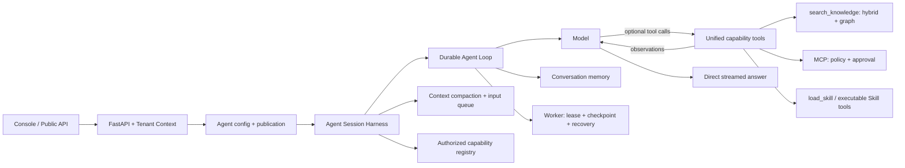

# NexaFlow Agentic 平台落地架构

Agent 本体是通用的模型/工具循环，不是固定 Agentic RAG 流水线。知识库检索、MCP 和可执行 Skills 是可选能力；绑定某个知识库不改变其他任务的执行方式。平台继续采用模块化单体，复用现有的版本、权限、发布、持久化、审批与会话记忆。

## 核心与能力边界

- 核心状态包含消息、事件、模型轮次、工具次数、待执行调用、最终答案、用量和 harness checkpoint；核心不读取证据 ID、查询指纹或证据充分性。
- 所有能力以同一个 StructuredTool 契约暴露给模型。知识工具自己的描述提供可检索来源和引用语法；MCP 与 Skills 沿用各自版本化工具描述。
- 模型自主选择直接回答、一个工具或多工具批次，并基于工具结果继续决策。知识库不享有“必须优先调用”的系统规则；重复查询和继续检索由模型决定。
- 不再有隐藏 grounding manifest、核验节点、证据数量/多样性门控或替换最终答案的核验兜底。工具返回无结果或失败时，模型仍可说明限制并给出有用答案。
- 成功知识工具事件仍生成来源卡片，答案可引用真实 source_ref。来源卡片表示检索结果，不是平台对答案真实性的认证。

## Skills

Agent Skill 控制面仍提供不可变版本、权限和资源绑定。初始上下文只注入已授权 Skill 的名称、简介、意图与 version_id；模型通过 load_skill 按需读取该固定版本的指令、输入/输出 schema 与安全要求。可执行文档/PDF/PPTX/表格 Skills 继续通过统一工具运行时执行。

Skill 版本在 Agent 发布和 Run 创建时冻结到 resource_snapshot / skill_snapshots。Skill 声明的知识库和工具在准备阶段做租户及主体权限校验，再纳入可选能力。通用运行时长、轮次与工具预算取严格值；旧 retrieval、stop 和 grounding 评估字段只保留用于旧定义/版本哈希兼容，不再控制核心循环或注入提示词。

当前渐进加载的是现有数据库 Skill 定义，不是任意文件系统 SKILL.md 包。没有新增动态插件安装、用户扩展代码加载、脚本或 assets 浏览系统。

## Harness

- AgentSession 复用 conversation_id、Run 四表和 checkpoint，不建立第二套会话或工具账本。checkpoint.harness 保存已消费的输入 ID/内容、启用工具、已加载 Skill 版本与压缩次数。
- CapabilityRegistry 统一承载知识、MCP 和其他工具。search_tools 发现已授权能力，activate_tools 设置后续轮次的启用集合；不能新增授权或绕过审批。为保持现有 Agent 行为，默认启用全部已绑定工具，三个 harness 管理工具始终可用。
- AgentContextManager 在每次模型轮次前检查上下文，超阈值时摘要旧消息、保留系统协议及最近消息，并保持 assistant 工具声明与 tool 结果成组。摘要计入 model_usage；当前工具结果或工具 schema 本身无法容纳时显式失败，不伪装成无限上下文。
- ExtensionRuntime 提供受信任、项目代码管理的 context、before_tool、after_tool 生命周期；知识、MCP、其他工具从扩展注册进入统一 registry。不是用户可上传任意代码的插件执行器，实际动作仍通过原有 durable 审批/幂等边界。
- steer 在下一模型轮次前生效；follow_up 等当前任务产生普通答案后生效。两种输入均追加进 agent_run_events，以 input_id 幂等，消费状态随下一 checkpoint 持久化。输入提交与成功终态争用同一 RunState 行锁：终态先完成则拒绝新输入，输入先接受则继续处理或显式失败，避免成功收尾时静默丢失。失败/取消后仍能读取已接受的队列内容。
- 追加任务前的普通答案保存于 checkpoint.harness.inputs 的 previous_answer，并按实际消费顺序投影到会话和历史记忆；最终 result 仍是最后一次答复，不覆盖前一任务的可读答复。
- Console 调试面板支持运行中输入、调整当前任务、追加后续任务（Alt+Enter）及取消。公开和 API Key 提供输入接口，公开聊天 UI 尚未增加这些控件；审批等待不会因排入输入而自动解除。输入不会重置冻结的轮次、工具次数或整次截止时间，每个 Run 最多接受 32 条、每条 4000 字符。
- 这是当前 Python runtime 上的 harness 基础，不是 pi 的完整移植；没有新增树形会话分支、任意扩展安装或独立 TypeScript 服务。

## 已有接口

- GET/POST /api/v1/workspaces/{workspace_id}/agent-skills
- GET/PATCH /api/v1/workspaces/{workspace_id}/agent-skills/{skill_id}
- POST /api/v1/workspaces/{workspace_id}/agent-skills/{skill_id}/publish
- GET /api/v1/workspaces/{workspace_id}/agent-skills/{skill_id}/versions
- GET/PUT/DELETE /api/v1/workspaces/{workspace_id}/agent-skills/{skill_id}/permissions/{user_id}
- Agent 创建/更新绑定 skills: [{skill_id, version_id}]
- POST /api/v1/workspaces/{workspace_id}/agents/{agent_id}/runs/{run_id}/inputs
- POST /api/v1/public/agents/{agent_id}/runs/{run_id}/inputs
- POST /api/v1/agent-api/{agent_id}/runs/{run_id}/inputs

输入接口返回 202，入参为 input_id（客户端生成的幂等 ID）、mode（steer / follow_up）和 content。仅当前 Run 的来源主体可写，访问和发布状态仍按现有控制台/公开/API Key 规则重验；完成的 Run 需提交新 prompt。

## 保留的生产边界

1. agent_runs / agent_run_states / agent_run_snapshots / agent_run_events 和 tool_invocations 是唯一运行及动作账本。
2. PostgreSQL 是 Run、Skill、知识图谱和审计事实源；Qdrant 是可重建检索索引。
3. 租约、checkpoint、重试幂等、租户隔离、授权重验、外部写入审批和独立工具超时不变。
4. 累计模型 token 不再作为执行门禁；用量仍记录。总运行时长、模型轮次与工具数是防失控熔断；预算耗尽后各类工具统一撤下 schema，给模型最终回答机会。供应商的上下文和单次输出上限无法由平台移除。
5. 评测针对答案、真实工具调用、权限、用量和延迟，不再要求 grounding 状态。

## 升级兼容性

不删除现有业务历史或数据库列。旧 Run 的 grounding_status / grounding_meta 及旧 Skill 字段仍可读；新 Run 固定写 skipped / {}，前端与公开进度不再展示旧核验事件。旧 checkpoint 恢复时忽略 RAG 专用状态，并更新系统协议以免继续要求 manifest。升级后需重启 Worker 才使用新的执行代码。

回滚为恢复代码并重启进程，不需要数据迁移。历史已生成的结果不自动重写，进行中的旧 Run 仍受其冻结的通用预算约束。
