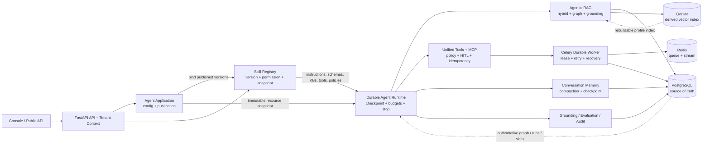
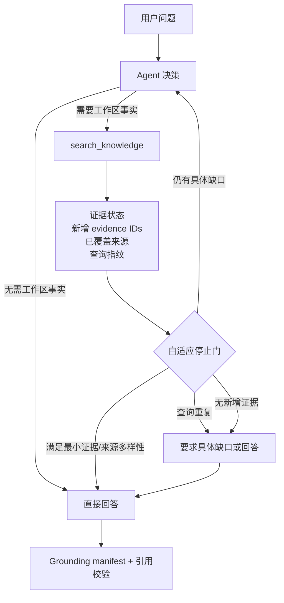

# NexaFlow Agentic 平台落地架构

这份文档把 FigJam 中的完整 Agentic RAG、Skills、MCP、Durable Worker、Memory 和 Evaluation 框架映射到 NexaFlow 现有模块。实现采用模块化单体，不拆成一组必须同时上线的微服务；每一期都能独立运行、回滚和验收。

## 当前目标架构

## 一期一期的实现边界

| 期次 | 交付内容 | NexaFlow 落点 | 验收标准 |
|---|---|---|---|
| 1 | SkillBundle 控制面 | `agent_skills`、版本、权限、Agent 绑定、发布快照 | 可创建/发布/授权 Skill；Agent 只能绑定有权限的已发布版本 |
| 2 | Runtime v3 约束 | Agent Run snapshot、checkpoint、Skill budgets、retrieval/stop policy | 重试仍使用同一 Skill/Tool/KB 版本；预算取最严格值；无隐藏推理落库 |
| 3 | Evidence Engine | 现有混合检索、图谱、grounding manifest、证据 digest | 证据不足可控结束；引用只能来自实际 evidence；Skill 可要求 grounding 与最小证据数 |
| 4 | Memory 与长期改进 | 对话压缩、Run 事件、审计、评估 rubric | Checkpoint 可恢复；长期记忆后续增加来源、作用域、TTL 和纠错 |
| 5 | 运营化 | 运行轨迹、成本/延迟指标、Skill 漂移评估、告警 | 发布前可比较评估集；权限拒绝、失败、人工审批可观测 |

## 已落地的第一期接口

- `GET/POST /api/v1/workspaces/{workspace_id}/agent-skills`
- `GET/PATCH /api/v1/workspaces/{workspace_id}/agent-skills/{skill_id}`
- `POST /api/v1/workspaces/{workspace_id}/agent-skills/{skill_id}/publish`
- `GET /api/v1/workspaces/{workspace_id}/agent-skills/{skill_id}/versions`
- `GET/PUT/DELETE /api/v1/workspaces/{workspace_id}/agent-skills/{skill_id}/permissions/{user_id}`
- Agent 创建/更新请求新增 `skills: [{skill_id, version_id}]`

Skill 版本在 Agent 发布和 Run 创建时都会冻结到 `resource_snapshot` / `skill_snapshots`。Skill 声明的知识库和工具会在 Run 准备阶段解析、做租户权限校验并纳入执行资源；Skill 的运行预算、检索预算、停止策略和评估要求由执行器读取。

## 本分支分期验收状态

| 期次 | 本分支状态 | 已接入的现有能力 |
|---|---|---|
| 1 控制面 | 已完成 | Skill 创建、草稿更新、发布版本、`view/use` 权限、Agent 绑定，以及 Agent 设置页的版本选择 |
| 2 Runtime v3 | 已完成 | Run 快照携带 Skill 版本；执行时合并 Skill 指令、工具、知识库；运行时长、轮次、工具数、模型 token、检索轮次和无新增证据停止轮数取严格值 |
| 3 Evidence Engine | 已完成 | Skill 可声明 grounding 和最小证据数；沿用现有混合检索、图谱和单次 grounding manifest，证据不足会落为 `insufficient` |
| 4 Memory | 已复用 | 沿用现有 conversation memory、压缩、checkpoint 和四表 Run 账本；Skill 快照随 regenerate/子运行继续传递 |
| 5 运营化 | 已复用 | 沿用现有审计日志、Run 事件、用量、延迟和评测链路；Skill 版本位于 Run/application snapshot 中，可按版本回放 |

这使得本分支可以先上线 Skill 控制面和运行时接入，再逐步补充 Skill 专属的评测集、漂移告警和长期记忆来源；这些增强不改变当前 Run、ToolInvocation 或知识图谱的事实源。

## Agentic RAG 检索控制器（本期增量）

检索预算现在按“上限”解释，不再把上限当成目标次数。运行时在每轮工具调用后检查证据增量、Skill 声明的最小证据数和来源多样性；相同检索参数（忽略 `limit` 分页参数）会被跳过，并写入正常的 Tool 事件。这样简单问题可以一次检索后直接回答，多跳问题仍可继续检索到预算上限。

这对应公开研究中“按需检索、检索质量评估、按问题复杂度选择单步或迭代策略”的方向：[Self-RAG](https://arxiv.org/abs/2310.11511)、[CRAG](https://arxiv.org/abs/2401.15884)、[Adaptive-RAG](https://arxiv.org/abs/2403.14403)。本实现先采用确定性运行时门控，不把私有思维链落库；对外保留工具事件、证据 ID、grounding 状态和简短决策提示，便于审计和回放。

## 重要设计取舍

1. `agent_runs`、`agent_run_states`、`agent_run_snapshots`、`agent_run_events` 和 `tool_invocations` 继续作为唯一运行与动作账本，不新建平行的 Agent action 表。
2. PostgreSQL 是 Skill、Run、Evidence Graph 和审计的事实源；Qdrant 只保留可重建索引。
3. Skill 不能携带凭据；工具凭据、MCP Bearer token 仍走现有加密配置和策略链路。
4. 对外只显示简洁的进度、工具事件、证据和结果，不保存或展示模型隐藏推理。

## 回滚策略

第一期所有新数据位于独立 `agent_skills*` 表，Run 扩展字段有默认空数组；旧 Agent/Workflow 请求不带 `skills` 时保持兼容。回滚代码前先停止新 Skill 绑定，再按 migration downgrade 移除新表和快照列；已存在的旧 Agent 运行账本不需要迁移。
